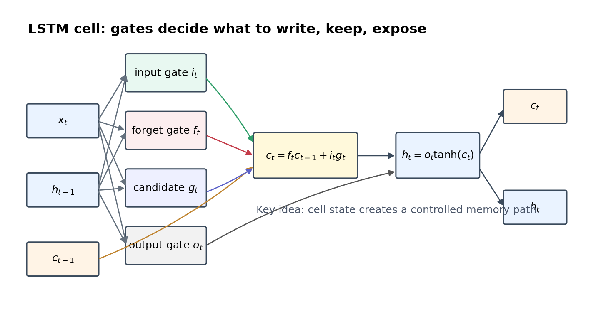
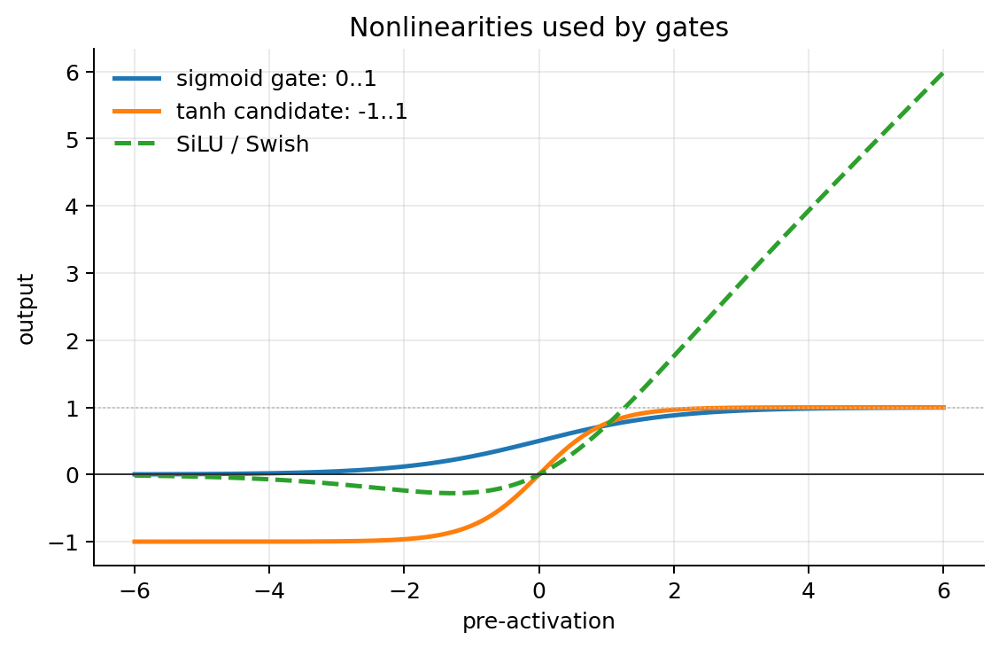
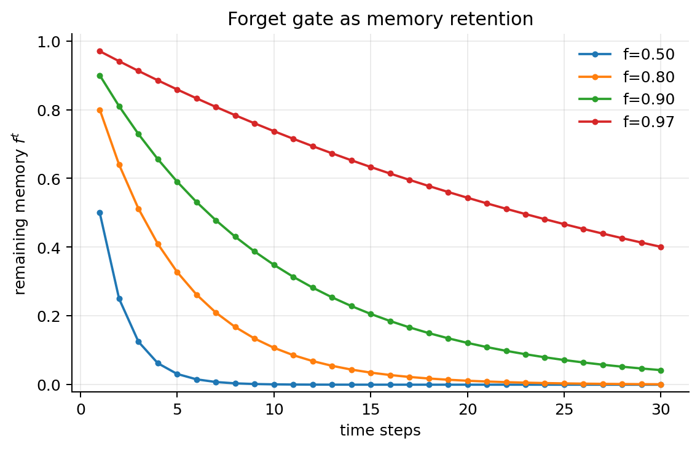
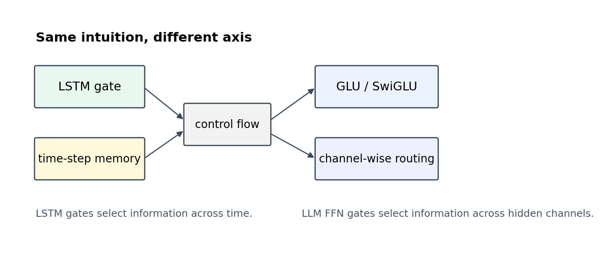

# LSTM 门控机制学习笔记

这份笔记配合 Week 4 LSTM 门控机制 Notebook（week4_lstm_gating_wanglei.ipynb）使用。目标不是把 LSTM 背成公式，而是让有一定 Python / PyTorch / NLP 基础的同学看懂：为什么普通 RNN 容易忘、LSTM 的三个门分别在控制什么、这些“门控”思想为什么在大模型时代仍然有参考价值。

## 1. 为什么还要学 LSTM？

Transformer 已经成为主流，但 LSTM 仍然值得学，原因有三点：

1. 它是理解序列建模的经典入口：RNN、LSTM、GRU、Attention、Transformer 都在回答同一个问题：序列里哪些信息应该留下，哪些应该丢掉。
2. 它的门控思想非常清楚：LSTM 把“记忆”拆成可解释的输入门、遗忘门、输出门，适合学习神经网络如何动态控制信息流。
3. 它能帮助理解现代模型中的 gate：GLU、SwiGLU、Mixture-of-Experts 路由、RNN-like 线性注意力模型，都在不同层面复用了“用一个信号控制另一个信号”的思想。

## 2. 普通 RNN 的问题：信息路径太脆弱

普通 RNN 的核心形式可以写成：

\[
h_t = \tanh(W_x x_t + W_h h_{t-1} + b)
\]

它每一步都用新的 \(h_t\) 覆盖旧状态。对于短句子，这通常够用；但如果标签依赖很早之前的词，例如：

> not ... ... ... good

模型必须把 not 的影响保留到很后面。普通 RNN 在反向传播时会不断乘以同一个递归矩阵和非线性导数，梯度容易衰减或爆炸。LSTM 的核心改进就是增加一条相对稳定的 cell state 路径，让记忆可以被门控地写入、保留和读取。

## 3. LSTM 的四个量：输入门、遗忘门、候选记忆、输出门

给定当前输入 \(x_t\)、上一时刻隐藏状态 \(h_{t-1}\)、上一时刻记忆 \(c_{t-1}\)，LSTM 通常写成：

\[
\begin{aligned}
i_t &= \sigma(W_i [x_t; h_{t-1}] + b_i) \\
f_t &= \sigma(W_f [x_t; h_{t-1}] + b_f) \\
g_t &= \tanh(W_g [x_t; h_{t-1}] + b_g) \\
o_t &= \sigma(W_o [x_t; h_{t-1}] + b_o) \\
c_t &= f_t \odot c_{t-1} + i_t \odot g_t \\
h_t &= o_t \odot \tanh(c_t)
\end{aligned}
\]

这里 \(\sigma\) 是 sigmoid，输出范围在 0 到 1，适合作为“开关”；\(\tanh\) 输出范围在 -1 到 1，适合生成候选记忆。

四个量可以这样理解：

| 符号 | 中文名 | 作用 | 直觉 |
|---|---|---|---|
| \(i_t\) | 输入门 | 决定新信息写入多少 | 现在看到的信息重要吗？ |
| \(f_t\) | 遗忘门 | 决定旧记忆保留多少 | 之前记住的东西还要不要？ |
| \(g_t\) | 候选记忆 | 生成准备写入的新内容 | 如果要更新，更新成什么？ |
| \(o_t\) | 输出门 | 决定当前隐藏状态暴露多少 | 记忆中的哪些部分给下游看？ |

## 4. 遗忘门为什么关键？

如果某个维度上的遗忘门一直接近 1，记忆就能沿着时间轴保存较久；如果接近 0，旧记忆会快速清空。假设每一步遗忘门都是同一个数 \(f\)，连续 \(t\) 步后剩余记忆大约是 \(f^t\)。

这张图的直觉很重要：

- \(f=0.5\)：记忆几步后几乎消失。
- \(f=0.9\)：短期还能留住，但长距离仍会明显衰减。
- \(f=0.97\)：可以保留更长上下文，但如果太接近 1，也可能保留无关旧信息。

所以 LSTM 的学习目标不是“永远记住”，而是学会在不同上下文中动态选择。

## 5. Notebook 会做什么？

Notebook 中的代码分成五部分：

1. 手写一个 ManualLSTMCell：不用直接调用 nn.LSTMCell，而是自己写四个门和状态更新。
2. 检查张量形状：看清楚输入、隐藏状态、记忆状态和 gate 的 shape。
3. 构造一个小型文本分类任务：句子中可能出现 not ... good 或 not ... bad，标签依赖长程否定关系。
4. 训练一个可检查门控值的 LSTM 分类器：训练后输出验证集准确率，并可视化某个句子的 gate。
5. 连接到现代大模型的 gate：用 GLU / SwiGLU 对比 LSTM 的门控思想。

这份 Notebook 不下载外部数据，不依赖本地绝对路径，适合直接在共享仓库中阅读和运行。

## 6. 从 LSTM 到大模型：门控思想没有消失

LSTM 的门控是沿时间维度控制记忆：

\[
c_t = f_t \odot c_{t-1} + i_t \odot g_t
\]

现代 Transformer 主干不再用这种递归状态，但门控思想仍然存在于前馈层和路由结构里。例如 GLU/SwiGLU 可以抽象成：

\[
\mathrm{GLU}(x) = (xW_a) \odot \sigma(xW_b)
\]

\[
\mathrm{SwiGLU}(x) = (xW_a) \odot \mathrm{SiLU}(xW_b)
\]

它们的共同点是：一条分支产生内容，另一条分支产生控制信号，再逐元素相乘。区别在于：

| 机制 | 主要控制轴 | 典型用途 | 直觉 |
|---|---|---|---|
| LSTM gate | 时间步之间的记忆流 | 序列建模、文本分类、时间序列 | 哪些历史信息继续留下？ |
| Attention | token 之间的信息读取 | Transformer 编码/解码 | 当前 token 应该看哪些 token？ |
| GLU/SwiGLU | hidden channel 之间的特征流 | Transformer FFN | 哪些特征通道应该被放大或抑制？ |
| MoE routing | expert 之间的计算分配 | 大规模稀疏模型 | 这条样本该交给哪些专家处理？ |

因此，学习 LSTM 不是为了回到旧模型，而是为了掌握一个会反复出现的建模思想：神经网络并不只是生成表示，还要学习如何控制表示的流动。

## 7. 学习时建议重点看什么？

阅读 Notebook 时，建议按下面的问题检查自己是否真的理解：

- \(i_t\)、\(f_t\)、\(o_t\) 为什么使用 sigmoid，而 \(g_t\) 为什么使用 tanh？
- 如果 \(f_t\) 全部接近 0，会发生什么？如果全部接近 1 呢？
- 为什么 \(c_t\) 被称作 memory path，而 \(h_t\) 更像 exposed state？
- 训练后的 gate heatmap 中，not、good、bad 这类词是否引起更强响应？
- LSTM 的 gate 和 SwiGLU 的 gate 有什么相似点和根本区别？

## 8. 常见误区

- 误区 1：LSTM 能完全解决长程依赖。它只是比普通 RNN 更容易保留信息，面对很长文本仍然有瓶颈。
- 误区 2：门控值越大越好。gate 的意义是选择，不是全部打开。遗忘门太大可能保留噪声，输入门太大可能频繁覆盖记忆。
- 误区 3：Transformer 出现后 LSTM 没用了。在低延迟流式处理、小数据、时间序列和资源受限场景中，LSTM/RNN 仍然有实际价值；更重要的是，门控思想在现代模型中仍然非常常见。

## 9. 参考资料

- Hochreiter, S. and Schmidhuber, J. (1997). Long Short-Term Memory. Neural Computation. DOI: https://doi.org/10.1162/neco.1997.9.8.1735
- PyTorch documentation: torch.nn.LSTM. https://docs.pytorch.org/docs/stable/generated/torch.nn.LSTM.html
- Stanford CS224n: Natural Language Processing with Deep Learning. https://web.stanford.edu/class/cs224n/
- Christopher Olah, Understanding LSTM Networks. https://colah.github.io/posts/2015-08-Understanding-LSTMs/
- Shazeer (2020). GLU Variants Improve Transformer. https://arxiv.org/abs/2002.05202
- PaLM technical report, showing SwiGLU-style gated feed-forward usage in large language models. https://arxiv.org/abs/2204.02311
- LLaMA paper, describing gated feed-forward layers with SwiGLU. https://arxiv.org/abs/2302.13971

## 10. 本地运行方式

在仓库根目录下运行：

    conda run -n base jupyter nbconvert --to notebook --execute --inplace --ExecutePreprocessor.kernel_name=torch 06-nlp/wanglei/week4_lstm_gating_wanglei.ipynb

如果只想阅读，可以直接打开 Notebook；如果要重新生成输出，建议使用 torch 环境。
