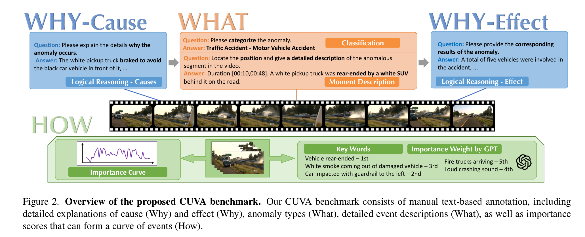
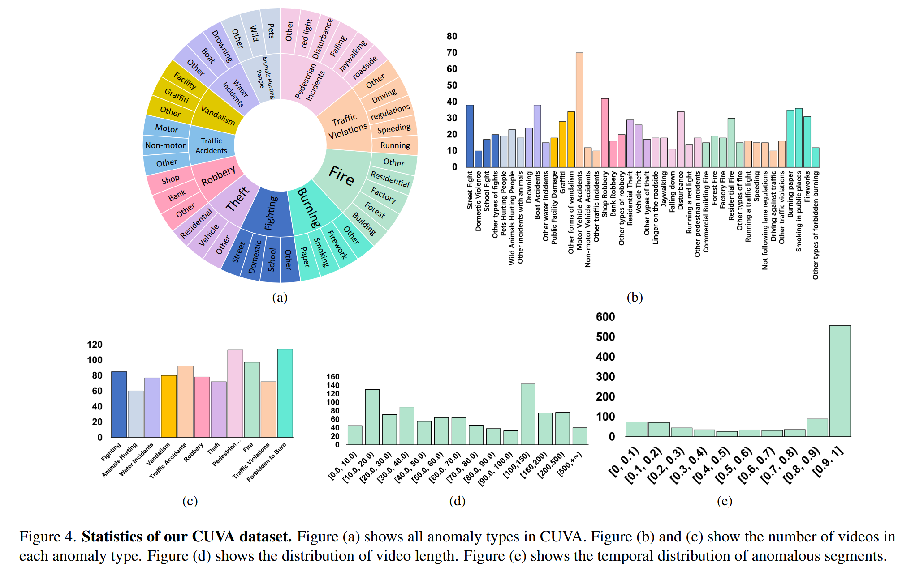
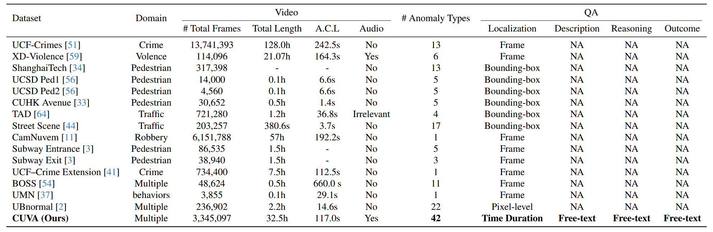
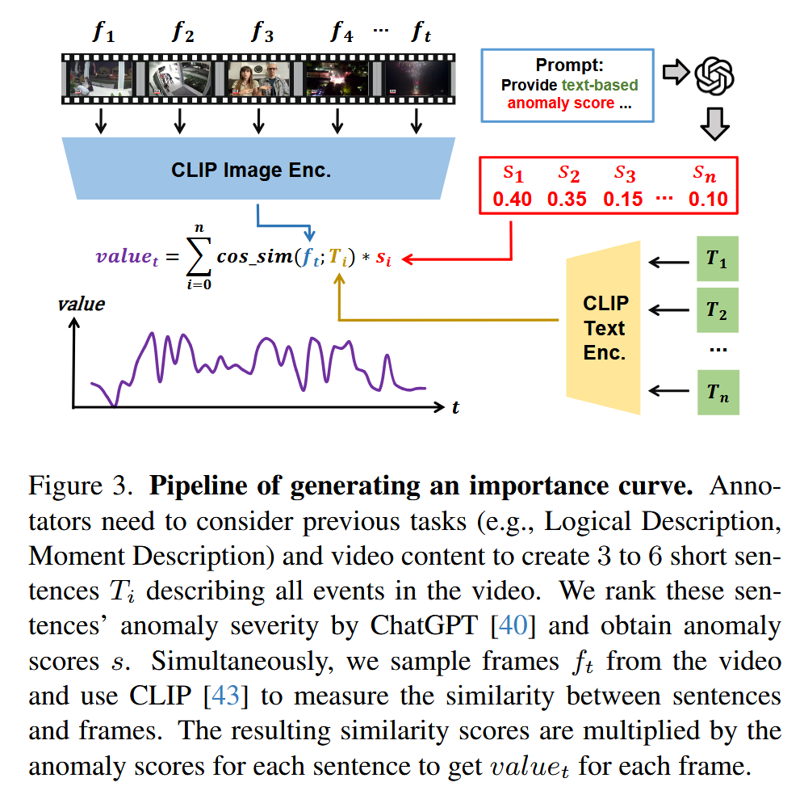
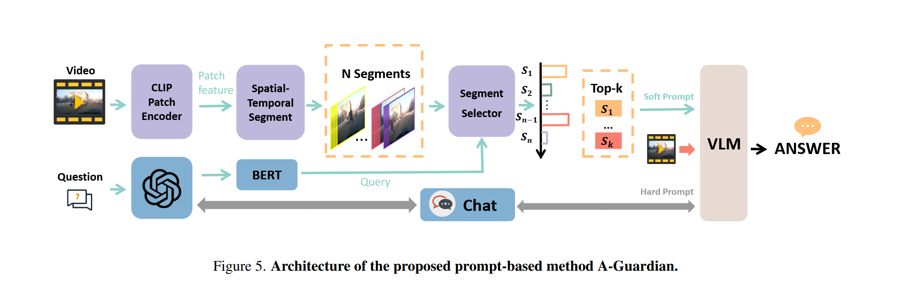
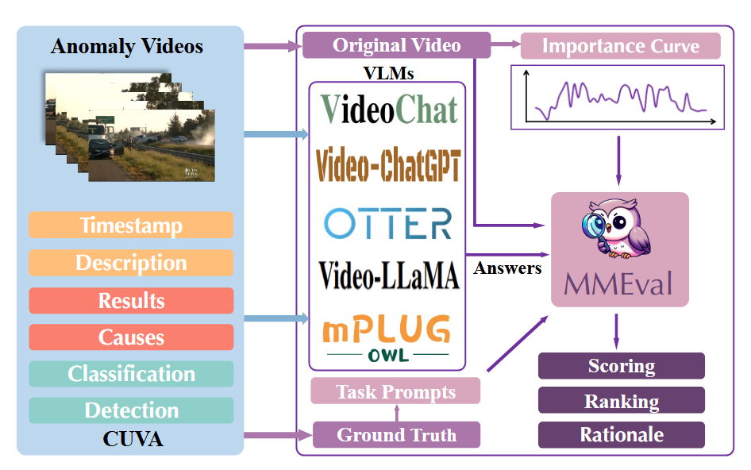
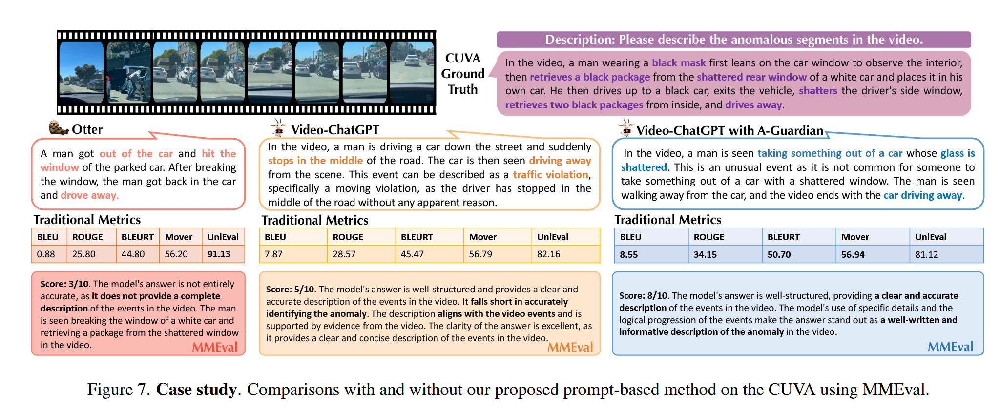

> [!abstract]+ 论文摘要
> 

> [!summary] 一句话总结
> 这篇论文不再满足于回答“视频里有没有异常”，而是要求模型回答：**发生了什么异常、为什么发生、造成了什么后果，以及异常严重程度如何随时间变化。**它构建了一个包含长视频、异常描述、原因、后果和严重程度曲线的数据集CUVA，并提出A-Guardian作为多模态大模型基线，同时设计MMEval来评价开放式文本答案。

## 1. 研究背景与动机
传统视频异常检测通常解决两个问题：
```
是否异常？+异常发生在哪里？
```
但现实中的监控系统还需要回答：
```
发生了什么？→为什么发生？→造成什么后果？→有多严重？
```
论文认为的难点在于：
- **长视频中的关键证据定位**：事故的原因可能出现在异常发生前数秒；
- **因果逻辑链构建**：模型需要连接“先前行为—触发事件—异常结果”。
## 2. 主要方法

> [!idea] 核心思路
> CUVA数据集​→重要性曲线​→A-Guardian方法​→MMEval评价​
### CUVA
定义三个任务What、Why、How
- What：异常检测（是否）、异常分类（种类）、异常时刻和描述
```
这里的异常分类是预先建立的、非开放词汇
```
- Why：为什么发生、造成什么结果
- How：异常有多严重-->重要性曲线

|属性|数值|
|---|--:|
|视频数量|1,000|
|问答对数量|6,000|
|视频总时长|32.46小时|
|平均视频长度|约117秒|
|异常场景|11类|
|细粒度异常类型|42类|
|标注语言|英文|
|数据来源|YouTube、Bilibili|
|标注人员|20余人|
|标注耗时|约150小时|
|与传统VAD数据集相比，CUVA最大的区别不是规模特别大，而是加入了异常描述、原因、后果和重要性曲线标注。||




### 重要性曲线


风险：

- ChatGPT的严重程度判断具有主观性；
- CLIP不擅长精确时序和细微动作；
- 生成曲线依赖多个预训练模型；
- 曲线误差可能进一步影响训练和评测。
### A Guardian

<mark style="background:rgba(240, 200, 0, 0.2)"><font color="#92d050">Hard Prompt+Soft Prompt+Video-ChatGPT</font></mark>

> **硬提示负责引导推理，软提示负责选择证据**

#### Hard Prompt
1. 作者先针对不同任务设计不同系统提示，然后让Video-ChatGPT回答
2. 将==原问题+模型初始回答==输入ChatGPT，由ChatGPT生成下一轮追问，再让Video-ChatGPT重新观察视频并回答
3. 经过多轮循环，模型逐渐从模糊回答转向具体回答
#### Soft Prompt
论文先把视频划分为 N 个片段，每个片段包含 T 帧，每帧包含 M 个patch；然后用冻结的CLIP提取特征，并利用问题选择Top-k个相关视频片段。
##### 1. 帧级特征
$$
f_{k,t}
=
\operatorname{Pooling}
\left(
p_{k,t,1},
p_{k,t,2},
\ldots,
p_{k,t,M}
\right)
$$
其中：
- $p_{k,t,m}$​：第 k 个视频片段、第 t 帧、第 m 个patch的特征；
- $f_{k,t​}$：第 k 个片段中第 t 帧的整体特征；
- Pooling：对一帧内所有patch进行空间池化。
一帧中的多个图像块→一个帧特征
##### 2. 片段级特征

$$
s_k
=
\operatorname{Pooling}
\left(
f_{k,1},
f_{k,2},
\ldots,
f_{k,T}
\right)
$$
其中：
- $f_{k,t}$：第 k 个片段中的帧特征；
- $s_k$​：第 k 个视频片段的整体特征。
- 一个片段中的多帧→一个片段特征
##### 3. 问题特征
$$
\boldsymbol{q}
=
\operatorname{Pooling}
\left(
w_1,
w_2,
\ldots,
w_Z
\right)
$$
其中：
- $w_z$​：问题中第 z 个词或token的特征；
- $Z$：问题包含的token数量；
- $q$：整个问题的特征表示。
问题中的多个词→一个问题向量
##### 4. Top-k视频片段选择
$$
\mathbf{X}_t
=
\underset{\operatorname{Top}_k}{\operatorname{selector}}
\left(
\operatorname{softmax}
\left(
\frac{
\boldsymbol{q}\mathbf{S}^{\mathsf T}
}{
\sqrt{d_k}
}
\right),
\mathbf{S}
\right)
$$
其中，所有视频片段特征构成：
$$
\mathbf{S}
=
\left[
s_1,
s_2,
\ldots,
s_N
\right]
$$
公式含义是：
1. 计算问题 q 与每个视频片段 sk​ 的相似度；
2. 用Softmax得到每个片段的重要程度；
3. 选择得分最高的Top-k片段；
4. 取出这些片段对应的视觉特征，作为Soft Prompt。
#### 最终预测
训练阶段主要微调片段选择器，CLIP保持冻结；作者还使用GPT生成候选回答和数据增强。候选答案通过BERT编码后，根据语义相似度选择最终结果：
### MMEval


## 3. 实验设置
>模型使用CLIP-L/14视觉编码器、Vicuna-v1.1 7B语言模型，并用LLaVA权重初始化。实验在4张NVIDIA A40上完成，每个任务约训练8小时。
- mPLUG-Owl；
- Video-LLaMA；
- PandaGPT；
- Otter；
- Video-ChatGPT；
- Video-ChatGPT + A-Guardian。
### 评估指标
| 任务类型    | 具体任务                | 输出形式      | 采用指标                                        |
| ------- | ------------------- | --------- | ------------------------------------------- |
| 封闭式判断   | Detection           | 是否存在异常    | Accuracy                                    |
| 封闭式分类   | Classification      | 预定义异常类别   | Accuracy                                    |
| 时间定位    | Timestamp           | 异常开始、结束时间 | Temporal IoU                                |
| 开放式生成   | Description         | 异常事件描述    | BLEU、ROUGE、BLEURT、MoverScore、UniEval、MMEval |
| 开放式生成   | Cause               | 异常原因解释    | 同上                                          |
| 开放式生成   | Effect              | 异常后果描述    | 同上                                          |
| 指标有效性验证 | Answer-pool Ranking | 对三种答案进行排序 | 排序准确率                                       |
## 4. 实验结果


> [!failure] 局限与不足
> - 重要性曲线依赖ChatGPT、CLIP、VideoChat、SEVILA、UniVTG和滤波处理
> - MMEval以Video-ChatGPT作为评价基础，而A-Guardian同样建立在Video-ChatGPT上

## 5. 数据集

https://huggingface.co/datasets/fesvhtr/https://github.com/fesvhtr/CUVA  数据集