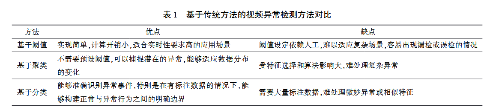
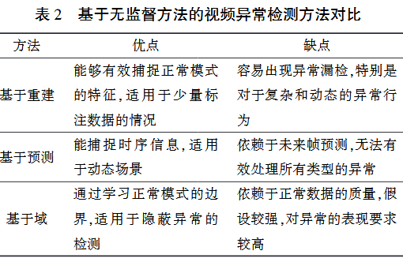
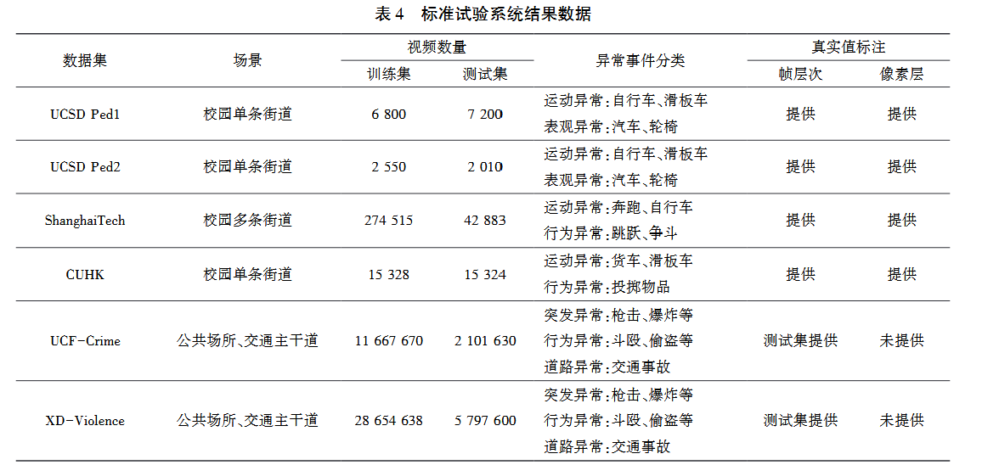
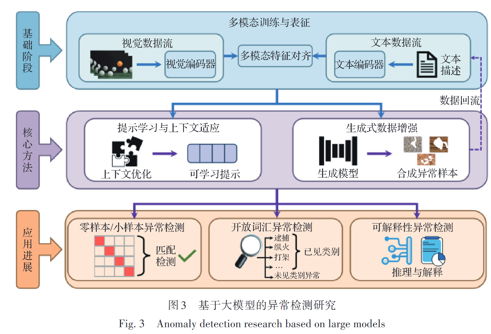
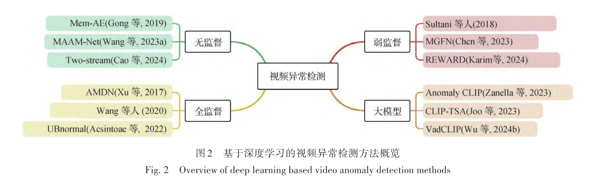
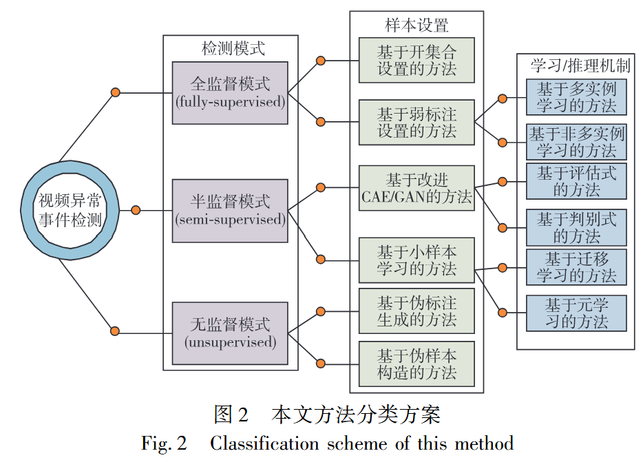
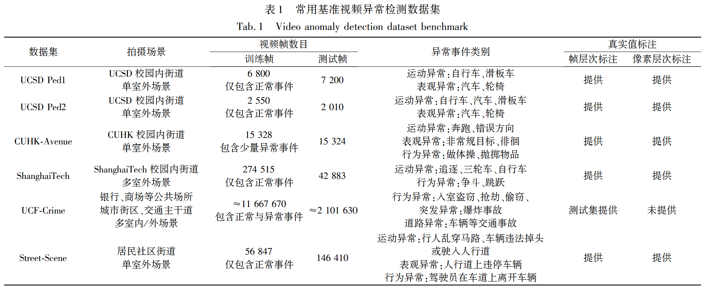

## 论文阅读报告 视频异常检测技术综述 2026

**标题**：视频异常检测技术综述
**发表**：激光杂志，2026
**一句话总结**：根据视频异常检测技术,从无监督学习、弱监督 学习和监督学习 3 个角度对视频异常检测进行综述，并且介绍了基准数据集及其在新兴研究中的不足。主要探讨多模态在VAD的应用

### 1. 研究背景与动机

尽管现有的综述文献对视频异常检测技术进行了分类总结,但仍存在不足。 第一,许多综述未能全 面涵盖所有基于深度学习的方法,尤其是在开放集异 常检测和少样本检测方面的最新进展;第二,现有文献对多模态数据融合在视频异常检测中的应用尚未深入探讨,尤其是在如何有效结合视频、音频与文本等不同模态的信息上,缺乏系统地分析。 针对这些研究空白,本研究不仅对视频异常检测技术进行了全 地回顾和分类总结,而且特别关注了开放集视频异常检测和多模态学习趋势的最新发展,系统阐述了不同学习框架和技术的优缺点,为未来的研究提供了新的视角和参考。

### 2. 主要方法

传统

- 基于阈值：设定一个阈值来区分正常和异常
- 基于聚类：将视频数据划分为多个簇,正常数据通常集中在少数 簇 中, 而 异常数据则分布在边缘或者孤立区域
- 基于分类：将VAD问题转换成二分类或者多分类；通过训练分类模型, 将视频数据划分为正常和异常类别。

| 分类     | 方法                                                         |
| -------- | ------------------------------------------------------------ |
| 基于阈值 | Andrade（Performance analysis of event detection models in crowded scenes）多观察隐马尔可夫模型MOHMM |
| 基于聚类 | Jiang（ Abnormal event detection from surveillance video by dynamic hierarchical clustering）隐马尔可夫模型HMM和分层聚类<br />Porikli（Event detection by eigenvector decomposition using object and frame features）HMM和光谱聚类方法<br />Ermis（Motion segmentation and abnormal behavior detection via behavior clustering）K-means |
| 基于分类 | Xu（Detecting anomalous events in videos by learning deep representations of appearance and motion）单类别支持向量机<br />Ionescu（Object centric autoencoders and dummy anomalies for abnormal event detection in video）支持向量机二分类器 |



**深度学习**

- 无监督：没有事先给定任何异常标签的情况下,通过挖掘样本数据之间的相似性,学习正常样本的特征分布,进而构建其表征模型
  - 重建
  - 预测
  - 基于域



- 弱监督
  - 多示例MIL
  - 多模态
- **监督**：开放集监督式视频异常检测
  - 开放集视频异常检测
  - 少样本

### **3. 实验设置**

- 
- 评估指标
  - 接受者操作特征曲线( Receiver Operating Characteristic curve, ROC) 下的面积 ( Area Under Curve, AUC)  
  - 平均精确度( Average Precision,AP )


### **4. 主要结论与核心数值**

对于VAD的主要改进：

1. 异常检测算法改进
2. 多模态数据的融合
3. 异常检测的实时性
4. 异常检测的可解释性
5. 大规模数据集的构建

### **5. 我的疑问与不足**

- **我没看懂的地方**
- **我认为方法的局限性**
- **可能的改进方向（哪怕是猜测）**

### **6. 与实验室方向的关联**


##### 表1 无监督学习方法——基于重建

| 作者             | 论文名                                                       | 方法概述                                                     | 优点                                           | 缺点                                                         |
| :--------------- | :----------------------------------------------------------- | :----------------------------------------------------------- | :--------------------------------------------- | :----------------------------------------------------------- |
| Hasan 等人 `[7]` | *Learning temporal regularity in video sequences*            | 首次将传统卷积自编码器（CAE）用于VAD，通过重建误差判断异常   | 开创性工作，结构简单                           | 2D卷积无法有效捕捉时序信息；自编码器泛化能力过强可能重构异常导致漏检 |
| Yiru 等人 `[18]` | *Spatio-temporal autoencoder for video anomaly detection*    | 采用3D卷积同时处理空间和时间维度                             | 能同时提取时空特征                             | 3D卷积参数量大，计算开销较高                                 |
| Luo 等人 `[19]`  | *Remembering history with convolutional lstm for anomaly detection* | 结合CNN进行图像表示、LSTM编码运动信息                        | 能捕捉视频中的时序规律性模式                   | 模型结构较复杂，训练难度大                                   |
| Gong 等人 `[20]` | *Memorizing normality to detect anomaly: Memory-augmented deep autoencoder for unsupervised anomaly detection* | 引入记忆模块（MemAE），记录正常样本特征分布，通过注意力检索进行重构 | 有效解决传统自编码器对异常样本过拟合的问题     | 记忆单元大小有限，存储能力受约束                             |
| Park 等人 `[21]` | *Learning memory-guided normality for anomaly detection*     | 引入新记忆网络记录正常数据原型模式，使用特征紧凑性和分离性损失训练记忆项 | 确保记忆项目的多样性和区分能力，性能进一步提升 | 记忆网络设计和训练过程较为复杂                               |

##### 表2 无监督学习方法——基于预测

| 作者             | 论文名                                                       | 方法概述                                                     | 优点                                 | 缺点                                   |
| :--------------- | :----------------------------------------------------------- | :----------------------------------------------------------- | :----------------------------------- | :------------------------------------- |
| Liu 等人 `[8]`   | *Future frame prediction for anomaly detection - a new baseline* | 采用U-Net预测未来帧（FramePred），引入光流一致性作为运动约束 | 前瞻性强，能利用时序依赖关系         | 光流计算额外增加了计算开销             |
| Ye 等人 `[22]`   | *Anopcn: Video anomaly detection via deep predictive coding network* | 采用Conv-LSTM结构的深度预测编码网络（AnoPCN），使用RGB差异替代光流捕捉运动特征 | 无需额外计算光流，更高效利用运动信息 | 对长期动态信息的建模能力仍有提升空间   |
| Chen 等人 `[23]` | *Comprehensive regularization in a bi-directional predictive network for video anomaly detection* | 提出基于补丁预测的双向架构，通过预测一致性、关联一致性和时间一致性进行正则化 | 避免无关背景干扰，更好学习正常模式   | 双向预测机制增加了模型复杂度和训练难度 |
| Liu 等人 `[24]`  | *A hybrid video anomaly detection framework via memory-augmented flow reconstruction and flow-guided frame prediction* | 混合框架，结合记忆增强光流重建和光流引导帧预测，加权求和两种误差 | 融合重建和预测两种策略的优势         | 两阶段设计导致计算量较大               |

##### 表3 无监督学习方法——基于域

| 作者                  | 论文名                                                       | 方法概述                                                     | 优点                                         | 缺点                                       |
| :-------------------- | :----------------------------------------------------------- | :----------------------------------------------------------- | :------------------------------------------- | :----------------------------------------- |
| Xu 等人 `[15]`/`[26]` | *Detecting anomalous events in videos by learning deep representations of appearance and motion* | 两阶段方法：SDAE提取外观和运动特征，再输入单类SVM进行异常判别 | 经典单分类范式，适用于正常数据充足的场景     | 两阶段流程非端到端，特征和分类器可能不匹配 |
| Wu 等人 `[27]`        | *A deep one-class neural network for anomalous event detection in complex scenes* | 借鉴SVDD思想，3D-CAE提取特征后构建包围正常事件的最小超球面   | 能学习正常事件的紧凑表示，适用于隐蔽异常检测 | 对训练数据质量和正常模式完备性要求较高     |

##### 表4 弱监督学习方法——基于多示例框架（MIL）

| 作者               | 论文名                                                       | 方法概述                                                     | 优点                                               | 缺点                                        |
| :----------------- | :----------------------------------------------------------- | :----------------------------------------------------------- | :------------------------------------------------- | :------------------------------------------ |
| Sultani 等人 `[9]` | *Real-world anomaly detection in surveillance videos*        | 首次将MIL引入VAD，构建UCF-Crime数据集，采用排序损失+稀疏性约束+时间平滑正则 | 仅需视频级标签，显著降低标注成本                   | C3D特征提取计算量大，存在噪声预测导致的误判 |
| Zhu 等人 `[28]`    | *Motion-aware feature for improved video anomaly detection*  | 提取运动特征与C3D特征融合，引入注意力网络整合时间上下文      | 增强模型对运动信息的敏感性                         | 需要大量训练数据，模型训练复杂              |
| Zhang 等人 `[29]`  | *Temporal convolutional network with complementary inner bag loss for weakly supervised anomaly detection* | 利用TCN融合视频段间时间信息，引入内外包损失约束搜索空间      | 同时考虑正包中最高分和最低分实例，更好约束学习空间 | 时间卷积计算开销大，时间信息提取仍有局限    |
| Wan 等人 `[30]`    | *Weakly supervised video anomaly detection via center-guided discriminative learning* | 用AR-Net替换全连接层，引入动态MIL损失和中心损失              | 有效扩大异常与正常示例间的分数差距                 | 大规模数据下计算复杂度较高                  |
| Tian 等人 `[31]`   | *Weakly-supervised video anomaly detection with contrastive learning of long and short-range temporal features* | 卷积金字塔（短时）+自注意力（长时），提出top-K对比MIL（MTN-KMIL） | 能同时捕捉多尺度时间依赖关系                       | 多尺度建模和对比学习优化较复杂              |
| Feng 等人 `[32]`   | *Mist: Multiple instance self-training framework for video anomaly detection* | 多实例自训练框架（MIST），通过自训练逐步识别异常片段         | 无需帧级精细标注，可扩展性好                       | 自训练初期可能检测不准，误差可能累积        |
| Li 等人 `[33]`     | *Self-training multi-sequence learning with transformer for weakly supervised video anomaly detection* | 利用Transformer进行多序列时序建模（MSL）                     | 强大的长时依赖建模能力，适用于复杂动态异常         | Transformer计算资源需求大，训练成本高       |
| Park 等人 `[34]`   | *Normality guided multiple instance learning for weakly supervised video anomaly detection* | 编码正常视频中的多种正常模式，引入正常性聚类和正常性引导三元组损失 | 减少噪声预测影响，判别能力增强                     | 异常样本极其稀缺时仍存在性能瓶颈            |

##### 表5 弱监督学习方法——基于多模态框架

| 作者              | 论文名                                                       | 方法概述                                                     | 优点                               | 缺点                                               |
| :---------------- | :----------------------------------------------------------- | :----------------------------------------------------------- | :--------------------------------- | :------------------------------------------------- |
| Wu 等人 `[35]`    | *Not only look, but also listen: Learning multimodal violence detection under weak supervision* | 融合视觉和音频信息，发布XD-Violence大规模多模态数据集        | 视觉信息不足时音频成为关键判别特征 | 多模态联合处理计算资源需求高                       |
| Wu 等人 `[36]`    | *Weakly supervised audio-visual violence detection*          | 利用图卷积网络和多分支模型建模视频片段间关系                 | 粗粒度和细粒度任务中均表现优异     | 特征融合和关系建模复杂，训练耗时                   |
| Wu 等人 `[37]`    | *Vadclip: Adapting vision-language models for weakly supervised video anomaly detection* | 结合文本提示与正常性引导（VADCLIP），通过自然语言描述正常行为特征 | 减少对精确标注的依赖，可扩展性强   | 对文本提示质量依赖较强，不适用于无文本描述场景     |
| Liang 等人 `[38]` | *VioNets: efficient multi-modal fusion method based on bidirectional gate recurrent unit and cross-attention graph convolutional network for video violence detection* | 跨注意力图卷积+Bi-GRU动态融合音频、光流和RGB                 | 能动态建模模态间相互作用           | 对计算资源和训练数据量要求较高                     |
| Shin 等人 `[39]`  | *Multimodal attention-enhanced feature fusion-based weakly supervised anomaly violence detection* | 集成RGB（CLIP+ViT+I3D）、光流和音频，门控特征融合            | 多模态时空特征提取全面             | 需处理信息冗余和模态不平衡问题                     |
| Sun 等人 `[40]`   | *Multi-scale bottleneck transformer for weakly supervised multimodal violence detection* | 多尺度瓶颈变换器，利用瓶颈令牌减少信息冗余                   | 有效处理信息冗余和模态异步问题     | 复杂动态异常场景下仍存在性能瓶颈                   |
| Meng 等人 `[41]`  | *Audio-Visual Collaborative Learning for Weakly Supervised Video Anomaly Detection* | 音频-视觉协作学习框架（AVCL），含MIL、AVHS、MML模块          | 通过音频和视觉协作处理视觉模糊异常 | 模型训练和调优复杂，对数据质量依赖较高             |
| Jin 等人 `[42]`   | *Aligning First, Then Fusing: A novel weakly supervised multimodal violence detection method* | “先对齐再融合”框架，引入MFMS实现语义对齐                     | 有效解决模态语义冗余和异步问题     | 模型结构复杂，对特征提取与对齐依赖度高，训练成本大 |

##### 表6 监督学习方法——开放集视频异常检测

| 作者                 | 论文名                                                       | 方法概述                                                    | 优点                                                       | 缺点                              |
| :------------------- | :----------------------------------------------------------- | :---------------------------------------------------------- | :--------------------------------------------------------- | :-------------------------------- |
| Liu 等人 `[43]`      | *Margin Learning Embedded Prediction for Video Anomaly Detection with A Few Anomalies* | 首个开放集监督VAD工作，在特征空间中学习区分正常与异常的边界 | 开创性地关注开放集场景                                     | 少量异常示例下边界学习仍具挑战    |
| Acsintoa 等人 `[44]` | *Ubnorma: New benchmark for supervised open-set video anomaly detection* | 发布专门用于开放集VAD评估的新基准数据集Ubnorma              | 提供标准化的开放集评估框架                                 | 数据集本身不提供方法改进          |
| Zhu 等人 `[45]`      | *Towards open set video anomaly detection*                   | 利用标准化流模型生成伪异常特征，突破封闭集限制              | 能泛化到未见过的异常类型                                   | 伪异常与真实异常可能存在分布偏差  |
| Wu 等人 `[47]`       | *Open-vocabulary video anomaly detection*                    | 扩展至开放词汇VAD，引入视觉-语言模型进行异常类别识别        | 不仅能检测异常，还能识别异常类别                           | 对视觉-语言模型的对齐质量依赖较高 |
| Li 等人 `[46]`       | *Anomize: Better Open Vocabulary Video Anomaly Detection*    | 文本增强双流结构+组引导文本编码，LLM生成差异化标签文本      | 解决检测模糊与分类混淆，标志向“开放集+多模态+语义增强”发展 | 依赖LLM生成质量，整体架构复杂     |

##### 表7 监督学习方法——少样本视频异常检测

| 作者              | 论文名                                                       | 方法概述                                                     | 优点                                     | 缺点                             |
| :---------------- | :----------------------------------------------------------- | :----------------------------------------------------------- | :--------------------------------------- | :------------------------------- |
| Lu 等人 `[48]`    | *Few-shot scene-adaptive anomaly detection*                  | 首个元学习模型，测试阶段需用新场景少量样本进行微调           | 开创少样本VAD方向                        | 部署前需要额外的微调过程         |
| Hu 等人 `[49]`    | *Adaptive anomaly detection network for unseen scene without fine-tuning* | 基于度量的自适应网络，测试时利用少量正常样本作为参考，无需微调 | 避免了部署前微调                         | 度量学习的泛化能力有限           |
| Huang 等人 `[50]` | *Boosting variational inference with margin learning for few-shot scene-adaptive anomaly detection* | 变分网络结合边界学习，无需微调即可适应新场景                 | 进一步提升少样本场景下的适应性           | 变分推断的计算复杂度较高         |
| Aich 等人 `[51]`  | *Cross-domain video anomaly detection without target domain adaptation* | 基于未训练CNN的异常合成模块（zxVAD），在正常帧中添加外部物体生成伪异常 | 无需目标域适配或微调，鲁棒性和泛化能力强 | 合成的伪异常可能与真实异常不一致 |

## 论文阅读报告 大模型时代的视频与图像安全研究进展——VAD部分 2026

**标题**：大模型时代的视频与图像安全研究进展
**发表**：中国图象图形学报，2026 桑农
**一句话总结**：图像与视频理解安全和图像与视频生成安全两条主线出发；在理解安全方面,重点总结了全监督、半监督、弱监督和无监督异常检测方法的技术演进,并进一步归纳了基于视觉—语言大模型的零样本、开放词汇和可解释异常检测新范式

### 1. 研究背景与动机

多模态大模型（如CLIP、GPT-4V、Sora）和扩散模型极大提升了视觉内容的理解与生成能力，推动安防、内容生产等应用发展。

但能力提升也带来新安全风险——模型在开放场景下易误判、偏差、缺乏可解释性；

### 2. 主要方法

- **按监督信号**（传统分类）：全监督（对比学习、开放集）、半监督（自监督【重建、预测、去噪、对比学习】、单类学习【单类分类器、高斯分类器】、对抗学习）、弱监督（MIL、多模态【音频视频、视觉文本】）、无监督
- **按大模型新范式**：
  - 零样本/小样本异常检测
  - 开放词汇异常检测
  - 可解释性异常检测（结合LLM生成自然语言解释）
- 

### **3. 实验设置**

### **4. 主要结论与核心数值**

1)大规模、多模态基准的创建。

2)开放世界任务的推进。 零样本与增量学习成为关键途径

3)大模型的深度融合。

### **5. 我的疑问与不足**

整篇论文融合了图像和视频，考虑到了AD、生成和伪造检测

但是对于VAD的分析比较浅显，尤其是大模型板块，主要是混杂了图像和视频的，

### **6. 与实验室方向的关联**

##### 表1-1 全监督异常检测

| 作者（参考文献）     | 论文名                                                       | 方法概述                                                     | 优点                       | 缺点                                 |
| :------------------- | :----------------------------------------------------------- | :----------------------------------------------------------- | :------------------------- | :----------------------------------- |
| Acsintoae 等人 `[9]` | *UBnormal: new benchmark for supervised open-set video anomaly detection* | 发布UBnormal数据集，利用对比学习进行边缘学习以获得紧凑正态分布 | 提供标准化的开放集评估框架 | 数据集为虚拟场景，与真实场景存在差异 |
| Zhu 等人 `[11]`      | *Towards open set video anomaly detection*                   | 利用对比学习进行边缘学习，获得紧凑正态分布                   | 开创视频开放集异常检测     | 对比学习需要精心设计正负样本对       |

##### 表1-2 半监督异常检测——自监督学习（重建/预测/去噪/对比）

| 作者（参考文献）         | 论文名                                                       | 方法概述                                            | 优点                     | 缺点                       |
| :----------------------- | :----------------------------------------------------------- | :-------------------------------------------------- | :----------------------- | :------------------------- |
| Nguyen 和 Meunier `[13]` | *Anomaly detection in video sequence with appearance-motion correspondence* | 结合Conv-AE和U-Net，基于外观-运动对应进行未来帧预测 | 融合外观和运动信息       | 对复杂场景泛化能力有限     |
| 闫善武等人 `[14]`        | *融合行人时空信息的视频异常检测*                             | 融合行人时空信息进行异常检测                        | 针对行人目标的专用设计   | 对非行人异常检测效果有限   |
| 陈兆波等人 `[15]`        | *改进注意力混合自动编码器视频异常检测研究*                   | 改进注意力混合自动编码器，提升重建质量              | 注意力机制增强特征提取   | 计算开销较大               |
| 郭方圆和吉根林 `[16]`    | *基于双鉴别器和伪视频生成的视频异常检测方法*                 | 结合双鉴别器和伪视频生成进行异常检测                | 伪视频生成增强训练数据   | 伪视频质量影响检测性能     |
| Liu 等人 `[17]`          | *AMPNet: appearance-motion prototype network assisted automatic video anomaly detection system* | 外观-运动原型网络辅助自动检测                       | 原型学习增强正常模式表示 | 原型数量需人工设定         |
| 黄少年等人 `[18]`        | *基于多支路聚合的帧预测轻量化视频异常检测*                   | 基于多支路聚合的帧预测轻量化检测                    | 轻量化设计适合边缘部署   | 检测精度可能受限于轻量结构 |
| Zhou 等人 `[19]`         | *Object-guided and motion-refined attention network for video anomaly detection* | 目标引导和运动细化的注意力网络                      | 同时关注目标和运动信息   | 注意力机制计算量大         |
| Wang 等人 `[26]`         | *Cluster attention contrast for video anomaly detection*     | 聚类注意力对比用于视频异常检测                      | 聚类增强正常模式学习     | 聚类数需预设               |

##### 表1-3 半监督异常检测——单类学习/对抗学习

| 作者（参考文献） | 论文名                                                       | 方法概述                                | 优点                       | 缺点             |
| :--------------- | :----------------------------------------------------------- | :-------------------------------------- | :------------------------- | :--------------- |
| Fan 等人 `[30]`  | *Video anomaly detection and localization via Gaussian mixture fully convolutional variational autoencoder* | 高斯混合全卷积VAE用于视频异常检测和定位 | 高斯混合建模正常分布更精细 | 高斯分量数需预设 |

##### 表1-4 弱监督异常检测

| 作者（参考文献） | 论文名                                                       | 方法概述                                                     | 优点                           | 缺点                                       |
| :--------------- | :----------------------------------------------------------- | :----------------------------------------------------------- | :----------------------------- | :----------------------------------------- |
| Joo 等人 `[42]`  | *CLIP-TSA: clip-assisted temporal self-attention for weakly-supervised video anomaly detection* | 以CLIP为视频特征提取器，设计时序注意力模块弥补CLIP上下文相关性不足 | 利用CLIP强大的视觉表征能力     | CLIP为图像级预训练，对视频时序信息利用有限 |
| Wu 等人 `[43]`   | *VadCLIP: Adapting vision-language models for weakly supervised video anomaly detection* | 双分支结构，一支做粗粒度二分类，另一支通过片段级视觉-文本相似度实现细粒度分类 | 多模态对齐提升异常类别区分能力 | 双分支结构增加计算复杂度                   |
| 姜迪等人 `[44]`  | *基于跨模态融合与双曲图注意力机制的视频异常检测*             | 融合RGB特征（I3D）与音频特征（VGGish），引入双曲图注意力机制 | 跨模态融合丰富信息源           | 双曲空间计算复杂，模型训练耗时             |

##### 表1-5 无监督异常检测

| 作者（参考文献）      | 论文名                                                       | 方法概述                                                     | 优点                          | 缺点                             |
| :-------------------- | :----------------------------------------------------------- | :----------------------------------------------------------- | :---------------------------- | :------------------------------- |
| Wang 等人 `[45]`      | *Detecting abnormality without knowing normality: a two-stage approach for unsupervised video abnormal event detection* | 先通过自适应重建损失阈值训练自编码器估计初始伪标签，再基于伪标签优化正态性模型 | 无需任何标注                  | 初始伪标签准确性影响最终性能     |
| Pang 等人 `[46]`      | *Self-trained deep ordinal regression for end-to-end video anomaly detection* | 采用“初始检测→伪标签生成→迭代训练”循环，迭代优化异常分数学习器 | 自训练不断提升性能            | 迭代过程计算量大                 |
| Zaheer 等人 `[47]`    | *Generative cooperative learning for unsupervised video anomaly detection* | 利用异常的低频特性，生成器与判别器交叉监督互学伪标签         | 生成-判别协作增强伪标签可靠性 | 低频特性假设可能不成立           |
| Al-Lahham 等人 `[48]` | *A coarse-to-fine pseudo-labeling (C2FPL) framework for unsupervised video anomaly detection* | 通过分层分裂聚类生成视频级粗伪标签，结合统计假设检验生成片段级细伪标签 | 标签粒度精细                  | 聚类和统计检验准确性影响最终效果 |

##### 表1-6 零样本与小样本异常检测

| 作者（参考文献）   | 论文名                                                       | 方法概述                                                   | 优点                           | 缺点                       |
| :----------------- | :----------------------------------------------------------- | :--------------------------------------------------------- | :----------------------------- | :------------------------- |
| Cao 等人 `[49]`    | *AdaCLIP: adapting CLIP with hybrid learnable prompts for zero-shot anomaly detection* | 利用混合可学习提示对CLIP进行适配，用于零样本异常检测       | 无需训练样本即可检测新类别异常 | 可学习提示需要少量适配数据 |
| Zhou 等人 `[50]`   | *AnomalyCLIP: object-agnostic prompt learning for zero-shot anomaly detection* | 采用与物体无关的提示学习策略进行零样本异常检测             | 不依赖特定物体类别             | 细粒度异常定位能力有限     |
| Salehi 等人 `[51]` | *Crane: context-guided prompt learning and attention refinement for zero-shot anomaly detection* | 上下文引导的提示学习和注意力细化，可整合DINOv2增强空间理解 | 增强对细粒度异常的感知         | 多模型集成增加计算开销     |
| Gu 等人 `[52]`     | *FiLo: zero-shot anomaly detection by fine-grained description and high-quality localization* | 通过细粒度描述和高质量定位实现零样本异常检测               | 检测和定位一体化               | 细粒度描述需精心设计       |
| Kim 等人 `[53]`    | *GenCLIP: generalizing CLIP prompts for zero-shot anomaly detection* | 通过多层提示、双分支推理和自适应文本提示过滤实现零样本检测 | 去除不相关类别干扰             | 多层提示设计复杂           |

##### 表1-7 开放词汇与可解释性异常检测

| 作者（参考文献）       | 论文名                                                       | 方法概述                                                     | 优点                           | 缺点                             |
| :--------------------- | :----------------------------------------------------------- | :----------------------------------------------------------- | :----------------------------- | :------------------------------- |
| Li 等人 `[59]`         | *Anomize: Better Open Vocabulary Video Anomaly Detection*    | 利用LLM获取多层次视觉文本信息，结合标签关系编码减少分类混淆  | 解决检测模糊与分类混淆两大挑战 | 依赖LLM生成质量，整体架构复杂    |
| Liu 等人 `[60]`        | *Language-guided open-world video anomaly detection under weak supervision* | 通过动态视频合成增加异常相对持续时间多样性，结合对比学习和负样本挖掘 | 动态调整异常定义               | 动态视频合成质量影响检测性能     |
| Hinami 等人 `[61]`     | *Joint detection and recounting of abnormal events by learning deep generic knowledge* | 学习实体、动作、属性等通用视觉概念，以人类可理解形式描述异常事件 | 提供语义级别的异常描述         | 概念学习覆盖范围有限             |
| Reiss 和 Hoshen `[62]` | *An attribute-based method for video anomaly detection*      | 提取速度和姿态等属性级显式表示及隐式语义表示                 | 属性解耦提升可解释性           | 属性提取依赖预训练模型           |
| Yang 等人 `[63]`       | *Follow the rules: reasoning for video anomaly detection with large language models* | 首个基于规则的半监督异常视频检测推理框架，利用LLM实现异常事件推理 | 利用LLM强大推理能力            | 规则设计需人工定义，覆盖范围有限 |
| Zhang 等人 `[64]`      | *Holmes-VAU: towards long-term video anomaly understanding at any granularity* | 构建首个大规模多模态VAD指令调优基准数据集（HVAU-70k），利用LLM生成高质量异常分析 | 大规模数据集支撑多粒度理解     | 半自动标注范式仍有标注误差       |

## 论文阅读报告 基于深度学习的监控视频异常检测方法综述 2025

**标题**：基于深度学习的监控视频异常检测方法综述
**发表**：中国图像图形学报，2025
**一句话总结**：特别探讨了大模型为该领域带来的新机遇与挑战



### 1. 研究背景与动机

现有综述存在不足——或对未来发展分析简略，或偏重理论推导而缺乏对数据集、指标等实用细节的介绍。本文旨在从**深度学习视角**全面梳理方法进展，并**重点关注大模型**带来的新可能，为新手提供清晰入口，为研究者指明方向。

### 2. 主要方法

1. **问题定义**：明确视频异常的5种类型（直观、动作变化、轨迹变化、群体变化、时空异常）及其3个特性（抽象性、不确定性、稀疏性）。  

2. **方法分类**：按监督程度分为**全监督**、**弱监督**（以多实例学习为主）、**无监督**（以重构/预测误差为核心）三大类，分别阐述代表性工作、优缺点。  

   - 弱监督是分为<u>MIL及其三个改进方向</u>和<u>其他</u>

     ```mermaid
     timeline
         title 弱监督视频异常检测技术演进
         MIL奠基 : Sultani等首次引入MIL框架
                  : 深度多实例排名 + 稀疏/时间平滑约束
                  : 开启弱监督VAD主流范式
         
         MIL改进之损失优化 : IBL损失 （Zhang等，2019）
                           : 中心损失+动态MIL损失 Wan等，2020
                           : 自校正损失 Majhi等，2024
         
         MIL改进之时空理解 : 异常区域学习 （Liu和Ma，2019a）
                           : 时间增强网络 （Zhu和Newsam，2019）
                           : RTFM （Tian等，2021）
                           : 扫视-聚焦网络 （Chen等，2023）
                           : Transformer时序聚合 （Huang等，2024）
         
         MIL改进之标签策略 : 多实例伪标签生成 （Feng等，2021）
                           : 两阶段自训练 （Zhang等，2023）
                           : 动态实例选择 （Wang等，2024b）
                           : 对抗+聚焦训练 （He等，2024）
         
         其他非MIL方法 : GCN去噪标签 （Zhong等，2019）
                       : 边缘学习嵌入预测 （Liu等，2019b）
                       : XD-Violence多模态数据集 （Wu等，2020）
                       : 李生CNN距离度量 （Ramachandra和Jones，2020）
                       : 协同常态学习 （Liu等，2022）
                       : 实时端到端训练 （Karim等，2024）
     ```

     

   - 全监督是探讨视频异常问题发生的情境（针对老人和患者等的异常动作的检测问题；针对拥挤场景下的视频异常检测问题），此外列举了两三个代表性方法

     ```mermaid
     timeline
         title 全监督视频异常检测
         老人/患者异常动作 : AMDN（Xu等，2017） 外观+运动双流融合
                          : WTA-AE （Tran和Hogg，2017） 卷积自编码+一类SVM
                          : Sabokrou等（2018b） GAN端到端竞争协作
                          : 结合毫米波雷达/骨架检测/注意力网络等
         
         拥挤场景 : Sabokrou等（2017） 局部+全局级联分类器
                   : 小图块学判别， 大图块推异常
         
         通用场景改进 : Unmasking （Ionescu等，2017） 迭代去判别特征， 无需训练序列
                       : TSC+SRNN （Luo等，2017a） 时间相干稀疏编码
                       : UBnormal （Acsintoe等，2022） 虚拟数据集+开集监督范式
         
         现状 : 依赖帧/像素级 精细标注，成本高昂
               : 2018年后新工作稀少
     ```

     

   - 无监督

   - ```mermaid
     timeline
         title 无监督视频异常检测技术演进
         AE重构误差 : Conv-AE/VAE/S2-VAE
                   : 泛化过强，易漏检
         未来帧预测 : Liu等U-Net/STAE
                   : 引入时序动态信息
         记忆模块 : MemAE/MNAD/MAAM-Net
                  : 限制泛化，增大误差差距
         GAN进阶 : STAN/AVID
                 : 学习分布，构造伪异常
         外部先验知识 : 骨架RNN/SSMTL++
                      : 语义级检测，性能超全监督
         大模型时代 : CLIP/LLAVA/零样本
                    : 无需训练，通用检测
     ```

3. **大模型结合**：单独成节，介绍利用CLIP、GPT-4V、LLAVA等模型进行零样本/少样本异常检测、细粒度分类及开放词汇识别的最新探索。  

   ```mermaid
   timeline
       title 大模型+视频异常检测
       Prompt驱动 : PFMF（Liu等，2023） Prompt引导映射网络 生成未见异常
       
       CLIP特征编码 : CLIP-TSA （Joo等，2023） ViT编码+时间自注意力
                     : Kim等（2023） CLIP+预定义文本相似度 零样本检测
       
       双分支架构 : Anomaly CLIP （Zanella等，2023） 正态原型驱动文本提示
                   : VadCLIP（Wu等，2024b） 粗粒度二分+细粒度多分类
       
       开放词汇 : OVVAD（Wu等，2024a） CLIP+ERNIE Bot语义知识+DALL-E生成伪异常
       
       无需训练 : LAVAD （Zanella等，2024） LLAVA生成文本描述+ LLM时间聚合评分
       
       通用探索 : Cao等（2023） GPT-4V 多模态多领域异常检测 （图像/视频/点云/时序）
   ```

   

4. **数据集与评估**：汇总10个常用及新数据集，介绍帧级/像素级/区域级/轨迹级4种判定标准，以及AUC、EER、AP 3种评估指标，并进行多表性能对比。  

5. **展望**：提出数据集需更真实、多模态；评估应兼顾AUC与虚警率；模型应走向细粒度、轻量化、在线学习、异常预测，并借助大模型向通用化发展。

### **3. 实验设置**

- 论文将数据集分为**2020年前**和**2020年后**两类介绍：

  2020年之前（6个）

  | 数据集                | 特点                                             | 标注类型         |
  | :-------------------- | :----------------------------------------------- | :--------------- |
  | **UCSD**（Ped1/Ped2） | 校园人行道固定视角，含骑车、滑板等异常           | 帧级 + 像素级    |
  | **Avenue**            | 公共场所固定摄像头，含奔跑、抛掷物等异常         | 帧级 + 像素级    |
  | **Subway**            | 地铁出入口，含逃票、逆行等异常                   | 帧级             |
  | **UMN**               | 3个场景，异常主要为人群四散                      | 帧级             |
  | **ShanghaiTech**      | 13种光照/角度场景，最具挑战性之一                | 帧级 + 像素级    |
  | **UCF-Crime**         | 13种异常类型（斗殴、纵火、盗窃等），共1900个视频 | 视频级（弱标签） |

  2020年之后（4个）

  | 数据集           | 特点                                          | 标注类型                    |
  | :--------------- | :-------------------------------------------- | :-------------------------- |
  | **XD-Violence**  | 最大规模（4754个视频，217h），含音频，6种异常 | 视频级 + 音频               |
  | **Street Scene** | 双车道场景，17种异常类型                      | 帧级 + 边界框               |
  | **ADOC**         | 校园24h记录，25种异常，边界框标注最丰富       | 帧级 + 边界框               |
  | **UBnormal**     | Cinema4D生成的虚拟数据集，22种异常，29种场景  | 像素级（分割掩码+对象标签） |
- 评估指标
  
  - | 指标                     | 含义                           | 特点                                      |
    | :----------------------- | :----------------------------- | :---------------------------------------- |
    | **AUC**（ROC曲线下面积） | 衡量分类器对正负样本的区分能力 | 取值范围0.5~1，越高越好，是目前最常用指标 |
    | **EER**（等错误率）      | FPR = FNR时的错误分类帧占比    | 越低表示性能越好                          |
    | **AP**（平均精度）       | Precision-Recall曲线下面积     | 取值范围0~1，越高越好                     |

### **4. 主要结论与核心数值**

| 方向       | 具体建议                                                     |
| :--------- | :----------------------------------------------------------- |
| **数据集** | 向更真实、多模态、多镜头、多维度标注发展，打破当前单一场景瓶颈 |
| **评估**   | 设计同时兼顾**AUC**和**虚警率**的评价体系，避免高AUC但高误报 |
| **模型**   | ① 设计细粒度、通用化模型，区分具体异常类型；② 面向边缘计算的轻量化；③ 拓展至动物行为、遥感、工业等新领域；④ 在线/终身学习能力；⑤ 从异常检测向**异常预测**延伸 |

### **5. 我的疑问与不足**

- 大模型相关工作的分类和论述较为零散，缺乏体系化的归纳框架
-  对大模型在实际部署中的根本性挑战（计算开销、推理延迟、幻觉风险、隐私安全等）没有分析

### **6. 与实验室方向的关联**

#####  全监督方法

| 作者（参考文献）      | 论文名                                                       | 方法概述                                                     | 优点                                 | 缺点                                 |
| :-------------------- | :----------------------------------------------------------- | :----------------------------------------------------------- | :----------------------------------- | :----------------------------------- |
| Xu 等人 `[11]`        | *Detecting anomalous events in videos by learning deep representations of appearance and motion* | 提出AMDN，分别学习外观和运动特征后融合，使用多个单类SVM预测异常得分 | 外观和运动双流融合                   | 两阶段流程非端到端，后期融合策略简单 |
| Tran 和 Hogg `[12]`   | *Anomaly detection using a convolutional winner-take-all autoencoder* | 提出卷积赢者通吃自编码器，提取运动特征编码作为单类SVM输入，训练中加入空间赢者通吃步骤引入稀疏性 | 稀疏性增强特征判别性                 | 赢者通吃策略可能丢失部分信息         |
| Sabokrou 等人 `[13]`  | *Adversarially learned one-class classifier for novelty detection* | 受GAN启发，提出端到端的竞争和协作算法，包含像素级和分块级两个检测网络 | 对抗性自监督训练，可精准定位异常区域 | GAN训练不稳定                        |
| Sabokrou 等人 `[14]`  | *Fast and accurate detection and localization of abnormal behavior in crowded scenes* | 提出基于三维图块的级联分类器，以局部和全局描述符为基础       | 级联设计兼顾速度和精度               | 局部-全局描述符设计依赖人工          |
| Ionescu 等人 `[15]`   | *Unmasking the abnormal events in video*                     | 改进Unmasking技术，迭代训练二分类器区分两个连续视频序列      | 无需训练序列                         | 迭代过程计算量大                     |
| Luo 等人 `[16]`       | *A revisit of sparse coding based anomaly detection in stacked RNN framework* | 提出时间相干稀疏编码，利用堆叠循环神经网络同时学习所有参数   | 避免琐碎超参数选择，检测速度快       | SRNN结构较浅可能限制表达能力         |
| Acsintoae 等人 `[17]` | *UBnormal: new benchmark for supervised open-set video anomaly detection* | 发布UBnormal虚拟数据集，将VAD作为有监督开集分类问题          | 训练和测试异常类型不相交             | 虚拟场景与真实场景存在差距           |

#####  弱监督方法——MIL框架

| 作者（参考文献）     | 论文名                                                       | 方法概述                                                     | 优点                           | 缺点                               |
| :------------------- | :----------------------------------------------------------- | :----------------------------------------------------------- | :----------------------------- | :--------------------------------- |
| Sultani 等人 `[18]`  | *Real-world anomaly detection in surveillance videos*        | 首次将MIL引入VAD，构建UCF-Crime数据集，采用排序损失+稀疏性约束+时间平滑正则 | 仅需视频级标签                 | C3D特征提取计算量大                |
| Zhang 等人 `[19]`    | *Temporal convolutional network with complementary inner bag loss for weakly supervised anomaly detection* | 提出内包损失，正包最高分与最低分差距最大化，负包差距最小化   | 约束弱监督搜索空间             | TCN计算开销大                      |
| Wan 等人 `[20]`      | *Weakly supervised video anomaly detection via center-guided discriminative learning* | 提出动态MIL损失和中心损失，增大类间距离、缩小类内距离        | 动态k值适应不同长度视频        | 大规模数据下计算复杂度高           |
| Majhi 等人 `[21]`    | *Human-scene network: a novel baseline with self-rectifying loss for weakly supervised video anomaly detection* | 提出自校正损失函数，动态从视频级标签计算伪时间标注           | 优化网络对人物与空间线索的理解 | 伪时间标注准确性有限               |
| Liu 和 Ma `[22]`     | *Exploring background-bias for anomaly detection in surveillance videos* | 提出异常区域学习引导框架，采用新的区域损失驱动网络学习异常区域 | 减少背景偏差干扰               | 区域损失设定需人工调参             |
| Landi 等人 `[23]`    | *Anomaly locality in video surveillance*                     | 添加时空通道标签，效果优于仅用全帧视频片段                   | 时空联合建模                   | 时空标签获取成本高                 |
| Zhu 和 Newsam `[24]` | *Motion-aware feature for improved video anomaly detection*  | 提出时间增强网络学习运动感知特征，将时间上下文引入MIL排序模型 | 运动信息增强检测性能           | 需要大量训练数据                   |
| Tian 等人 `[25]`     | *Weakly-supervised video anomaly detection with robust temporal feature magnitude learning* | 提出RTFM方法，训练特征幅度学习函数有效识别正样本             | 增强对异常视频中负样本的鲁棒性 | 特征量级受场景变化影响导致性能抖动 |
| Chen 等人 `[26]`     | *MGFN: magnitude-contrastive glance-and-focus network for weakly-supervised video anomaly detection* | 提出扫视和聚焦网络，整合时空信息实现更精确检测               | 扫视-聚焦机制提升定位精度      | 双阶段设计增加推理时间             |
| Huang 等人 `[27]`    | *Weakly supervised video anomaly detection via self-guided temporal discriminative transformer* | 引入Transformer时序特征聚合器和自引导判别特征编码器          | 自引导机制提升判别特征提取     | Transformer计算资源需求大          |
| Feng 等人 `[28]`     | *MIST: Multiple instance self-training framework for video anomaly detection* | 提出多实例伪标签生成器，采用稀疏连续采样策略产生片段级伪标签 | 自动关注异常区域               | 自训练初期检测不准                 |
| Zhang 等人 `[29]`    | *Exploiting completeness and uncertainty of pseudo labels for weakly supervised video anomaly detection* | 两阶段自训练方法，自我生成伪标签并自提炼异常评分             | 伪标签不断完善                 | 两阶段设计复杂                     |
| Wang 等人 `[30]`     | *A lightweight video anomaly detection model with weak supervision and adaptive instance selection* | 提出动态实例选择策略，自适应选择可信预测实例参与损失计算     | 减少弱标记不确定性             | 轻量化设计可能限制检测精度         |
| He 等人 `[31]`       | *Adversarial and focused training of abnormal videos for weakly-supervised anomaly detection* | 提出基于数据的对抗训练模块和基于模型的聚焦训练模块           | 解决正常与异常数据不平衡问题   | 对抗训练增加训练不稳定性           |

##### 弱监督方法——非MIL

| 作者（参考文献）            | 论文名                                                       | 方法概述                                                     | 优点                             | 缺点                             |
| :-------------------------- | :----------------------------------------------------------- | :----------------------------------------------------------- | :------------------------------- | :------------------------------- |
| Zhong 等人 `[32]`           | *Graph convolutional label noise cleaner: train a plug-and-play action classifier for anomaly detection* | 提出图卷积神经网络矫正噪声标签，将全监督动作分类器应用到弱监督异常检测 | 剔除标签噪声，充分利用成熟分类器 | GCN计算复杂度高                  |
| Liu 等人 `[33]`             | *Margin learning embedded prediction for video anomaly detection with a few anomalies* | 通过学习更紧凑的正态数据分布提高异常检测性能                 | 对未见异常也有适应性             | 边界学习对异常样本的依赖性仍存在 |
| Wu 等人 `[34]`              | *Not only look, but also listen: Learning multimodal violence detection under weak supervision* | 发布XD-Violence多模态数据集，设计弱监督异常检测方法减轻批次效应和标签噪声 | 视觉+音频多模态融合              | 多模态处理计算资源需求高         |
| Ramachandra 和 Jones `[35]` | *Street Scene: a new dataset and evaluation protocol for video anomaly detection* | 引入孪生卷积神经网络学习视频块间距离度量识别异常             | 度量学习直接基于距离判断         | 孪生网络训练需精心设计正负样本对 |
| Karim 等人 `[36]`           | *Real-time weakly supervised video anomaly detection*        | 提出实时端到端训练弱监督方法，直接从原始数据学习有效特征     | 端到端实时检测                   | 实时性要求限制模型复杂度         |

##### 无监督方法

| 作者（参考文献）         | 论文名                                                       | 方法概述                                                     | 优点                             | 缺点                                 |
| :----------------------- | :----------------------------------------------------------- | :----------------------------------------------------------- | :------------------------------- | :----------------------------------- |
| Chong 和 Tay `[37]`      | *Abnormal event detection in videos using spatiotemporal autoencoder* | 提出端到端自编码器，取代传统稀疏编码方法，无需手工提取先验知识 | 自动特征提取                     | 自编码器泛化能力可能导致异常重构良好 |
| Wang 等人 `[38]`         | *Detecting abnormality without knowing normality: a two-stage approach for unsupervised video abnormal event detection* | 提出S²-VAE组合网络（SC-VAE+SF-VAE）                          | 双网络优势互补                   | 组合网络参数量大                     |
| Ye 等人 `[39]`           | *AnoPCN: video anomaly detection via deep predictive coding network* | 设计预测编码模块增强运动信息利用，参考U-Net设计误差细化模块  | 运动信息增强，重建误差差异大     | 预测编码模块设计复杂                 |
| Yu 等人 `[40]`           | *Cloze test helps: effective video anomaly detection via learning to complete video events* | 设计外观和运动互补的定位感兴趣块，通过擦除图块构建视觉完形填空过程 | 增强模型全局构建能力             | 图块擦除策略需精心设计               |
| Rodrigues 等人 `[41]`    | *Multi-timescale trajectory prediction for abnormal human activity detection* | 提出多时间尺度模型，生成不同时间尺寸的异常事件预测           | 捕获不同时间尺度的动态变化       | 多尺度建模增加计算开销               |
| Georgescu 等人 `[42]`    | *Anomaly detection in video via self-supervised and multi-task learning* | 以3DCNN为基础，联合学习多个代理任务产生多时间尺度异常信息    | 自监督多任务提升性能             | 多个代理任务设计复杂                 |
| Luo 等人 `[43]`          | *Remembering history with convolutional LSTM for anomaly detection* | 提出ConvLSTM-AE，记忆与运动信息相对应的所有过去帧            | 对运动信息建模优于3D卷积         | LSTM难以处理超长序列                 |
| Liu 等人 `[44]`          | *Future frame prediction for anomaly detection—a new baseline* | 提出FramePred，通过预测未来帧与实际帧差异检测异常            | 前瞻性强                         | 并非所有异常都产生足够大预测误差     |
| Nguyen 和 Meunier `[45]` | *Anomaly detection in video sequence with appearance-motion correspondence* | 结合Conv-AE和U-Net，整合Inception模块，提出基于图块的方案降低噪声 | 图块方案降低噪声影响             | Inception模块参数多                  |
| Zhao 等人 `[46]`         | *Spatiotemporal autoencoder for video anomaly detection*     | 提出STAE，利用3D卷积提取时空特征，引入减权预测损失增强运动特征学习 | 3D卷积同时提取时空特征           | 3D卷积计算量大                       |
| Wang 等人 `[47]`         | *Video anomaly detection based on spatio-temporal relationships among objects* | 利用注意力机制增强模型对物体间时空关系的理解                 | 物体间关系建模提升预测能力       | 目标检测前置影响整体性能             |
| Gong 等人 `[48]`         | *Memorizing normality to detect anomaly: memory-augmented deep autoencoder for unsupervised anomaly detection* | 提出MemAE，引入记忆模块限制自编码器泛化能力                  | 有效解决异常重构问题             | 记忆单元大小有限                     |
| Park 等人 `[49]`         | *Learning memory-guided normality for anomaly detection*     | 引入分离性损失和紧密性训练记忆模块，强化记忆多样性和代表性   | 记忆项判别能力增强               | 记忆网络训练复杂                     |
| Tao 等人 `[50]`          | *Memory-guided representation matching for unsupervised video anomaly detection* | 设计内存模块捕捉正常模式，伪标签生成模块和异常事件生成模块辅助训练 | 负学习增强模型鲁棒性             | 伪异常生成质量影响性能               |
| Wang 等人 `[51]`         | *Memory-augmented appearance-motion network for video anomaly detection* | 提出MAAM-Net，利用基于边际的潜在损失扩大记忆模块中模式边际距离 | 强化记忆能力                     | 边际损失参数需调优                   |
| Lee 等人 `[52]`          | *STAN: spatio-temporal adversarial networks for abnormal event detection* | 提出时空生成对抗网络，利用双向ConvLSTM设计时空生成器和鉴别器 | 对抗训练学习正常时空特征模式     | GAN训练不稳定                        |
| Morais 等人 `[53]`       | *Learning regularity in skeleton trajectories for anomaly detection in videos* | 利用人体骨架特征，设计RNN双分支分别处理全局和局部骨架特征    | 针对人体异常动作检测专用设计     | 依赖骨架检测质量                     |
| Markovitz 等人 `[54]`    | *Graph embedded pose clustering for anomaly detection*       | 提取人体姿态特征进行聚类，通过“词袋”表示和相似性对比判定异常 | 姿态聚类提供可解释的动作表示     | 聚类数需预设                         |
| Barbalau 等人 `[55]`     | *SSMTL++: revisiting self-supervised multi-task learning for video anomaly detection* | 利用YOLO引入目标位置、人体骨架等外部知识                     | 多外部信息融合达到最佳性能       | 对外部模型依赖强                     |
| Lu 等人 `[56]`           | *Few-shot scene-adaptive anomaly detection*                  | 首次探索小样本学习与无监督VAD结合，将元学习与自编码器相结合  | 少量无监督数据即可学习鉴别新异常 | 元学习需要多任务训练设置             |
| Lyu 等人 `[57]`          | *Learning normal dynamics in videos with meta prototype network* | 添加可微存储模块，引入元学习策略到异常检测                   | 少样本场景下性能进一步提升       | 原型网络设计复杂                     |
| Guo 等人 `[58]`          | *Ada-VAD: domain adaptable video anomaly detection*          | 预训练阶段合成异常样本并设计自监督预测任务，适应阶段通过对抗训练减少分布偏移 | 域自适应能力增强                 | 对抗训练不稳定                       |
| Wu 等人 `[59]`           | *DSSnet: Dynamic self-supervised network for video anomaly detection* | 提出动态网络方法自适应选择网络架构，设计HADConv从多样异常中自适应提取特征 | 动态架构适应不同异常             | 动态卷积设计复杂                     |
| Cao 等人 `[60]`          | *Context recovery and knowledge retrieval: a novel two-stream framework for video anomaly detection* | 基于上下文恢复和知识检索的双流框架                           | 双流互补充分利用运动信息         | 两流融合机制需精心设计               |

##### 结合大模型技术的方法

| 作者（参考文献）    | 论文名                                                       | 方法概述                                                     | 优点                                   | 缺点                                 |
| :------------------ | :----------------------------------------------------------- | :----------------------------------------------------------- | :------------------------------------- | :----------------------------------- |
| Liu 等人 `[61]`     | *Generating anomalies for video anomaly detection with prompt-based feature mapping* | 设计异常Prompt引导的映射网络，生成真实场景中未见过的无限类型异常 | 解决虚拟异常数据集应用于真实场景的挑战 | Prompt设计质量直接影响生成效果       |
| Joo 等人 `[62]`     | *CLIP-TSA: clip-assisted temporal self-attention for weakly-supervised video anomaly detection* | 利用CLIP中的ViT编码视觉特征，引入时间自注意力引导模型关注关键片段 | CLIP特征判别性强，大幅超越先前方法     | CLIP为图像级预训练，时序信息利用有限 |
| Zanella 等人 `[63]` | *Delving into CLIP latent space for video anomaly recognition* | 引入正态原型驱动的大语言模型特征空间变换，更有效生成不同异常类型的文本提示特征 | 更好区分不同种类异常                   | 文本提示设计依赖人工                 |
| Wu 等人 `[64]`      | *VadCLIP: Adapting vision-language models for weakly supervised video anomaly detection* | 双分支结构，一支做粗粒度二分类，另一支将异常类别标签语言特征与视觉编码对齐实现细粒度分类 | 超越当前最佳水平                       | 双分支增加计算量                     |
| Zanella 等人 `[65]` | *Harnessing large language models for training-free video anomaly detection* | 提出LAVAD，基于LLAVA为每帧生成文本描述，设计提示机制解锁LLM的时间聚合和异常评分能力 | 无需训练，通用性强                     | 文本描述质量影响检测性能             |
| Kim 等人 `[66]`     | *Unsupervised video anomaly detection based on similarity with predefined text descriptions* | 通过LLM获取符合数据集场景的文本描述，用CLIP计算输入帧和文本余弦相似度检测异常 | 利用LLM知识扩展异常定义                | 文本描述需要人工预定义               |
| Wu 等人 `[67]`      | *Open-vocabulary video anomaly detection*                    | 将问题分解为无类别检测和类别特定分类两个任务，引入ERNIE Bot语义知识和DALL-E mini合成伪未见异常 | 检测和分类已见和未见异常               | 依赖多个大模型，计算成本高           |
| Cao 等人 `[68]`     | *Towards generic anomaly detection and understanding: large-scale visual linguistic model (GPT-4V) takes the lead* | 探索GPT-4V在多模态、多域异常检测任务中的应用                 | 单/零样本异常检测表现优异              | GPT-4V为通用模型，专用性有限         |

## 论文阅读报告 基于深度学习的前沿视频异常检测方法综述 2025

**标题**：基于深度学习的前沿视频异常检测方法综述
**发表**：计算机应用研究，2025，李南君
**一句话总结**：本文提出了一种**基于“检测模式—样本设置—学习/推理机制”三级递进分类方案**，系统梳理了近年来基于深度学习的视频异常检测方法，并首次将开集合、弱标注、小样本学习、无监督伪标注生成等前沿方向纳入统一框架进行归纳。

### 1. 研究背景与动机

现有综述存在分类维度单一、忽略全监督方法、未覆盖近期前沿成果等不足，且缺乏对方法内在流程（从数据设置到推理机制）的系统性梳理。因此，作者希望建立一个**多层次、覆盖全面、贴近实际实现流程**的分类体系，为研究者提供清晰的技术路线图和未来方向指引。

### 2. 主要方法

由检测模式、样本设置到学习 / 推理机制的三级分类方案（基于 DLM 的视频异常事件检测研究基本流程）




### **3. 实验设置**



- 评估指标


### **4. 主要结论与核心数值**


### **5. 我的疑问与不足**

可以借鉴这个分类思路，这篇综述的分类思路是从视频异常检测的处理思路来的

由检测模式、样本设置到学习 / 推理机制的三级分类方案

那可以对大模型的处理思路进行一个分类

大模型-->输入的模态-->参数（是否微调）-->视觉语义融合

```
VFM
├── Frozen Feature Extraction
├── Parameter-efficient Adaptation
└── Full Fine-tuning

VLM
├── Zero-shot Prompting
├── Prompt Tuning
└── Cross-modal Fine-tuning

MLLM
├── Direct Inference
├── Instruction Tuning
└── Domain Fine-tuning
```


### **6. 与实验室方向的关联**

##### 表3-1 全监督——开集合设置

| 作者（参考文献）      | 论文名                                                       | 方法概述                                                     | 优点                   | 缺点                         |
| :-------------------- | :----------------------------------------------------------- | :----------------------------------------------------------- | :--------------------- | :--------------------------- |
| Liu 等人 `[12]`       | *Margin learning embedded prediction for video anomaly detection with a few anomalies* | 率先提出基于边界学习的开集合异常检测方法，在预测损失上添加三元组损失，学习紧凑正常特征分布并扩大与已知异常特征分布距离 | 可检测未知类型异常     | 边界学习需要少量已知异常样本 |
| Huang 等人 `[13]`     | *Boosting variational inference with margin learning for few-shot scene-adaptive anomaly detection* | 引入变分正太推理模块与边界学习优势互补，用KL散度聚合正常特征分布 | 提升边界度量学习效果   | 变分推理计算复杂             |
| Acsintoae 等人 `[14]` | *UBnormal: new benchmark for supervised open-set video anomaly detection* | 公开首个开集合监督式异常事件标准数据集UBnormal               | 提供开集合公平对比平台 | 虚拟场景与真实场景存在差距   |

##### 表3-2 全监督——弱标注设置（MIL框架）

| 作者（参考文献）     | 论文名                                                       | 方法概述                                                     | 优点                                       | 缺点                        |
| :------------------- | :----------------------------------------------------------- | :----------------------------------------------------------- | :----------------------------------------- | :-------------------------- |
| Sultani 等人 `[15]`  | *Real-world anomaly detection in surveillance videos*        | 首次将MIL引入VAD，将视频视为袋子、片段视为实例，设计MIL排序损失训练FC异常得分网络 | 仅需视频级标注                             | C3D特征固定，未参与迭代训练 |
| Zhang 等人 `[16]`    | *Temporal convolutional network with complementary inner bag loss for weakly supervised anomaly detection* | 嵌入TCN捕获时序信息，提出袋内损失                            | 约束弱监督学习的大搜索空间                 | TCN计算开销大               |
| Wan 等人 `[17]`      | *Weakly supervised video anomaly detection via center-guided discriminative learning* | 采用I3D提取特征，设计AR-Net，提出动态MIL损失（k-max选择）和中心损失 | 动态适应不同长度视频，保证高判别性特征     | 大规模数据下计算复杂度高    |
| Feng 等人 `[19]`     | *MIST: Multiple instance self-training framework for video anomaly detection* | 构筑融入自引导注意力模块的特征编码器，基于MIL排序损失循环更新编码器权重 | 获取任务导向的判别性特征                   | 自训练初期检测不准          |
| Zhu 和 Newsam `[20]` | *Motion-aware feature for improved video anomaly detection*  | 使用PWC-Net计算光流，提出时序增强网络提取运动感知特征，设计嵌入注意力机制的时序MIL排序损失 | 运动信息增强，全面参考时序上下文           | 光流计算额外开销            |
| Wu 等人 `[21]`       | *Weakly-supervised spatiotemporal anomaly detection in surveillance video* | 提出双分支特征编码架构（时序C3D+空间局部片段），添加关系推理模块挖掘相关性 | 学习视频片段局部区域特征，迭代共享监督信息 | 双分支结构复杂，训练耗时    |
| Yu 等人 `[18]`       | *Cross-epoch learning for weakly supervised anomaly detection in surveillance videos* | 提出跨周期学习，在当前周期引入先前周期的难实例特征，设计动态边界损失和验证损失 | 缓解异常与正常样本不均衡问题               | 难实例库存储增加内存开销    |
| Zaheer 等人 `[22]`   | *CLAWS: clustering assisted weakly supervised learning with normalcy suppression for anomalous event detection* | 提出基于随机批次的训练方式，设计聚类损失完成异常得分评估     | 减少小批次训练的数据相关性                 | 聚类数选择需调参            |
| Li 等人 `[24]`       | *Self-training multi-sequence learning with transformer for weakly supervised video anomaly detection* | 提出多序列学习方法，挑选平均异常得分最大的序列计算损失，引入自训练迭代更新Transformer得分网络 | 降低异常实例选择错误风险                   | Transformer计算资源需求大   |

##### 表3-3 全监督——弱标注设置（非MIL）

| 作者（参考文献）   | 论文名                                                       | 方法概述                                                     | 优点                        | 缺点             |
| :----------------- | :----------------------------------------------------------- | :----------------------------------------------------------- | :-------------------------- | :--------------- |
| Zhong 等人 `[28]`  | *Graph convolutional label noise cleaner: train a plug-and-play action classifier for anomaly detection* | 提出交替优化框架，利用TSN获得伪标注，用GCN基于特征相似性和时序延续性清洗伪标注 | 利用成熟动作识别模型        | 交替优化收敛慢   |
| Zaheer 等人 `[29]` | *A self-reasoning framework for anomaly detection using video-level labels* | 提供自推理框架开展伪标注的循环生成与更正                     | 思路与ATO框架一致，实现简单 | 伪标注准确性有限 |

##### 表3-4 半监督——改进CAE/GAN（基于重构/预测/融合）

| 作者（参考文献）         | 论文名                                                       | 方法概述                                                     | 优点                             | 缺点                           |
| :----------------------- | :----------------------------------------------------------- | :----------------------------------------------------------- | :------------------------------- | :----------------------------- |
| Gong 等人 `[42]`         | *Memorizing normality to detect anomaly: memory-augmented deep autoencoder for unsupervised anomaly detection* | 在CAE中嵌入记忆模块（MemAE），测试时检索最相关记忆项解码     | 克服CAE泛化能力过强问题          | 记忆单元大小有限               |
| Park 等人 `[43]`         | *Learning memory-guided normality for anomaly detection*     | 设计特征紧凑性和离散性损失训练记忆模块，测试环节根据待测样本状态持续更新记忆项 | 记忆项判别能力增强，适应场景变化 | 记忆网络设计和训练复杂         |
| Nguyen 和 Meunier `[57]` | *Anomaly detection in video sequence with appearance-motion correspondence* | 在GAN生成器CAE中嵌入跨越连接和Inception模块，采用单编码器-双解码器架构 | 减少网络深度影响                 | 双解码器增加参数量             |
| Wang 等人 `[59]`         | *Generative neural networks for anomaly detection in crowded scenes* | 在CAE编码层和解码层间引入跨越连接                            | 优化重构质量                     | 跨越连接设计需适配具体网络     |
| Chen 等人 `[60]`         | *Multiscale spatial temporal attention graph convolution network for skeleton-based anomaly behavior detection* | 使用预训练姿态估计模型提取人体骨架，设计MSTA-GCB组建CAE编码器和解码器 | 多尺度时空注意力增强骨架重构     | 依赖骨架检测质量               |
| Wang 等人 `[61]`         | *Making reconstruction-based method great again for video anomaly detection* | 利用预训练目标检测模型识别目标，构建STATE（时空自转换编码器） | Transformer增强时序建模          | 目标检测前置影响整体性能       |
| Luo 等人 `[47]`          | *Normal graph: spatial temporal graph convolutional networks based prediction network for skeleton based video anomaly detection* | 以历史时刻人体时空骨架图为输入，利用ST-GCN预测当前时刻骨架图 | 骨架图表示简洁高效               | 仅适用于高分辨率、人群稀疏场景 |
| Zeng 等人 `[48]`         | *A hierarchical spatio-temporal graph convolutional neural network for anomaly detection in videos* | 提出低层次/高层次融合时空骨架图表示，构建分级ST-GCN多分支预测 | 适用于高分辨率和低分辨率多种场景 | 分级结构设计复杂               |
| Huang 等人 `[65]`        | *Hierarchical graph embedded pose regularity learning via spatio-temporal transformer for abnormal behavior detection* | 整合GCN与Transformer设计STGformer，全局分支预测个体交互，局部分支预测关节点连接 | 全局和局部联合预测               | 双分支Transformer计算量大      |
| Hao 等人 `[63]`          | *Spatiotemporal consistency-enhanced network for video anomaly detection* | 判别器从片段时空一致性角度辨别生成样本与真实样本             | 时空一致性约束提升预测质量       | 片段级别判别粒度较粗           |
| Feng 等人 `[64]`         | *Convolutional transformer based dual discriminator generative adversarial networks for video anomaly detection* | 提供双判别器分别在帧级别和片段级别开展空间一致性和时序连贯性评估 | 多粒度判别提升性能               | 双判别器增加训练难度           |
| Wang 等人 `[66]`         | *Robust unsupervised video anomaly detection by multipath frame prediction* | 使用多个残差模块组成编码器和解码器进行多路预测，提出噪声容限损失 | 多尺度区域处理，噪声鲁棒         | 多路预测增加计算量             |
| Liu 等人 `[45]`          | *A hybrid video anomaly detection framework via memory-augmented flow reconstruction and flow-guided frame prediction* | 设计ML-MemAE-SC进行光流重构，以重构光流为条件输入CVAE执行帧预测 | 重构质量影响预测，异常识别更敏感 | 两阶段设计计算量大             |
| Zhong 等人 `[46]`        | *A cascade reconstruction model with generalization ability evaluation for anomaly detection in videos* | 以视频帧重构结果作为光流预测输入，利用SE模块实现通道注意力   | 重构-预测级联                    | 级联误差累积                   |
| Morais 等人 `[70]`       | *Learning regularity in skeleton trajectories for anomaly detection in videos* | 设计基于GRU的单编码器双解码器CAE，双分支分别重构当前和预测未来骨架轨迹 | 重构和预测功能分离               | 双解码器增加参数量             |
| Lee 等人 `[71]`          | *Multi-contextual predictions with vision Transformer for video anomaly detection* | 集成独立上下文外观预测分支（Transformer-CAE）和运动重构分支（经典CAE） | 混合架构性能优越                 | 两分支独立运行缺少交互         |

### 表3-5 半监督——改进CAE/GAN（判别器/概率/决策模型）

| 作者（参考文献）         | 论文名                                                       | 方法概述                                                     | 优点                     | 缺点                       |
| :----------------------- | :----------------------------------------------------------- | :----------------------------------------------------------- | :----------------------- | :------------------------- |
| Li 等人 `[49]`           | *Variational abnormal behavior detection with motion consistency* | 在判别器中引入瓦氏距离评估相似性，生成器中嵌入运动一致性约束 | 训练稳定性提升           | 瓦氏距离计算复杂度高       |
| Huang 等人 `[79]`        | *Self-supervised attentive generative adversarial networks for video anomaly detection* | 采用自监督机制设计辅助任务，将预测帧旋转后与真实帧联合进行判别器多分类训练 | 强化判别器鉴别能力       | 旋转角度分类需定义         |
| Ouyang 和 Sanchez `[80]` | *Video anomaly detection by estimating likelihood of representations* | 在高斯混合模型框架下建模CAE输出的正常目标隐层特征分布，用EM算法求解GMM参数 | 概率模型提供似然估计     | EM算法交替迭代运算长       |
| 钟友坤和莫海宁 `[81]`    | *基于深度自编码-高斯混合模型的视频异常检测方法*              | 搭建多层感知机估计GMM参数并评估样本似然                      | 避免EM算法交替迭代       | MLP估计精度有限            |
| Fan 等人 `[82]`          | *Video anomaly detection and localization via Gaussian mixture fully convolutional variational autoencoder* | 通过VAE中的KL散度逼近正常隐层特征分布与先验GMM分布           | VAE端到端训练            | KL散度非对称               |
| Li 等人 `[83]`           | *Video anomaly detection and localization via multivariate Gaussian fully convolution adversarial autoencoder* | 利用AAE中编码器与判别器的对抗学习近似正常特征分布与先验多元高斯分布 | 对抗学习逼近更精确       | 对抗训练不稳定             |
| 胡海洋等人 `[86]`        | *融合自编码器和one-class SVM的异常事件检测*                  | 使用C3D提取正常视频片段时空特征，用降噪自编码器降维后训练OC-SVM | 自编码器+单类SVM经典组合 | OC-SVM超平面为半开放决策面 |
| Wu 等人 `[90]`           | *A deep one-class neural network for anomalous event detection in complex scenes* | 采用SVDD模型创建封闭超球面完整包裹正常视频片段的时空隐层特征 | 封闭超球面包围更全面     | SVDD对参数敏感             |

##### 表3-6 半监督——小样本学习（迁移学习/元学习）

| 作者（参考文献）       | 论文名                                                       | 方法概述                                                     | 优点                    | 缺点                   |
| :--------------------- | :----------------------------------------------------------- | :----------------------------------------------------------- | :---------------------- | :--------------------- |
| Sun 等人 `[51]`        | *Anomaly crossing: new horizons for video anomaly detection as cross-domain few-shot learning* | 在源领域基于强标注样本训练特征编码器，搭建领域适应模块利用目标领域少量正常样本迁移编码器 | 减少目标领域标注需求    | 需要跨领域模型调整     |
| Aich 等人 `[91]`       | *Cross-domain video anomaly detection without target domain adaptation* | 提出“开箱即用”跨域迁移框架，Normaly分类器学习正常与伪异常差异 | 无需领域适应            | 伪异常多样性影响泛化   |
| Doshi 和 Yilmaz `[92]` | *A modular and unified framework for detecting and localizing video anomalies* | 设计“即插即用”的模块化迁移架构                               | 模块化设计灵活          | 模块间接口需标准化     |
| Lu 等人 `[52]`         | *Few-shot scene-adaptive anomaly detection*                  | 在元训练环节面向多个已知场景进行多任务学习，元测试环节依靠少量样本微调即可适应新场景 | 快速适应新场景          | 元训练需要多场景数据   |
| Lyu 等人 `[53]`        | *Learning normal dynamics in videos with meta prototype network* | 构建动态原型单元学习正常帧典型动态模式，引入元学习在推理阶段持续更新DPU参数 | 应对新场景正常/异常变化 | 动态原型更新策略需设计 |

##### 表3-7 无监督方法（伪标注生成/伪样本构造）

| 作者（参考文献）     | 论文名                                                       | 方法概述                                                     | 优点                   | 缺点                     |
| :------------------- | :----------------------------------------------------------- | :----------------------------------------------------------- | :--------------------- | :----------------------- |
| Pang 等人 `[98]`     | *Self-trained deep ordinal regression for end-to-end video anomaly detection* | 用iForest和Sp对无标注视频帧分类获取初始伪标注，采用自训练策略每次迭代更新伪标注集合 | 无需任何标注           | 初始分类精度影响最终性能 |
| Guo 等人 `[99]`      | *Self-trained prediction model and novel anomaly score mechanism for video anomaly detection* | 利用iForest和PCA-Rec完成正常/异常帧分类，自训练迭代更新嵌入记忆模块的预测网络 | 记忆模块+预测网络      | 自训练过程计算量大       |
| Thakare 等人 `[101]` | *DyAnNet: a scene dynamicity guided self-trained video anomaly detection network* | 双流无监督框架，iForest输出原始视频和光流序列异常得分融合后生成伪集合 | 双流融合增强初始分类   | 双流设计增加复杂度       |
| Lin 等人 `[102]`     | *A causal inference look at unsupervised video anomaly detection* | 提出因果推理结构分析伪标签生成的混淆效应，去除效果不佳的反向因果路径 | 原理性分析伪标签影响   | 因果推断理论复杂         |
| Zaheer 等人 `[103]`  | *Generative cooperative learning for unsupervised video anomaly detection* | 基于时序约束进行自监督学习，设计协作学习框架交替训练生成器和判别器 | 生成-判别协作互学      | 协作学习收敛性难保证     |
| Huang 等人 `[104]`   | *Abnormal event detection using deep contrastive learning for intelligent video surveillance system* | 构造混洗、反向、旋转等多类时序辅助任务获得伪样本进行对比学习训练 | 多种自监督任务增强表征 | 多任务权重需调优         |
| Wang 等人 `[105]`    | *Video anomaly detection by solving decoupled spatio-temporal jigsaw puzzles* | 构造时空拼图辅助任务（多标签细粒度分类），空间和时序维度解耦 | 解耦设计提升特征判别性 | 拼图任务设计复杂         |