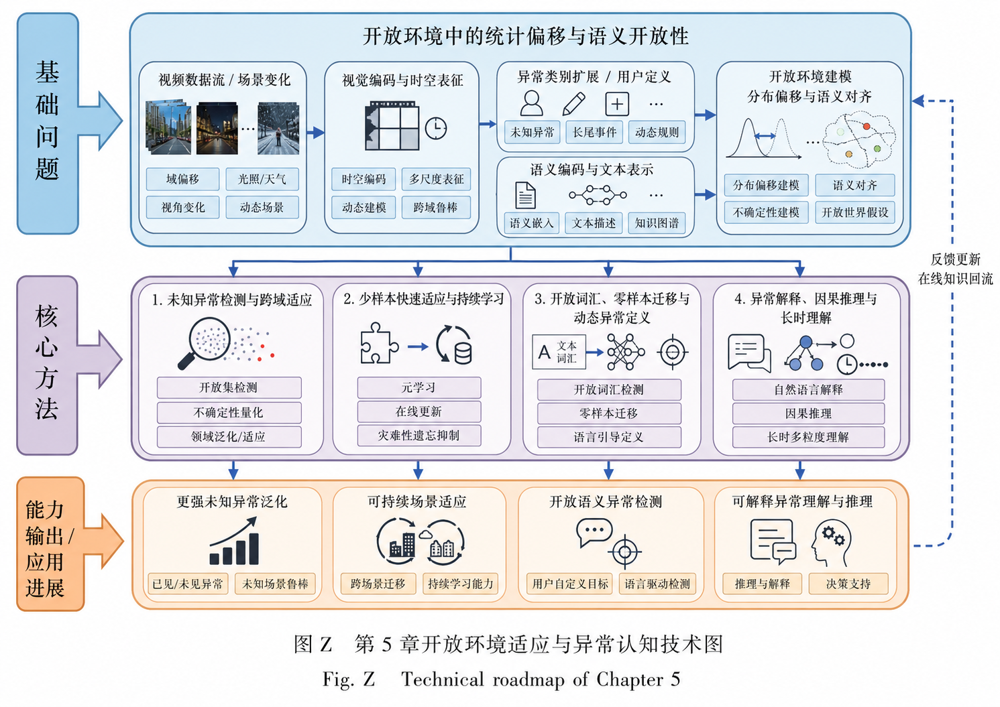

# 第1章 绪论
# 第2章 视频异常检测基础与统一分类框架

# 第3章 正常性先验驱动的视频异常检测

视频异常事件通常具有发生频率低、类别难以穷举和标注成本高等特点。在许多实际场景中，训练数据主要由正常视频构成，异常样本数量较少，甚至完全不可获得。因此，早期及当前大量视频异常检测方法并不直接学习具体异常类别，而是首先建立正常视频的外观、运动、对象关系或时序演化模式，再将测试阶段中偏离正常模式的内容判定为异常。

正常性先验驱动方法的核心假设是：正常事件具有一定规律性和重复性，可以从训练数据中学习；异常事件由于不符合所学规律，会表现为较大的重建误差、预测误差、原型距离或较低的正常分布似然。根据正常性知识的表示方式，现有研究可以分为四条主要路线：生成式正常性建模、原型与记忆约束、正常特征空间与概率分布建模，以及混合无标签数据中的异常发现与自训练。

## 3.1 生成式正常性建模：重建、预测与事件恢复

生成式方法是深度视频异常检测中较早形成的技术路线。其基本思想是利用正常视频训练重建模型或预测模型，使模型能够恢复符合正常规律的视频内容。当测试视频中出现训练阶段没有观察到的事件时，模型难以准确恢复相应外观、运动或时序变化，由此产生较大的异常误差。

早期研究主要使用自编码器重建当前视频帧或短时片段，随后逐渐转向未来帧预测、外观—运动一致性学习、重建与预测联合建模以及事件级恢复。研究重点也由“能否还原像素”逐步发展为“能否恢复完整的正常事件结构”。

| 论文名                                                                                                                                         | 简洁表述                                                          | 关键词                      | 解决问题                                         | 缺点                                                      | 备注                                 |
| ------------------------------------------------------------------------------------------------------------------------------------------- | ------------------------------------------------------------- | ------------------------ | -------------------------------------------- | ------------------------------------------------------- | ---------------------------------- |
| **Learning Temporal Regularity in Video Sequences**，CVPR 2016                                                                               | 使用卷积自编码器学习正常视频中的外观与时间规律，并依据测试视频的重建误差计算异常分数，是深度重建式视频异常检测的重要起点。 | 卷积自编码器；正常性建模；重建误差；时空规律   | 解决传统手工特征难以统一描述复杂正常行为的问题，使模型能够从正常视频中自动学习时空表示。 | 高容量自编码器可能同时重建正常和异常内容；像素误差容易受到光照、背景和摄像机噪声影响。             | 适合作为3.1的起点，重点介绍“正常可重建、异常难重建”的基础假设。 |
| **Future Frame Prediction for Anomaly Detection**，CVPR 2018                                                                                 | 将视频异常检测转换为未来帧预测任务，认为正常事件具有较稳定的时间演化规律，而异常事件会导致未来帧预测质量下降。       | 未来帧预测；生成对抗学习；时间规律；预测误差   | 缓解单纯重建当前输入时模型容易直接复制图像内容、缺少运动建模的问题。           | 未来视频具有多种合理变化，正常的快速运动、遮挡和光照变化也可能造成较大预测误差；短时预测难以发现长时逻辑异常。 | 是由帧重建转向时序预测的重要代表。                  |
| **Anomaly Detection in Video Sequence with Appearance–Motion Correspondence**，ICCV 2019                                                     | 不再单纯依据像素重建误差，而是学习正常视频中外观信息与运动信息之间的对应关系，并依据对应关系被破坏的程度判断异常。     | 外观—运动对应；跨模态一致性；运动建模；正常关系 | 解决单一外观特征难以识别运动异常，以及单一运动特征容易忽略对象身份和场景信息的问题。   | 外观与运动估计本身可能存在误差；正常但罕见的外观—运动组合仍可能被误判为异常。                 | 代表异常依据由“像素恢复误差”转向“正常关系一致性”。        |
| **HF²-VAD: A Hybrid Video Anomaly Detection Framework via Memory-Augmented Flow Reconstruction and Flow-Guided Frame Prediction**，ICCV 2021 | 将光流重建和光流引导的视频帧预测结合，同时建模正常运动结构与外观变化，并引入记忆机制限制正常模式范围。           | 光流重建；帧预测；混合生成；记忆增强       | 解决仅依赖外观重建或仅依赖运动预测时信息不完整的问题。                  | 框架包含光流估计、记忆读取和帧预测等多个模块，误差可能逐级累积；计算复杂度较高。                | 可作为重建、预测和记忆机制融合的代表。                |
| **Video Event Restoration Based on Keyframes for Video Anomaly Detection**，CVPR 2023                                                        | 根据部分关键帧恢复完整视频事件，使模型从单帧和短期变化进一步学习事件级时序结构，并依据事件恢复质量检测异常。        | 关键帧；事件恢复；长时结构；事件级异常      | 解决单帧重建和相邻帧预测难以覆盖完整事件过程的问题。                   | 关键帧选择可能遗漏异常发生前后的重要信息；长时恢复仍可能受到正常事件多样性的影响。               | 代表生成式VAD由帧级恢复向事件级恢复发展。             |
| **Diversity-Measurable Anomaly Detection**，CVPR 2023                                                                                        | 针对自编码器既需要覆盖多样正常模式、又不能过度重建异常的矛盾，对模型可恢复内容的多样性进行显式建模和控制。         | 重建多样性；异常过泛化；生成能力控制；正常覆盖  | 解决生成模型容量过弱无法覆盖正常变化、容量过强又会重建异常的两难问题。          | 正常多样性与异常过泛化之间仍难以设定统一边界；多样性度量可能依赖具体数据分布。                 | 适合放在3.1末尾，用于总结生成模型容量控制问题。          |

这一技术路线可以概括为：

> **帧重建 → 未来帧预测 → 外观—运动一致性 → 重建与预测融合 → 事件级恢复 → 重建多样性控制**

这一阶段的核心问题是：

> 模型能否学习足够丰富的正常变化，同时又避免将异常事件也作为可恢复内容？

在分析生成式方法时，需要区分三种不同层面的误差。第一种是像素误差，主要反映预测图像与真实图像之间的低层视觉差异；第二种是特征误差，反映深层视觉表示之间的差异；第三种是语义异常，强调事件是否违反场景规则或正常行为逻辑。三者之间并不完全一致。较大的像素误差可能只是由光照变化或摄像机抖动引起，而某些语义上明显异常的事件，在外观和运动上仍然可能被生成模型较好地恢复。

现有生成式方法主要面临以下问题：

1. **异常过泛化**：生成器具有较强表达能力时，可能同样准确地重建异常输入。
   
2. **误差与异常语义不一致**：低层视觉误差不能充分表示场景规则和行为逻辑。
   
3. **正常未来具有多解性**：未来帧不存在唯一正确结果，预测误差不一定来自异常。
   
4. **时间范围有限**：短时重建和预测难以处理需要长时间上下文才能判断的异常。
   
5. **视觉噪声敏感**：遮挡、低照度、压缩噪声和摄像机运动可能导致误报。
   

因此，后续研究开始通过正常原型和记忆模块限制生成模型能够调用的正常模式，避免模型无约束地恢复所有输入。

## 3.2 原型与记忆驱动的正常模式约束

记忆网络和原型学习方法主要针对生成模型的异常过泛化问题。其核心思想是将正常视频压缩为有限数量的代表性模式，并要求模型在重建、预测或异常判别时只能调用这些正常参考。若测试输入与已有正常原型差异较大，模型就难以获得合适的记忆内容，从而产生较高的异常分数。

随着研究发展，正常记忆由静态特征存储逐步扩展为可学习记忆、动态原型和空间—时间双记忆。部分方法还放弃了解码器重建，直接在特征空间中检索与测试样本最相似的正常参考。

|论文名|简洁表述|关键词|解决问题|缺点|备注|
|---|---|---|---|---|---|
|**Memorizing Normality to Detect Anomaly: Memory-Augmented Deep Autoencoder**，ICCV 2019|在编码器和解码器之间加入记忆模块，使用有限记忆项保存典型正常模式，并通过稀疏读取减少异常输入被准确重建的可能性。|记忆增强自编码器；正常模式；稀疏读取；异常过泛化|解决普通自编码器容量过强、异常样本也能够被较好重建的问题。|固定数量的记忆项可能无法覆盖复杂正常模式；记忆初始化和更新方式会影响检测稳定性。|是记忆增强视频异常检测的代表性起点。|
|**Learning Memory-Guided Normality for Anomaly Detection（MNAD）**，CVPR 2020|引入正常原型更新机制，并利用紧凑性约束和分离性约束提高记忆项的代表性与判别性，同时支持重建式和预测式框架。|记忆更新；紧凑性；分离性；正常原型|解决早期记忆模块中原型区分度不足、正常样本可能对应多个模糊记忆项的问题。|记忆更新依赖训练数据质量；原型数量和约束权重需要人工设置；仍存在异常模式与正常原型相近的问题。|可重点分析记忆项如何由“存储结构”发展为“可学习正常原型”。|
|**Learning Normal Dynamics in Videos with Meta Prototype Network**，CVPR 2021|使用动态原型单元描述正常运动变化，并通过元学习使原型能够利用少量目标场景数据快速适应新环境。|动态原型；正常动力学；元学习；场景适应|解决固定记忆库难以适应新摄像场景和动态正常模式的问题。|在线或快速更新过程中可能吸收未标记异常；少量目标样本难以覆盖长期正常变化。|在本节介绍动态原型机制，在第5.2节重点讨论少样本场景适应。|
|**VideoPatchCore: An Effective Method to Memorize Normality for Video Anomaly Detection**，ACCV 2024|将图像异常检测中的PatchCore思想扩展到视频，通过空间和时间记忆库存储正常外观与正常运动特征，并依据最近邻距离检测异常。|PatchCore；特征记忆库；空间记忆；时间记忆；最近邻检索|解决生成式方法训练复杂、解码器可能过度恢复异常的问题，直接在特征空间中建立正常参考。|记忆库规模可能较大；检索成本随样本数量增加；预训练特征未必适合所有监控异常。|代表由“重建式记忆”向“检索式正常参考”发展。|

这一阶段的核心问题是：

> 有限数量的正常原型能否充分覆盖正常行为，同时保持与异常行为之间的判别距离？

原型与记忆方法需要重点比较以下几个方面：

- 记忆中保存的是像素模式、深层特征、对象特征还是运动模式；
  
- 记忆项是固定的、端到端学习的，还是能够根据新场景在线更新；
  
- 测试样本通过稀疏读取、注意力匹配还是最近邻检索调用正常模式；
  
- 原型数量过少是否导致正常模式覆盖不足；
  
- 原型数量过多是否使正常空间过度扩张；
  
- 异常样本是否可能污染动态更新的正常记忆。
  

其发展过程可以概括为：

> **静态正常记忆 → 可学习判别性记忆 → 动态场景原型 → 空间与时间双记忆 → 检索式正常参考**

相比无约束生成模型，原型和记忆方法能够更明确地限制正常模式范围。但其性能高度依赖记忆是否具有代表性。若正常行为本身具有明显长尾分布，有限记忆项可能将罕见正常事件误判为异常；若允许记忆持续更新，又需要防止漏检异常被吸收到正常模型中。

## 3.3 正常特征空间与分布建模

重建和记忆方法通常需要通过生成误差或检索距离间接判断异常。另一类方法则直接在深层特征空间中建立正常分布、正常子空间或单类决策边界。当测试样本位于正常特征空间之外，或在正常概率分布下具有较低似然时，模型将其判定为异常。

根据正常空间的建模方式，该类方法可以进一步分为单类判别边界、场景感知对比表征、显式概率密度估计和多粒度结构化分布建模。

| 论文名                                                                                                  | 简洁表述                                                                                         | 关键词                    | 解决问题                                      | 缺点                                            | 备注                   |
| ---------------------------------------------------------------------------------------------------- | -------------------------------------------------------------------------------------------- | ---------------------- | ----------------------------------------- | --------------------------------------------- | -------------------- |
| **GODS: Generalized One-Class Discriminative Subspaces for Anomaly Detection**，ICCV 2019             | 通过多个判别超平面构造紧凑的一类正常特征子空间，使正常样本集中于有限区域，并依据样本偏离正常子空间的程度检测异常。                                    | 单类学习；判别子空间；超平面；正常边界    | 解决仅依赖重建误差时正常与异常特征缺少明确决策边界的问题。             | 正常分布复杂时，有限超平面难以准确描述非线性结构；边界对特征质量较敏感。          | 可作为判别式单类正常空间建模的起点。   |
| **Normalizing Flows for Human Pose Anomaly Detection（STG-NF）**，ICCV 2023                             | 使用时空图归一化流对人体骨架序列进行显式概率密度建模，将低似然姿态和运动序列判定为异常。                                                 | 归一化流；人体姿态；时空图；显式似然     | 解决重建式模型难以准确计算正常数据概率，以及背景变化容易干扰异常判断的问题。    | 主要依赖人体骨架，难以覆盖车辆、物体状态和人物—物体交互异常；姿态估计错误会直接影响结果。 | 代表结构化姿态特征与显式密度估计结合。  |
| **Hierarchical Semantic Contrast for Scene-Aware Video Anomaly Detection**，CVPR 2023                 | 通过层次化语义对比学习，使特征同时保留动作信息和场景条件，处理同一动作在不同场景中可能具有不同异常属性的问题。                                      | 对比学习；场景感知；语义层次；上下文异常   | 解决忽略场景条件时，模型容易将跨场景正常行为混淆或形成统一但错误的异常边界的问题。 | 场景标签或语义分组的质量会影响对比学习；复杂场景规则难以仅通过视觉对比关系完整表达。    | 适合强调VAD中的场景依赖性。      |
| **MULDE: Multiscale Log-Density Estimation via Denoising Score Matching**，CVPR 2024                  | 在多个噪声尺度上估计视频特征的对数密度，使模型能够描述复杂、多峰和多尺度的正常分布。                                                   | 对数密度估计；去噪得分匹配；多尺度；概率建模 | 解决单一尺度概率模型难以覆盖复杂正常特征分布的问题。                | 多尺度密度估计增加训练复杂度；低密度样本仍可能是罕见正常而不是真实异常。          | 代表由简单似然估计向多尺度得分建模发展。 |
| **Object-Centric Auto-Encoders and Dummy Anomalies for Abnormal Event Detection in Video**，CVPR 2019 | 采用对象中心自编码器提取外观和运动特征，并对正常对象特征进行聚类；在one-versus-rest学习中，以其他正常簇构造dummy anomalies，增强正常子类别之间的判别边界。 | 对象中心；正常聚类；代理异常；一类判别    | 解决整帧建模容易受背景干扰、单一正常空间难以表示多模态正常行为的问题。       | 依赖对象检测和聚类质量；dummy anomalies与真实异常仍存在差异。        | 代表对象级正常特征空间与代理负样本建模。 |
这一阶段的核心问题是：

> 模型能否建立既紧凑又具有足够覆盖能力的正常特征空间，并将罕见正常行为与真实异常区分开来？

需要注意的是，低概率或低似然并不必然等同于异常。某些事件虽然在训练数据中很少出现，但仍然符合场景规则，例如极少见的正常职业行为、特殊天气条件或罕见的人群运动。相反，某些异常事件在外观和动作层面可能十分常见，只是在特定场景中违反规则。因此，仅依赖统计偏离难以完整表达上下文异常。

现有正常特征空间与分布方法主要面临以下问题
1. **罕见正常与异常混淆**：训练分布之外的内容可能只是未覆盖的正常行为。
2. **特征表示依赖明显**：密度估计和边界质量高度依赖特征提取器。
3. **高维密度估计困难**：复杂视频特征通常具有多峰、非线性和多尺度特征。
4. **场景分布发生变化**：摄像机、背景和对象构成变化会改变正常特征分布。
5. **结构化信息覆盖不全**：姿态或对象级表示难以覆盖所有异常类型。
6. **似然与语义规则脱节**：高概率事件仍可能违反特定场景规范。
因此，正常分布建模正在由单一低层特征密度估计，逐步转向场景条件、多粒度表示和结构化对象关系建模。

## 3.4 自监督学习与混合无标签异常发现

### 3.4.1 正常训练数据上的自监督学习

|论文|简洁表述|关键词|解决问题|局限性|备注|
|---|---|---|---|---|---|
|**Anomaly Detection in Video via Self-Supervised and Multi-Task Learning**，CVPR 2021|利用视频自身结构构造多个自监督代理任务，从对象外观、运动和时间规律等不同角度学习正常表征，并联合多任务响应进行异常检测。|自监督学习；多任务；对象级表征；时空规律|缓解单一重建或预测任务只能利用有限正常线索的问题，使模型在无异常标签条件下学习更丰富的正常时空特征。|代理任务仍是人为设计，其难度和学习目标与真实异常语义之间可能存在差距；多任务设计也增加训练复杂度。|**核心论文。** 代表VAD由单一生成目标向多种自监督信号联合学习发展。|
|**Video Anomaly Detection by Solving Decoupled Spatio-Temporal Jigsaw Puzzles**，ECCV 2022|将空间拼图和时间拼图解耦，使模型分别学习正常对象的空间排列和时间顺序，再依据代理任务完成情况判断异常。|时空拼图；自监督；空间结构；时间顺序|解决单一代理任务难以同时描述正常外观结构与时间演化的问题。|拼图任务与真实异常仍存在语义差距，任务难度和采样策略会影响学习效果。|代表自监督任务由一般多任务学习向显式时空结构约束发展。|
|**Multi-Scale Video Anomaly Detection by Multi-Grained Spatio-Temporal Representation Learning**，CVPR 2024|通过连续性判断、断点定位和缺失帧估计等多粒度代理任务，同时学习局部与全局时空表征。|多粒度自监督；连续性；断点定位；缺失帧估计|解决固定空间粒度或单一时间尺度难以同时覆盖局部异常和较长时间结构变化的问题。|多粒度任务增加模型复杂度，代理任务仍难直接表示场景规则和高层异常语义。|**建议保留。** 应归入3.4，而不是3.3概率分布建模。|
|**Self-Distilled Masked Auto-Encoders Are Efficient Video Anomaly Detectors**，CVPR 2024|将掩码自编码、自蒸馏和合成异常结合，用视频内部恢复任务及教师—学生差异增强无标签异常检测表征。|Masked Autoencoder；自蒸馏；合成异常；高效VAD|解决传统重建网络计算量较大、单一恢复误差判别能力有限的问题。|本质上仍部分依赖恢复或表示差异；视觉上接近正常模式的语义异常可能缺乏明显响应。|作为自监督VAD向掩码学习和高效模型发展的代表。|

### 3.4.2 混合无标签数据中的异常发现

|论文|简洁表述|关键词|解决问题|局限性|备注|
|---|---|---|---|---|---|
|**Deep Anomaly Discovery from Unlabeled Videos via Normality Advantage and Self-Paced Refinement**，CVPR 2022|利用未标注视频中正常样本数量更多、规律更稳定的“正常性优势”获得初始异常估计，再通过自步细化逐步筛除可疑样本并优化正常模型。|混合无标签；正常性优势；自步学习；异常发现|放宽“训练集必须全部正常”的假设，降低人工筛选纯正常训练集的成本。|初始异常估计错误可能在迭代过程中被强化；当异常比例较高或正常模式高度多样时，正常性优势可能减弱。|**核心论文。** 适合作为由纯正常训练转向混合无标签训练的关键节点。|
|**Generative Cooperative Learning for Unsupervised Video Anomaly Detection**，CVPR 2022|通过生成模块与异常判别模块之间的协同学习，从混合无标签视频中逐步建立正常模式并发现异常候选。|生成协同学习；混合数据；伪标签；迭代优化|缓解单一生成模型容易吸收异常，以及单一判别模型缺少可靠异常监督的问题。|不同模块之间存在相互依赖，错误候选可能形成错误强化，训练稳定性要求较高。|代表从单模型异常发现发展到生成与判别协同优化。|
|**Learning Anomalies with Normality Prior for Unsupervised Video Anomaly Detection**，ECCV 2024|在混合无标签训练数据中引入正常性先验，根据正常模式与潜在异常之间的关系主动学习异常表征。|正常性先验；无监督异常学习；混合训练集；异常表征|解决传统无监督方法主要学习正常模式、没有主动利用训练集中潜在异常信息的问题。|正常性先验不准确会影响异常候选筛选；异常比例和类别均未知时，稳定学习仍较困难。|代表研究由“避免异常污染”进一步发展为“主动利用潜在异常”。|

这一阶段的核心问题是：

> 在不知道哪些训练样本属于异常的情况下，模型能否利用正常数据的统计优势，逐步发现异常，同时避免错误伪标签不断累积？

混合无标签异常发现通常包含以下过程：

- 建立初始正常性模型；
- 依据重建误差、特征距离或异常分数筛选样本；
- 选择高置信度正常样本和异常候选；
- 利用伪标签重新训练或更新模型；
- 逐步扩大可靠训练集合；
- 对低置信度样本进行延迟判断或多轮 refinement。

与前面的一类学习不同，本节并不假设训练集全部正常。其关键风险是伪标签错误累积。一旦初始模型将异常样本判为正常，这些样本可能被用于更新正常原型，使正常边界进一步扩张；反之，若将罕见正常样本判为异常，模型可能不断强化错误分离。

混合无标签方法仍面临以下问题：

1. 无法事先确定训练集中的异常比例；
2. 初始正常性模型可能受到异常污染；
3. 自训练容易形成确认偏差；
4. 伪异常或异常候选未必覆盖真实异常类型；
5. 不同论文对“无监督”的定义和训练数据设定不完全一致；
6. 缺少统一协议比较纯正常训练与混合无标签训练方法。
## 3.5 本章总结

正常性先验驱动的视频异常检测经历了由低层视觉恢复到高层正常结构建模的发展过程：

>生成式正常性建模 → 原型与记忆约束 → 正常特征空间与分布建模 → 自监督学习与混合无标签异常发现

四类方法的核心区别在于正常性知识及监督信号的构造方式。生成式方法将正常性表示为视频内容的可恢复性；记忆与原型方法将正常性表示为有限正常参考；特征空间与分布方法直接描述正常边界、子类别或高概率区域；自监督方法利用视频内部结构构造代理监督，而混合无标签方法进一步放宽纯正常训练假设，从未标注数据中主动发现潜在异常。

# 第4章 标签判别驱动的视频异常检测

正常性先验方法主要通过学习正常模式检测偏离，但其判别能力受到正常分布覆盖范围和异常语义缺失的限制。当异常标签能够获得时，研究者可以直接利用正常与异常之间的监督信息学习判别边界，从而增强对复杂异常事件的识别和定位能力。

根据标签粒度，标签判别驱动方法可以分为密集监督、稀疏监督和视频级弱监督。密集监督提供帧级、时间边界、空间位置或异常类别信息；稀疏监督只标注少量关键帧、时间点或粗略区间；视频级弱监督只说明整个视频是否包含异常。由于视频级标签无法直接指出异常发生位置，相关研究进一步发展出多实例学习、伪标签优化和细粒度时间边界补全方法。

## 4.1 密集监督下的细粒度异常检测

密集监督方法能够获得较完整的异常标注，包括逐帧正常—异常标签、异常开始与结束时间、空间框、目标轨迹、像素掩码、异常类别以及事件属性等。模型可以直接学习异常事件的视觉表现和时间边界，并进一步完成异常分类、空间定位和事件描述。

相比只使用正常视频的一类方法，密集监督能够利用真实异常样本建立明确的判别边界。但异常事件本身发生频率较低，逐帧和逐目标标注又需要较高人工成本，因此密集监督数据集的规模通常受到限制。

| 论文名                                                                                                             | 简洁表述                                                        | 关键词                    | 解决问题                                       | 缺点                                          | 备注                |
| --------------------------------------------------------------------------------------------------------------- | ----------------------------------------------------------- | ---------------------- | ------------------------------------------ | ------------------------------------------- | ----------------- |
| **Joint Detection and Recounting of Abnormal Events by Learning Deep Generic Knowledge**，ICCV 2017              | 利用异常事件的时空标注和语义属性，同时完成异常事件检测、位置定位和异常内容描述，是较早将异常检测与异常重述结合的工作。 | 全监督VAD；时空定位；异常属性；事件描述  | 解决传统异常检测只能输出异常分数，无法说明异常发生位置和事件内容的问题。       | 依赖细粒度时空和语义标注，数据构建成本高；异常类别和属性通常由数据集预先定义。     | 可作为全监督异常定位与解释的起点。 |
| **Anomaly Detection in Video Sequences: A Benchmark and Computational Model**，IET Image Processing 2021         | 构建LAD数据集，提供视频级异常类别和帧级异常标签，并将视频异常检测建模为异常分类与时间定位的多任务学习问题。     | LAD；全监督分类；帧级标签；多任务学习   | 解决传统数据集主要提供二元异常标签、缺少异常类别识别和细粒度监督的问题。       | 数据集规模和场景覆盖可能限制模型泛化；全监督模型容易记忆已有异常类别。         | 适合作为密集监督分类与定位的代表。 |
| **Fine-VAD: Towards Fine-Grained Video Anomaly Detection via Progressive Cross-Granularity Learning**，CVPR 2026 | 将视频异常检测扩展到更细粒度的异常类型和跨粒度学习，使模型能够在粗粒度异常判断与细粒度类别识别之间逐步传递监督信息。  | 细粒度VAD；跨粒度学习；异常分类；渐进学习 | 解决二元正常—异常判断无法区分相近异常类别，以及不同标注粒度之间缺少信息共享的问题。 | 依赖细粒度类别和层次标签；类别体系可能具有数据集依赖性；对完全未知异常的能力仍需验证。 | 适合作为密集语义监督的最新发展。  |

这一阶段的核心问题是：

> 在获得异常时间、空间和类别标注后，模型能否同时完成准确检测、精细定位和异常语义识别？

密集监督可以按照标注内容进一步区分：

- **帧级标签**：标明每一帧是否异常；
  
- **时间边界**：给出异常事件的开始时间和结束时间；
  
- **空间标注**：提供异常主体框、轨迹或像素掩码；
  
- **异常类别**：指出异常属于斗殴、闯入、交通事故等具体类型；
  
- **异常属性**：描述参与者、动作、对象和场景关系；
  
- **自然语言标注**：进一步提供事件描述和异常理由。
  

密集监督方法的优势是能够直接优化细粒度目标，减少视频级弱标签引入的时间定位歧义。但其局限同样明显：异常标注成本高，不同标注者对异常开始和结束时间可能存在分歧；异常类别通常由数据集预先设定，使模型容易形成闭集依赖；训练集中没有出现的异常类别仍可能被漏检。

## 4.2 稀疏监督与标注高效学习

密集监督方法需要标注异常事件的完整开始时间、结束时间或逐帧状态，标注者往往需要反复播放视频并仔细判断异常边界，因而难以扩展到大规模长视频。视频级弱监督虽然只需说明视频是否包含异常，但缺少异常发生位置，容易使模型关注异常视频中的背景、对象类别或最显著片段。稀疏监督试图在两者之间建立中间形式：只为每个异常视频或异常事件提供一个或少数几个时间点，使模型在保持较低标注成本的同时获得明确的异常位置提示。

相关研究可以按照监督信息的利用方式分为三个阶段：首先，使用单帧或Glance标注为模型提供异常种子；其次，将稀疏异常点向邻近片段传播，恢复完整异常事件；最后，通过主动学习选择信息价值更高的帧，进一步提高单位标注成本所带来的性能收益。

### 4.2.1 从视频级标签到单帧异常监督

早期弱监督VAD仅提供视频级正常或异常标签，模型需要在没有位置提示的情况下自行寻找异常片段。这种设定虽然标注成本低，但异常视频中的绝大多数片段仍然正常，容易造成实例选择偏差。单帧监督在视频级标签基础上增加一个异常时间点，使模型能够获得可靠的局部异常参考。

GlanceVAD提出为每个异常事件标注一个随机异常帧，并将其称为Glance annotation。该标注方式不要求人工确定精确边界，只需在确认异常事件后点击其中一帧。为了从离散Glance点产生连续异常监督，该方法使用时间高斯核表示潜在异常事件，通过初始化和更新多个高斯核生成平滑伪标签。

在此基础上，SF-VAD进一步采用每个异常视频一个异常帧的监督形式，并通过Frame-guided Progressive Learning将单帧参考扩展到事件级理解。模型先利用证据学习估计其他片段与标注帧之间的异常相关性，再结合特征相似度挖掘潜在异常事件，同时从事件外区域中分离正常模式，以降低误报。

这一阶段的核心问题是：

> 一个异常帧能否为完整异常事件提供足够可靠的监督，并在大幅降低标注成本的同时避免视频级弱监督中的位置歧义？

两篇VAD核心论文的区别可以概括为：

|比较内容|GlanceVAD|SF-VAD|
|---|---|---|
|标注单位|每个异常事件一个Glance点|每个异常视频一个异常帧|
|稠密监督生成|时间高斯核渲染|异常相关性与事件挖掘|
|主要目标|生成平滑连续的异常分布|从单帧推广到离散异常事件|
|主要风险|高斯分布未必符合真实边界|一个视频中的多个异常可能遗漏|

### 4.2.2 从稀疏标注点到完整异常区间

单帧标注只说明某一时刻属于异常，却没有指出事件何时开始、何时结束。如果模型仅围绕标注帧进行局部训练，容易只检测异常中视觉表现最明显的片段，产生碎片化结果。因此，稀疏监督的关键不只是识别标注点，而是将点监督扩展为完整事件监督。

时间动作定位领域为这一问题提供了较成熟的技术基础。SF-Net通过动作帧扩展和背景帧挖掘，将单帧标签转换为更多伪动作及伪背景监督；Learning Action Completeness From Points则进一步以标注点为种子搜索完整时间序列，并显式学习事件完整性。

但动作定位方法不能直接等同于异常检测。动作类别通常具有较明确的开始、发展和结束过程，而异常可能由短暂状态变化、长期行为积累、人物—物体关系或场景规则冲突共同构成。同一异常事件内部的视觉特征也可能发生较大变化。因此，将相邻动作帧扩展机制迁移到VAD时，需要防止以下问题：

- 将异常发生前后的正常上下文错误扩展为异常；
- 只扩展与标注帧外观相似的片段，遗漏异常的其他阶段；
- 将同一视频中的两个独立异常合并为一个区间；
- 将间断发生的异常强制建模为连续事件；
- 在长时间渐变异常中无法确定明确边界。

### 4.2.3 从随机标注到主动稀疏标注

现有Glance和单帧监督通常由人工在异常事件中随机选择或直接点击一个代表性帧，但视频中的不同帧并不具有相同的信息价值。若标注点位于遮挡、过渡或视觉线索较弱的位置，模型可能难以据此恢复完整异常事件。

主动稀疏标注为解决这一问题提供了新的方向。Are All Frames Equal?通过模型估计各帧的信息价值，主动选择最值得人工标注的帧，使有限标注预算集中于高不确定性或高代表性内容。虽然该工作针对视频动作检测，但其思想可以迁移到VAD：模型先从大量视频中筛选最需要人工确认的异常候选，再由标注者提供单帧、异常类型或正常—异常判断。

这一方向的核心问题是：

> 在标注预算固定时，应该随机标注异常帧，还是优先标注模型最不确定、最有代表性或最能确定事件边界的帧？

| 论文名                                                                                                                   | 简洁表述                                                                                                                                | 关键词                           | 解决问题                                                     | 缺点                                                                    | 备注                                                                                          |
| --------------------------------------------------------------------------------------------------------------------- | ----------------------------------------------------------------------------------------------------------------------------------- | ----------------------------- | -------------------------------------------------------- | --------------------------------------------------------------------- | ------------------------------------------------------------------------------------------- |
| **GlanceVAD: Exploring Glance Supervision for Label-efficient Video Anomaly Detection**，ICME 2025，CCF B               | 提出Glance标注范式，只需在每个异常事件内部随机标注一帧。模型以该帧为初始中心，通过Temporal Gaussian Splatting生成平滑、连续的异常伪标签，并逐步扩展到完整异常区间。                                  | Glance监督；单帧标注；时间高斯；稠密伪标签；标注高效 | 在视频级标签与完整时间边界之间建立中间监督形式，降低逐帧或边界标注成本，同时为模型提供明确的异常位置参考。    | 一个标注点不能直接给出异常边界；标注者仍需观看完整视频并识别每个异常事件；目前主要处理时间标注，没有利用空间位置；原文实验仍采用闭集设定。 | **4.2必选，是VAD中首次系统研究点监督或Glance监督的代表作。**论文为ICME 2025 Oral，并在UCF-Crime和XD-Violence上建立Glance标注。 |
| **Generalizing Single-Frame Supervision to Event-Level Understanding for Video Anomaly Detection**，NeurIPS 2025，CCF A | 提出Single-Frame supervised VAD，每个异常训练视频只标注一个异常帧；进一步提出Frame-guided Progressive Learning，先估计各帧与标注帧之间的异常相关性，再结合特征相似度挖掘离散异常事件，并分离事件外正常帧。 | 单帧监督；事件挖掘；证据学习；渐进学习；正常模式解耦    | 解决单个异常帧监督过于稀疏、模型难以由局部异常参考扩展到完整事件的问题。                     | 每个视频只标一帧时，可能遗漏视频中的多个异常事件；异常帧代表性会影响事件扩展；基于特征相似度扩展时，外观变化较大的同一异常可能被分割。   | **4.2必选，是GlanceVAD之后更直接的单帧监督VAD工作。**论文重新标注了ShanghaiTech、UCF-Crime和XD-Violence三个数据集。         |
| **SF-Net: Single-Frame Supervision for Temporal Action Localization**，ECCV 2020，CCF B                                 | 每个动作实例只标注一个时间帧，分别预测类别分数与actionness分数；以标注帧为种子向邻近时间扩展伪动作帧，并从未标注区域中挖掘伪背景帧，最终恢复完整动作区间。                                                  | 单帧监督；时间动作定位；动作帧扩展；背景挖掘；伪标签    | 为“如何从一个时间点恢复完整事件区间”提供了成熟的方法基础，是GlanceVAD等稀疏监督VAD的重要前置研究。 | 研究对象是预定义动作类别，不是开放、稀有和场景依赖的异常；相邻帧扩展假设动作内部具有连续且相似的视觉特征，对渐变异常和间断异常未必适用。  | **不是VAD论文，不应作为本节核心VAD方法展开，但适合放在技术来源或方法启发部分。**该论文当前已有较高引用，是单帧监督时间定位的代表性工作。                   |
| **Learning Action Completeness From Points for Weakly-Supervised Temporal Action Localization**，ICCV 2021，CCF A       | 针对点监督只能定位动作局部、容易产生碎片化区间的问题，先挖掘伪背景点，再以标注点为种子搜索最可能覆盖完整动作实例的最优时间序列，并利用动作分数和特征相似度约束学习事件完整性。                                             | 点监督；事件完整性；最优序列搜索；伪背景；时间边界     | 解决单帧或点监督模型只识别事件最显著部分、不能覆盖完整异常过程的问题，可为VAD中的异常区间补全提供方法依据。  | 依赖动作连续性和类别一致性；异常事件可能存在中断、多个阶段或明显外观变化，不能直接照搬动作定位中的完整性假设。               | **可作为4.2中“由标注点恢复完整异常事件”的关键方法基础。**论文报告其点标注成本约为完整边界标注的六分之一。                                   |
| **Are All Frames Equal? Active Sparse Labeling for Video Action Detection**，NeurIPS 2022，CCF A                        | 提出主动稀疏标注方法，不再随机选择待标注帧，而是通过帧级信息价值评分主动选择最值得人工标注的帧，并设计适合稀疏标签训练的损失函数。                                                                   | 主动学习；稀疏帧标注；信息帧选择；标注预算；视频动作检测  | 解决随机单帧标注可能缺少代表性的问题，使有限标注预算集中在不确定、信息量较高或具有代表性的帧上。         | 需要多轮“模型选择—人工标注—模型更新”过程，实际工作流比一次性Glance标注复杂；研究任务是动作检测而不是异常检测。          | **适合用于4.2的未来方向或标注策略部分，说明研究可由被动随机标注发展到主动选择异常帧。**原论文使用少量帧标注取得接近完整监督的动作检测性能。                   |

## 4.3 视频级弱监督与多实例异常判别

视频级弱监督是当前真实监控视频异常检测中的重要研究设定。训练阶段只提供视频级正常或异常标签，不标注异常具体发生在哪些片段。由于异常视频中通常只有少量时间段真正异常，其余大部分片段仍然正常，因此研究者通常将异常视频视为正包、正常视频视为负包，并使用多实例学习从包级标签推断片段级异常分数。

弱监督多实例学习的发展主要经历了排序学习、特征幅值判别、粗细粒度联合建模、无偏风险估计和上下文关系学习等阶段。

|论文名|简洁表述|关键词|解决问题|缺点|备注|
|---|---|---|---|---|---|
|**Real-World Anomaly Detection in Surveillance Videos**，CVPR 2018|将异常视频视为正包、正常视频视为负包，通过排序损失要求异常视频中最高分片段的异常分数高于正常视频片段，奠定真实长视频弱监督VAD的MIL范式。|多实例学习；排序损失；视频级标签；UCF-Crime|解决真实长视频难以获得逐帧异常标注的问题，使模型能够从视频级标签学习片段异常分数。|只关注正包中最高分片段，容易遗漏完整异常区间；模型可能学习场景或类别捷径。|是4.3必须重点介绍的MIL起点。|
|**RTFM: Weakly-Supervised VAD with Robust Temporal Feature Magnitude Learning**，ICCV 2021|从直接比较异常分数转向学习正常与异常片段的特征幅值差异，并使用Top-k片段增强异常表征。|特征幅值；Top-k；鲁棒时序特征；弱监督VAD|解决传统排序MIL只依赖单个最高分片段、异常特征判别性不足的问题。|特征幅值不一定与异常程度稳定对应；Top-k仍可能偏向少数显著片段。|代表MIL由分数排序向判别表征学习发展。|
|**MGFN: Magnitude-Contrastive Glance-and-Focus Network**，AAAI 2023|结合全局粗粒度观察、局部重点建模和幅值对比学习，使模型既分析长视频整体结构，又集中处理可疑异常片段。|粗细粒度联合；幅值对比；Glance-and-Focus；长视频|解决仅局部分析容易缺少上下文、仅全局分析又容易稀释稀疏异常的问题。|粗粒度分支和局部分支之间的选择仍依赖初始异常响应；可能忽略弱显著异常。|可与RTFM形成“幅值学习—粗细联合”的演进关系。|
|**Unbiased Multiple Instance Learning for Weakly Supervised VAD**，CVPR 2023|指出传统MIL容易受到正包中大量正常片段的影响，并通过无偏风险估计和自训练降低弱标签带来的学习偏差。|无偏MIL；弱标签噪声；风险估计；自训练|解决异常视频中大量正常片段被隐式当作异常样本，导致模型学习有偏的问题。|无偏估计依赖理论假设和数据分布；伪标签错误仍可能影响自训练结果。|代表弱监督VAD由经验改进转向MIL偏差的理论分析。|
|**Look Around for Anomalies: Context-Motion Relational Learning**，CVPR 2023|利用异常候选片段周围的上下文信息和运动关系进行判断，避免模型只根据局部显著外观识别异常。|上下文关系；运动关系；时序邻域；异常判别|解决局部片段本身难以确定是否异常，以及相同动作在不同上下文中含义不同的问题。|上下文窗口范围难以统一设置；较远时间范围的因果关系仍可能无法覆盖。|代表由孤立片段评分向关系感知异常判别发展。|

这一阶段的核心问题是：

> 在只有视频级标签的情况下，模型能否找到真正异常的时间片段，而不是只学习异常视频中的背景、对象或最显著瞬间？

其技术演进可以概括为：

> **排序MIL → 特征幅值判别 → 粗细粒度联合 → 无偏MIL → 上下文关系建模**

传统排序MIL假设异常视频中至少存在一个高异常分数片段，因此通过最大值或Top-k实例完成包级分类。但该假设容易使模型只发现最显著异常，忽略异常事件的完整持续范围。特征幅值和对比学习试图增强异常实例与正常实例之间的表示差异，无偏MIL则进一步指出，异常包中包含大量正常片段，会使普通正负包学习产生系统性偏差。

视频级弱监督方法需要重点分析以下问题：

1. **正包标签噪声**：异常视频中的大多数片段仍然正常。
   
2. **Top-k选择偏差**：模型容易反复选择最显著的少量异常片段。
   
3. **类别不平衡**：正常片段数量远高于异常片段。
   
4. **场景捷径学习**：模型可能根据背景、摄像角度或视频来源判断异常。
   
5. **异常完整性不足**：能够检测异常峰值，但无法覆盖完整事件区间。
   
6. **多异常事件遗漏**：同一视频出现多个异常时，模型可能只识别其中一个。
   
7. **上下文建模不足**：局部动作需要结合前后事件和场景规则判断。
   

由于MIL产生的片段级异常响应通常比较粗糙，后续研究进一步利用伪标签清理、自训练和连续时间建模提高时间定位精度。

## 4.4 伪标签细化与异常时间边界补全

视频级弱监督模型通常能够生成初始片段级异常分数，但这些分数并不等同于真实帧级标签。高分区域可能只覆盖异常事件中最显著的部分，低分区域也可能包含异常发生前后的关键阶段。因此，伪标签优化方法尝试将MIL产生的粗粒度响应转换为更可靠的片段级或帧级监督，再通过自训练提升异常时间定位能力。

相关研究的发展经历了标签噪声清理、MIL自训练、伪标签完整性与不确定性建模、显著响应抑制以及连续时间边界建模等阶段。

|论文名|简洁表述|关键词|解决问题|缺点|备注|
|---|---|---|---|---|---|
|**Graph Convolutional Label Noise Cleaner**，CVPR 2019|将异常视频中的片段初始化为带噪声标签，再利用图卷积建模片段关系并清理错误标签，获得更可靠的片段级监督。|图卷积；标签噪声清理；片段关系；伪标签|解决视频级异常标签无法区分异常片段与正常片段的问题。|初始标签设置较粗糙；图关系不准确时可能传播错误标签。|可作为弱监督伪标签清理的早期起点。|
|**MIST: Multiple Instance Self-Training Framework for VAD**，CVPR 2021|先使用MIL模型生成片段级伪标签，再利用伪标签训练细粒度异常检测器，并通过多轮迭代优化异常响应。|多实例自训练；伪标签；迭代优化；细粒度检测|解决单阶段MIL异常分数粗糙、难以直接获得精确时间定位的问题。|初始MIL错误会被自训练继承和放大；伪标签阈值选择影响结果。|是MIL与自训练结合的代表性工作。|
|**Exploiting Completeness and Uncertainty of Pseudo Labels for WSVAD**，CVPR 2023|同时建模伪标签的完整性和不确定性，减少模型只发现异常最显著部分而遗漏完整异常区间的问题。|伪标签完整性；不确定性；异常区间；弱监督定位|解决伪标签只覆盖异常核心片段、时间范围不完整的问题。|完整性估计和不确定性估计依赖模型自身预测；错误估计可能互相强化。|适合作为由“伪标签准确性”向“伪标签完整性”发展的代表。|
|**Discriminative Score Suppression for WSVAD**，WACV 2025|主动抑制模型已经发现的高显著异常响应，迫使模型继续搜索其他可能异常片段，从而扩大异常覆盖范围。|分数抑制；异常区域探索；显著片段；弱监督VAD|解决模型长期集中于最容易识别的异常片段、忽略其他异常阶段的问题。|抑制过强可能削弱真实核心异常；新发现的片段不一定真正异常。|代表异常区域探索和完整性补全路线。|
|**Mixture of Experts Guided by Gaussian Splatters Matters: A New Approach to Weakly-Supervised Video Anomaly Detection**，ICCV 2025|使用连续时间表示和专家混合模型描述异常区间，减少固定片段划分造成的时间边界粗糙问题。|连续时间表示；专家混合；Gaussian Splatters；时间边界|解决离散片段评分难以精确表示异常开始和结束时间的问题。|模型结构和连续时间优化较复杂；专家选择可能受到初始异常分数影响。|可作为由离散片段定位向连续时间边界建模发展的代表。|

这一阶段的核心问题是：

> 如何将不完整、带噪声的异常响应转化为可靠的细粒度伪标签，并避免伪标签错误在自训练过程中不断扩大？

其演进过程可以概括为：

> **标签噪声清理 → MIL自训练 → 伪标签不确定性 → 完整异常区域探索 → 连续时间边界建模**

需要明确区分4.3和4.4的任务：

- **4.3关注初始异常判别**：从视频级标签学习哪些片段可能异常；
  
- **4.4关注监督细化**：将粗糙异常响应转化为更准确、更完整的时间标签。
  

伪标签优化需要重点评价：

- 伪标签与真实帧级标签的一致性；
  
- 异常区间覆盖是否完整；
  
- 异常开始和结束边界是否准确；
  
- 是否能够同时处理短时异常和长时异常；
  
- 是否只检测最显著异常阶段；
  
- 多轮自训练后错误是否增加；
  
- 不同阈值和后处理规则是否影响公平比较。
  

现有方法仍面临以下共同问题：

1. **初始模型依赖明显**：伪标签质量受到MIL初始检测结果限制。
   
2. **确认偏差**：模型倾向于强化自身已经相信的预测。
   
3. **异常边界模糊**：异常事件的开始和结束本身可能具有主观性。
   
4. **完整性与准确性冲突**：扩大异常区间可能提高召回率，却引入更多正常片段。
   
5. **固定片段量化误差**：离散片段无法精确描述连续时间边界。
   
6. **多事件处理不足**：多个异常事件可能被合并或部分遗漏。
   

## 4.5 本章总结

标签判别驱动方法可以按照监督粒度概括为：

> **密集时空监督 → 稀疏关键标注 → 视频级多实例学习 → 伪标签细化与时间边界补全**

密集监督能够直接学习异常类别和精细位置，但需要较高标注成本；稀疏监督通过少量关键标注降低人工负担，但依赖标签传播和时间对齐；视频级弱监督适合大规模真实长视频，却存在正包噪声和时间定位不完整问题；伪标签方法能够进一步细化异常区间，但容易受到初始预测错误和自训练确认偏差影响。

因此，第3章主要回答“没有充分异常标签时如何学习正常并发现偏离”，第4章主要回答“具有不同粒度异常标签时如何建立异常判别边界并实现精细定位”。在此基础上，第5章可以进一步讨论训练类别、数据域和异常定义发生变化后，模型如何识别未知异常、适应新场景并完成语义解释与推理。


# 第五章


### 5.1 未知异常检测与跨域泛化

真实监控环境具有显著的开放性：一方面，测试阶段可能出现训练数据中从未出现过的异常类型；另一方面，摄像设备、拍摄视角、背景环境、对象构成以及异常判定规则也可能随应用场景发生变化。传统闭集监督模型容易记忆训练阶段的异常类别和场景特征，当未知异常或新场景出现时，往往产生漏检、高置信度误判或性能显著下降。

本节主要讨论统计分布层面的开放性，即模型如何识别训练分布之外的未知异常、量化预测结果的不确定性，并适应不同监控域之间的数据分布和异常规则变化。根据开放性来源，可以将相关研究划分为三个阶段：首先，从闭集异常检测扩展到开放集未知异常识别；其次，通过证据学习和跨模态建模量化未知性；最后，从单场景建模发展到零样本跨域泛化、多域学习和目标域适应。

```
在5.1中把所有领域适应方法都详细展开。像Ada-VAD可以在5.1重点介绍其“跨域对齐”，在5.2只简要回顾其“少样本更新”属性
```
#### 第一部分：从闭集检测到开放集未知异常识别

传统监督视频异常检测通常假设训练集和测试集具有相同的异常类别集合。在开放集条件下，模型不仅需要检测训练阶段出现过的已知异常，还需要识别未参与训练的未知异常。此时，评价重点不再只是模型对已知类别的判别能力，还包括其对未见异常的开放集泛化能力。

| 论文名                                                                                                                                                                                   | 简洁表述                                                                                                                              | 关键词                            | 解决问题                                                          | 局限性                                                                            | 备注                                                       |
| ------------------------------------------------------------------------------------------------------------------------------------------------------------------------------------- | --------------------------------------------------------------------------------------------------------------------------------- | ------------------------------ | ------------------------------------------------------------- | ------------------------------------------------------------------------------ | -------------------------------------------------------- |
| **UBnormal: New Benchmark for Supervised Open-Set Video Anomaly Detection**，CVPR 2022[[UBnormal_New Benchmark for Supervised Open-Set Video Anomaly Detection]]<br>                   | UBnormal构建了面向监督开放集视频异常检测的合成数据集与评测协议，在训练集和测试集之间划分不同的异常类型，使模型能够在利用已知异常监督信息的同时，评价其对未见异常的检测能力。该基准支持帧级和像素级异常标注，并用于比较正常样本单类学习与监督异常学习方法。 | 监督开放集；未知异常；合成数据集；帧级定位          | 解决传统监督VAD基准默认训练、测试异常类别相同，无法评价模型对未知异常泛化能力的问题。                  | 数据主要由虚拟场景和三维动画生成，与真实监控视频在纹理、运动和行为复杂性上存在域差距；开放集划分仍由预设异常类别构成，难以覆盖真实环境中不断演化的未知异常。 | 是监督开放集VAD的重要任务起点。在5.1介绍其任务价值，在数据集章节进一步分析其场景、类别和评测协议。     |
| **Enabling Real-World Supervised Video Anomaly Detection: New Open-Set Benchmark and New Framework**，IEEE TMM 2026[[1-read/Follow the RulesReasoning for VAD with LLMs，AnomalyRuler]] | 该工作构建真实世界监督开放集基准RSOB，以交通场景中的规则为异常判定依据，提供细粒度帧级标注，并设置局部异常、全局异常及跨场景异常等开放集测试情形。同时提出Human-Prior-Focused特征空间，通过正常原型和领域无关正常规则识别未见异常。     | 真实开放集基准；交通异常；正常规则；原型建模；HPF特征空间 | 解决UBnormal等合成基准与真实监控场景存在差距，以及监督模型容易记忆已知异常特征而没有真正学习正常—异常规则的问题。 | 数据集中于交通监控领域，异常规则依赖特定交通法规，向校园、工业和公共安全等场景迁移时仍需验证；正常原型也可能难以覆盖多样、长尾且持续变化的正常行为。     | 可与UBnormal形成“合成开放集基准—真实开放集基准”的演进关系，同时也是5.1与跨场景适应之间的过渡工作。 |

这一阶段的核心问题是：

> 当测试视频中出现训练阶段未见的异常类型时，模型能否在利用已知异常监督信息的同时，保持对未知异常的检测能力？

开放集视频异常检测通常需要同时评价：
- 已知异常的检测性能；
- 未知异常的检测性能；
- 已知异常与未知异常之间的性能平衡；
- 未知异常出现时模型的误报和漏报情况；
- 不同异常类别划分下的稳定性；
- 模型是否真正学习了正常性规则，而不是记忆训练异常类别。

需要注意的是，**开放集异常检测不等同于开放词汇异常检测**。开放集检测重点回答“一个未见事件是否异常”，不一定需要输出其语义类别；开放词汇检测则进一步要求利用文本语义识别该事件属于何种未见异常类别。

#### 第二部分：从异常分数到未知性与不确定性量化

普通异常分数只能表示样本偏离模型所学模式的程度，却不能说明模型是否真正理解该异常。当模型面对训练分布之外的视频时，仍可能输出错误但高度确信的结果。因此，开放环境下的VAD需要进一步估计模型的认知不确定性，使模型能够表达“该样本与已知异常不同，当前判断并不可靠”。

| 论文名                                                                                                   | 简洁表述                                                                                                                          | 关键词                               | 解决问题                                                        | 局限性                                                                                    | 备注                                               |
| ----------------------------------------------------------------------------------------------------- | ----------------------------------------------------------------------------------------------------------------------------- | --------------------------------- | ----------------------------------------------------------- | -------------------------------------------------------------------------------------- | ------------------------------------------------ |
| **Towards Open Set Video Anomaly Detection**，ECCV 2022[[Towards Open Set Video Anomaly Detection]]    | 该工作在弱监督多实例学习框架中引入证据深度学习和归一化流。模型利用图卷积网络建模视频片段关系，通过证据分类器估计类别置信度与不确定性，并依据不确定性筛选较可靠的异常片段；归一化流则用于学习正常特征分布并生成伪异常，从而兼顾已知异常判别和未知异常检测。 | OpenVAD；证据深度学习；认知不确定性；归一化流；弱监督MIL | 解决弱监督模型擅长检测已知异常但难以识别未知异常，以及无监督模型可检测任意偏离却容易产生较多误报的问题。        | 不确定性估计依赖特征质量和证据分类器的校准程度；伪异常与真实未知异常之间可能存在明显差异；在复杂场景中，高不确定性也可能来自视频噪声、遮挡或标签模糊，而不一定代表未知异常。 | 是5.1中“开放集检测与不确定性量化”的核心方法论文，与UBnormal的数据集论文形成互补。  |
| Multimodal Evidential Learning for Open-World Weakly-Supervised Video Anomaly Detection，IEEE TMM 2025 | 该工作提出多尺度证据视觉—语言模型，利用CLIP提供的视觉—语言关联增强未见异常语义建模，并结合多尺度时序模块和多模态证据收集器，对已见与未见异常进行帧级检测和证据估计。                                         | 开放世界弱监督VAD；视觉—语言模型；多尺度时序；多模态证据学习  | 解决传统开放集方法主要依赖视觉特征，对未见对象、动作和场景缺少语义先验，以及弱监督条件下未知异常缺乏细粒度标注的问题。 | 视觉—语言预训练知识可能无法准确覆盖监控领域中的细粒度、场景依赖异常；文本语义与视频异常之间的对齐偏差可能被转化为错误证据；证据值是否充分校准仍需单独评价。         | 属于5.1与5.3的交叉工作。放在5.1时重点讨论证据学习和未知性量化，而不是开放词汇类别识别。 |
| **Cross-Modal Uncertainty Modeling Framework for Unseen Video Anomaly Detection**，Neurocomputing 2026 | 该工作结合音频与视觉信息，采用证据深度学习量化未见异常下的认知不确定性，并通过跨模态互学习，使融合表示与置信度更高的单一模态进行对齐，从而提升模型对未见异常类别的鲁棒性。                                         | 音视频融合；跨模态不确定性；认知不确定性；未见异常         | 解决单一视觉模态在遮挡、低照度或动作不明显时证据不足，以及不同模态可靠性随视频内容变化的问题。             | 音频并非所有监控视频都可获得，且背景噪声可能影响异常判断；模型需要区分模态缺失、模态噪声和未知异常造成的不确定性，跨模态一致也不必然意味着预测正确。             | 可作为2026年多模态不确定性建模的发展补充，不必与前两篇同等篇幅展开。             |

这一阶段的核心问题是：

> 模型面对训练分布之外的视频时，能否意识到自身知识不足，而不是输出错误但高置信度的异常判断？

在写作中应区分以下概念
- **异常分数**：样本偏离正常模式或决策边界的程度；
- **预测置信度**：模型对当前分类结果的确信程度；
- **认知不确定性**：由于训练数据没有覆盖当前异常模式而产生的不确定性；
- **数据不确定性**：由遮挡、噪声、低分辨率和异常边界模糊等数据本身因素造成的不确定性；
- **模态不确定性**：不同模态所提供的信息质量不一致或相互冲突。
理想的开放环境模型不应简单地将所有高不确定样本判为异常。因为高不确定性也可能来自正常但罕见的行为、视频质量下降或模态缺失。因此，不确定性应与异常分数、正常性距离和场景信息联合使用。
#### 第三部分：从单场景检测到跨域泛化与目标域适应

即使训练和测试阶段的异常类别没有发生变化，监控域之间的差异也可能导致模型失效。例如，不同数据集可能具有不同的摄像视角、背景环境、对象尺度、视频质量和行为构成；更复杂的是，相同事件在不同场景中还可能具有不同的正常—异常属性。因此，跨域VAD不仅需要消除视觉分布偏移，还需要处理异常定义冲突。

| 论文名                                                                                  | 简洁表述                                                                                                                                            | 关键词                             | 解决问题                                                | 局限性                                                                                | 备注                                                         |
| ------------------------------------------------------------------------------------ | ----------------------------------------------------------------------------------------------------------------------------------------------- | ------------------------------- | --------------------------------------------------- | ---------------------------------------------------------------------------------- | ---------------------------------------------------------- |
| Cross-Domain Video Anomaly Detection Without Target Domain Adaptation，WACV 2023      | 该工作提出零样本跨域视频异常检测框架zxVAD，在训练和推理阶段不使用目标域训练数据。模型通过未来帧预测学习正常动态，并利用未经训练的卷积网络合成包含外来对象的伪异常，使正常分类器学习正常样本相对于伪异常的判别特征，从而直接迁移到未知目标域。                       | 零样本跨域；无目标域适配；伪异常合成；相对正常性学习      | 解决传统跨域方法必须获取目标域正常视频并重新适配模型，导致实际部署成本较高的问题。           | 合成伪异常主要通过加入外来对象构造，难以模拟行为异常、关系异常和长时间逻辑异常；完全不利用目标域信息虽然部署方便，但也限制了模型针对目标场景进行校准的能力。     | 代表“无目标域数据的单源跨域泛化”，应与使用少量目标样本的Ada-VAD明确区分。                  |
| Towards Multi-Domain Learning for Generalizable Video Anomaly Detection，NeurIPS 2024 | 该工作提出多域视频异常检测任务MDVAD，同时使用多个VAD数据集训练通用模型，并指出不同数据域之间存在“异常冲突”：同一行为在某个数据集可能正常，在另一个数据集中却被标为异常。作者构建六数据集多域基准，并提出多头学习、Null-MIL及异常冲突分类器，以减少不同域标签规则之间的干扰。 | 多域学习；异常定义冲突；通用VAD；Null-MIL；冲突感知 | 解决传统VAD只在单一数据集训练和测试，无法利用多域数据构建通用异常检测模型的问题。          | 依赖训练阶段能够获得多个具有代表性的源域；域特定多头结构可能削弱对完全未知域的统一建模能力；异常冲突由数据集标签体现，未必涵盖真实用户动态变化的异常规则。      | 是跨域部分的重要代表，说明VAD中的域偏移不仅是视觉风格变化，还包括正常—异常定义变化。               |
| Ada-VAD: Domain Adaptable Video Anomaly Detection，SDM 2024[[1-read/ada-vad]]         | Ada-VAD提出少样本跨域VAD设定。模型首先利用合成异常和自监督预测任务预训练领域不变表示，再使用少量目标域视频帧，通过对抗训练缓解源域与目标域之间的分布偏移，实现面向新场景的快速适配。                                                 | 少样本跨域适应；领域不变表示；对抗训练；自监督学习       | 解决完全零样本跨域模型无法充分利用少量目标域数据，以及从头训练目标域模型所需数据和标注成本较高的问题。 | 仍需获得少量目标域样本并执行额外适配；对抗式域对齐可能同时消除与异常判别有关的重要特征；当源域与目标域异常定义不同，而不仅是视觉分布不同时，仅进行特征对齐可能不足。 | 严格而言属于少样本跨域适应，因此与5.2存在交叉。在5.1强调跨域分布对齐，在5.2可从少样本快速适应角度简要回顾。 |

这一阶段的核心问题是：

> 当摄像环境、视觉分布或异常判断规则发生变化时，模型能否将已有正常性知识迁移到新的监控域？

相关方法可以按照目标域数据的可用程度区分：

|设定|源域数量|是否使用目标域数据|是否更新模型|代表工作|
|---|--:|--:|--:|---|
|**零样本跨域泛化**|单个或多个|否|否|zxVAD|
|**多域泛化**|多个|训练时不使用测试域|通常否|MDVAD|
|**无监督领域适应**|一个或多个|使用无标签目标域数据|是|领域对抗、记忆适应类方法|
|**少样本领域适应**|一个或多个|使用少量目标域样本|是|Ada-VAD|
|**测试时适应**|一个或多个|仅使用当前测试流|在线更新|可在5.2持续动态适应部分展开|

其中，**领域泛化**与**领域适应**的核心区别在于：

- 领域泛化要求模型在训练阶段无法访问目标域数据；
  
- 领域适应允许模型使用无标签或少量标注目标域样本进行调整；
  
- 多域泛化进一步利用多个源域学习跨场景共享规律；
  
- 测试时适应则在模型部署后利用持续到达的测试数据动态更新。
  

#### 未知异常、域偏移与异常定义冲突的区别

为避免不同开放性问题相互混淆，可以作如下区分：

|问题类型|发生变化的内容|典型表现|主要方法|代表工作|
|---|---|---|---|---|
|**未知异常**|测试异常类别超出训练异常集合|模型未见过该异常类型|开放集检测、正常性建模|UBnormal、OpenVAD、RSOB|
|**认知不确定性**|模型知识不足|模型无法可靠判断样本属于何种模式|证据学习、不确定性校准|OpenVAD、Multimodal Evidential Learning|
|**视觉域偏移**|背景、设备、视角、画质和对象分布变化|同一行为在新场景中的特征不同|领域泛化、特征对齐、目标域适应|zxVAD、Ada-VAD|
|**异常定义冲突**|不同域中的正常—异常规则不同|同一事件在不同场景具有不同标签|多域冲突建模、域条件决策|MDVAD、RSOB|
|**用户动态定义**|用户在推理时重新规定检测目标|相同视频随文本定义变化而得到不同判断|语言条件检测、动态定义推理|LaGoVAD、AnyAnomaly、DR-VAD|

其中，异常定义冲突与5.3的动态定义存在联系，但二者关注点不同：

- **5.1的异常定义冲突**通常由不同数据域和数据集标签规则客观产生，模型需要在统计学习中降低域间冲突；
  
- **5.3的动态异常定义**由用户通过自然语言主动指定，模型需要根据当前定义实时改变检测目标。
  

#### 本节总结

未知异常检测与跨域适应的发展可以概括为：

> **闭集异常判别 → 开放集未知异常检测 → 证据不确定性量化 → 零样本跨域泛化 → 多域冲突建模 → 少样本目标域适应**

现有研究仍面临以下共同问题：

1. **未知异常边界难以定义**：未知异常并非单一分布，模型很难通过有限训练数据覆盖其全部形态；
   
2. **罕见正常与真实异常容易混淆**：统计上偏离训练分布的事件不一定违反场景规则；
   
3. **不确定性校准不足**：高不确定性可能由未知异常、视频噪声或正常长尾样本共同造成；
   
4. **伪异常真实性有限**：随机粘贴对象或特征扰动无法完整模拟行为、关系和因果异常；
   
5. **域对齐可能产生负迁移**：过度追求域不变特征可能损失异常判别所需的场景特异信息；
   
6. **异常规则存在跨域冲突**：同一行为在不同场景中的正常—异常属性可能相反，单一统一决策边界难以适用；
   
7. **评测协议仍不统一**：不同研究对已知异常、未知异常、源域和目标域的划分方式不一致，结果难以直接比较。
   

未来研究需要从简单的视觉分布对齐进一步转向**规则感知的开放环境泛化**。模型不仅要判断样本是否偏离训练分布，还应区分这种偏离来自真实异常、正常长尾行为、视频质量变化还是场景规则改变。同时，应将异常分数、不确定性、域信息和场景条件联合建模，并通过跨类别、跨场景和跨数据集协议系统评价模型的开放环境适应能力。

因此，本节与后续内容可以形成如下分工：

> **5.1研究模型如何识别未见异常并适应新的数据域；5.2研究模型如何利用少量或持续到达的新数据更新自身；5.3研究异常类别和异常定义如何通过语言语义扩展；5.4研究模型如何解释异常并完成因果和长时推理。**


### 5.2 少样本、在线与持续适应

真实监控系统中的数据分布并非固定不变。新摄像机部署后，模型通常只能获得少量目标场景数据；随着时间推移，背景环境、人员构成、行为模式和异常类型还会持续发生变化。若模型始终保持固定参数，容易因场景差异产生误报；若只使用最新数据直接更新，又可能遗忘此前学习的正常模式和异常知识。

因此，本节关注模型如何利用**少量目标样本或持续到达的视频数据主动更新自身**。根据适应发生的时间和知识保存方式，相关研究可分为三个阶段：首先，利用元学习和原型建模实现新场景下的少样本快速适应；其次，将离线适应扩展为面向流式视频的在线学习；最后，在连续学习新场景和新异常模式的同时抑制灾难性遗忘。
```
正式写作时不要把这些论文全部写成同等地位。建议分层：

- 核心工作：Few-Shot Scene-Adaptive VAD、Meta Prototype Network、Rethinking VAD、CADE；
- 补充工作：在线评测、跨域少样本和Workshop论文；
- 前沿趋势：COPRA等预印本。
```

#### 第一部分：从场景重新训练到少样本元学习适应

传统视频异常检测模型通常需要针对每个摄像场景收集大量正常视频并重新训练。当监控摄像机数量增加时，这种方式会产生较高的数据收集和计算成本。少样本场景适应方法试图从多个已有场景中学习“如何快速适应”，使模型只需利用新场景中的少量正常帧或少量异常样本便能建立新的检测能力。

| 论文名                                                                                                                                                                | 简洁表述                                                                                                                           | 关键词                      | 解决问题                                        | 局限性                                                                                    | 备注                                                                       |
| ------------------------------------------------------------------------------------------------------------------------------------------------------------------ | ------------------------------------------------------------------------------------------------------------------------------ | ------------------------ | ------------------------------------------- | -------------------------------------------------------------------------------------- | ------------------------------------------------------------------------ |
| Few-Shot Scene-Adaptive Anomaly Detection，ECCV 2020<br>[yiweilu3/少数镜头场景自适应异常检测](https://github.com/yiweilu3/Few-shot-Scene-adaptive-Anomaly-Detection)             | 该工作提出少样本场景自适应异常检测任务。模型首先在多个已有监控场景上进行元学习，使其获得快速适应能力；面对未见摄像场景时，只需要少量目标场景视频帧即可调整模型并执行异常检测。                                        | 少样本场景适应；元学习；未见场景；正常样本    | 解决传统VAD模型需要为每个新摄像场景收集大量正常视频并从头训练的问题。        | 适应过程主要依赖少量正常帧，若这些帧无法覆盖目标场景中的时间、光照和行为变化，模型仍可能将未观察到的正常行为误判为异常；同时，方法主要处理场景适应，未显式利用少量异常样本。 | 可作为5.2的任务起点，体现VAD由“每个场景独立训练”转向“学习一个能够快速适应的初始化模型”。                        |
| Learning Normal Dynamics in Videos with Meta Prototype Network，CVPR 2021<br>[ktr-hubrt/MPN：CVPR21论文的官方代码：利用Meta原型网络学习视频中的正常动力学](https://github.com/ktr-hubrt/MPN/) | 该工作提出动态原型单元DPU，将视频中的正常动态实时编码为一组原型，并进一步引入元学习形成Meta-Prototype Unit，使正常性原型只需少量参数更新即可适应未见场景。相比固定记忆库，动态原型能够根据当前视频更新正常模式。            | 动态原型；元原型学习；正常动态；快速更新     | 解决固定记忆库占用额外存储、难以适应测试阶段新场景正常模式的问题。           | 原型更新依赖目标场景中输入样本的可靠性；若适应数据包含未标记异常，异常模式可能被错误吸收到正常原型中；有限数量的原型也难以覆盖高度多样的正常行为。              | 相比Few-Shot Scene-Adaptive VAD，该工作将适应对象进一步具体化为“正常性原型”，适合代表基于记忆和原型的快速适应路线。 |
| Anomaly Crossing: New Horizons for Video Anomaly Detection as Cross-Domain Few-Shot Learning，[imguangyu/异常交叉](https://github.com/imguangyu/AnomalyCrossing)        | 该工作将VAD定义为跨域少样本异常检测任务。模型先从大规模源域视频学习通用视频表征，再利用目标域正常视频进行自监督领域适应，最后结合少量目标异常样本训练分类器，并通过Meta Context Perception Module建模异常事件的时空上下文。 | 跨域少样本；少量异常样本；自监督适应；上下文感知 | 解决仅利用目标场景正常样本难以学习异常判别特征，以及目标域异常样本数量严重不足的问题。 | 方法仍需要一定数量的目标异常样本，并且少量异常样本可能无法代表复杂的异常分布；源域与目标域差异较大时，通用视频知识可能产生负迁移。目前主要以预印本形式公开。         | 可作为补充论文，说明少样本VAD从“利用少量正常帧适应场景”发展到“结合少量目标异常建立异常感知分类器”。                    |

这一阶段的核心问题是：

> 模型能否利用新场景中的少量正常帧或少量异常样本，快速建立适合目标场景的正常性模型和异常判别边界？

少样本适应方法通常涉及以下过程：

- 从多个源场景学习可迁移的模型初始化；
  
- 利用少量目标正常样本校准场景特征；
  
- 更新正常性原型或记忆结构；
  
- 利用少量目标异常样本学习异常判别信息；
  
- 限制需要更新的参数数量和梯度迭代次数；
  
- 评价模型适应前后在目标场景中的性能变化。
  

需要注意的是，**少样本场景适应不等同于开放集未知异常检测**。5.1中的开放集方法重点研究模型在不更新或有限更新条件下能否检测未见异常；本节则允许模型利用新到达的目标数据调整参数、原型或决策边界。

此外，Ada-VAD等少样本领域适应方法与本节存在交叉，但其核心贡献更侧重源域和目标域的分布对齐，因此建议在5.1重点介绍，在5.2中仅作为少样本跨域适应的补充引用。

#### 第二部分：从离线少样本适应到在线流式学习

少样本方法通常假设模型在正式部署前可以获得一组目标场景样本，并集中完成适应。然而，真实监控视频以连续数据流的形式到达，环境变化也可能逐步发生。因此，模型需要在保持在线检测能力的同时，利用不断到达的新数据更新正常性知识。

| 论文名                                                                                                                                              | 简洁表述                                                                                                | 关键词                        | 解决问题                                                         | 局限性                                                                              | 备注                                            |
| ------------------------------------------------------------------------------------------------------------------------------------------------ | --------------------------------------------------------------------------------------------------- | -------------------------- | ------------------------------------------------------------ | -------------------------------------------------------------------------------- | --------------------------------------------- |
| Continual Learning for Anomaly Detection in Surveillance Videos，CVPR Workshops 2020                                                              | 该工作较早将迁移学习、统计异常检测和持续学习结合起来：利用神经网络提取视频特征，再通过能够增量更新的统计检测模型学习近期数据，在降低重新训练和存储成本的同时进行在线异常决策。             | 在线异常检测；迁移学习；统计检测；持续更新      | 解决深度VAD模型更新成本高、难以在流式视频中持续学习，以及部分所谓在线方法仍依赖完整视频批处理的问题。         | 持续更新主要发生在较轻量的统计检测层，深层视觉表征本身的适应能力有限；方法对复杂动作、对象关系和高层语义变化的建模不足。                     | 适合作为持续VAD的早期探索，用于说明在线决策和灾难性遗忘问题何时开始受到关注。      |
| Rethinking Video Anomaly Detection—A Continual Learning Approach，WACV 2022                                                                       | 该工作从真实部署角度重新定义VAD，认为正常行为集合会随时间不断扩展，训练和测试过程应交替进行。论文同时研究持续学习和少样本学习，提出相应算法，并构建更综合的数据集及考虑异常事件时间特性的评价指标。 | 持续学习；少样本学习；增量正常性；时序评测      | 解决传统VAD默认训练集包含全部正常模式、训练结束后模型参数保持固定，以及帧级AUC难以反映异常事件及时检测效果的问题。 | 方法主要围绕正常模式的持续扩展展开，对连续出现的新异常类别和弱监督异常知识保持讨论不足；评价设定与现有常用数据集协议差异较大，难以直接和大量离线VAD方法比较。 | 是5.2的核心过渡工作，将少样本适应、持续学习、在线检测和评测问题纳入统一的真实部署框架。 |
| Evaluating the Effectiveness of Video Anomaly Detection in the Wild: Online Learning and Inference for Real-World Deployment，CVPR Workshops 2024 | 该工作建立面向真实部署的在线学习评测框架，使模型能够利用新环境中持续到达的流式数据进行更新，并重点考察姿态特征VAD方法在跨域条件下的实时适应能力、效率和隐私优势。                  | 流式数据；在线更新；真实部署；姿态异常检测；跨域评测 | 解决传统离线测试不能反映模型在新环境中边推理、边适应的实际能力，以及跨数据集评测与真实部署之间存在差距的问题。      | 主要实验集中在姿态特征方法，难以覆盖车辆、物体状态和人物—物体交互等非骨架异常；在线更新也可能受到伪标签错误和异常样本污染影响。                 | 更偏向在线学习协议和真实部署评测，而不是提出通用的灾难性遗忘抑制机制。           |

这一阶段的核心问题是：

> 当视频数据持续到达且场景逐渐变化时，模型能否一边执行异常检测，一边吸收新的正常模式，而不必停止系统并重新离线训练？

在线VAD通常需要同时考虑：

- 数据只能按照时间顺序访问；
  
- 模型不能反复使用完整历史数据；
  
- 当前数据可能没有人工标签；
  
- 异常事件可能混入在线更新数据；
  
- 模型更新不能显著影响实时推理速度；
  
- 评价指标需要考虑异常检测延迟；
  
- 新场景适应不能以旧场景性能大幅下降为代价。
  

在线学习的主要风险是**异常污染**。由于系统通常将高置信度正常片段用于自更新，一旦漏检的异常被当作正常数据吸收，模型的正常边界可能逐步扩张，最终降低对相似异常的敏感性。因此，在线更新通常需要结合置信度阈值、异常样本过滤、短期与长期记忆或人工反馈机制。

#### 第三部分：持续学习与灾难性遗忘抑制

在线学习强调数据按时间连续到达，而持续学习进一步要求模型在顺序学习多个场景或任务后，仍然保留此前获得的检测能力。由于神经网络参数会被最新数据覆盖，模型在适应新环境后可能遗忘旧场景的正常模式和异常特征，这一现象被称为灾难性遗忘。

| 论文名                                                                                                 | 简洁表述                                                                                                                                          | 关键词                              | 解决问题                                                     | 局限性                                                                                | 备注                                                     |
| --------------------------------------------------------------------------------------------------- | --------------------------------------------------------------------------------------------------------------------------------------------- | -------------------------------- | -------------------------------------------------------- | ---------------------------------------------------------------------------------- | ------------------------------------------------------ |
| **CADE: Continual Weakly-Supervised Video Anomaly Detection with Ensembles**，WACV 2026              | CADE将持续学习正式引入弱监督视频异常检测。其Dual-Generator用于缓解弱监督数据中的类别不平衡和标签不确定性；Multi-Discriminator集成则保留不同阶段学习到的异常模式，减少学习新场景后对旧异常知识的遗忘，并缓解模型只关注部分异常片段的“不完整性”问题。 | 持续弱监督VAD；灾难性遗忘；生成回放；判别器集成；异常不完整性 | 解决现有弱监督VAD主要在静态数据集上训练，面对连续场景变化时容易遗忘旧场景和旧异常模式的问题。         | 多生成器和多判别器会增加训练、存储及推理成本；生成或回放的数据与真实历史分布仍可能存在差异；随着任务数量持续增加，模型集成规模可能难以长期扩展。           | 是5.2持续学习部分最重要的代表作，标志着持续VAD由正常模式增量学习进一步发展到弱监督异常知识保持。    |
| **COPRA: Conditional Parameter Adaptation with Reinforcement Learning for Video Anomaly Detection** | COPRA面向VLM驱动的VAD，根据每个输入视频片段生成特定的参数更新，使冻结的VLM能够在训练和推理阶段针对当前场景与异常内容动态调整，而不是使用全局共享的固定提示或统一微调参数。                                                  | 条件参数生成；输入级适应；冻结VLM；强化学习；动态权重     | 解决静态后训练适配难以应对未见场景和异常类型，以及VLM训练时稀疏采样、推理时密集片段输入之间的配置不一致问题。 | 它生成的是面向当前输入的临时参数调整，不一定长期保存新知识，因此并非严格意义上的持续学习或遗忘抑制方法；输入条件参数生成还会增加模型训练与推理复杂度。目前为预印本。 | 建议作为5.2结尾的前沿补充，代表适应粒度由“场景级或任务级长期更新”进一步转向“视频片段级条件参数生成”。 |

这一阶段的核心问题是：

> 模型在依次学习新场景和新异常模式后，能否保持对旧场景和旧异常的检测能力？

现有灾难性遗忘抑制策略通常可以归纳为：

- **经验回放**：保存少量历史样本并与新数据共同训练；
  
- **生成回放**：使用生成模型模拟过去场景或异常特征；
  
- **知识蒸馏**：约束新模型输出与旧模型保持一致；
  
- **参数正则化**：限制对旧任务重要参数的修改；
  
- **模型扩展与集成**：为不同场景保留独立模块或判别器；
  
- **原型与记忆保持**：保存历史正常模式和异常模式的紧凑表示；
  
- **条件参数适应**：根据当前输入生成局部参数，不永久覆盖基础模型。
  

不同策略之间存在明显权衡。回放方法需要额外存储空间，并可能涉及隐私问题；模型扩展能够减少遗忘，但模型规模会随任务数量增长；参数正则化计算开销较小，却可能限制模型学习新场景；条件参数生成不会直接覆盖旧模型，但也未必形成能够长期累积的新知识。

#### 少样本适应、在线学习与持续学习的区别

为避免不同适应设定相互混淆，可以作如下区分：

|学习设定|数据到达方式|是否更新模型|是否要求保留旧知识|主要目标|代表工作|
|---|---|--:|--:|---|---|
|**少样本场景适应**|部署前获得少量目标样本|是|通常不是主要目标|快速适应一个新场景|Few-Shot Scene-Adaptive VAD、Meta Prototype Network|
|**跨域少样本学习**|获得目标正常数据和少量目标异常|是|通常不是主要目标|迁移源域异常知识|Anomaly Crossing|
|**在线学习**|数据以流形式持续到达|是|部分要求|边检测边吸收新模式|Continual Learning for Surveillance VAD、VAD in the Wild|
|**持续学习**|场景或任务依次到达|是|是|学习新知识并抑制遗忘|Rethinking VAD、CADE|
|**输入条件动态适应**|对每个输入片段临时适应|临时更新或生成参数|基础模型通常保持冻结|针对当前输入调整模型|COPRA|
|**测试时适应**|仅访问当前无标签测试数据|是|视方法而定|在部署阶段校准模型|可作为在线适应的后续方向|

其中，少样本学习与持续学习的关键区别是：

- 少样本学习关注模型**能否用少量数据快速学会新任务**；
  
- 持续学习关注模型**学会新任务后是否仍然记得旧任务**；
  
- 在线学习关注模型**能否在实时数据流中不断更新**；
  
- 条件参数适应关注模型**能否根据当前输入临时调整决策方式**。
  

#### 本节总结

少样本快速适应与持续学习的发展可以概括为：

> **新场景重新训练 → 少样本元学习适应 → 动态正常原型更新 → 跨域少量异常学习 → 在线流式更新 → 持续异常知识保持 → 输入条件参数生成**

现有研究仍面临以下共同问题：

1. **少量样本代表性不足**：有限目标样本难以覆盖新场景中的长期正常变化；
   
2. **异常污染风险**：未标记异常可能在在线更新中被错误吸收到正常模型；
   
3. **伪标签误差累积**：早期错误预测可能通过自训练不断强化；
   
4. **灾难性遗忘仍然明显**：学习新场景后，旧场景的检测性能容易下降；
   
5. **稳定性与可塑性冲突**：过度保护旧知识会限制新场景适应，过度更新又会造成遗忘；
   
6. **存储与隐私限制**：保存历史视频用于经验回放可能产生较高存储开销和隐私风险；
   
7. **在线评测协议不统一**：不同方法使用的数据顺序、历史样本权限和更新频率存在差异；
   
8. **模型更新安全性不足**：开放环境中的噪声、异常数据或恶意输入可能破坏持续学习过程。
   

未来研究需要建立更加统一的流式评测协议，明确模型在每个时间阶段能够访问哪些数据、是否允许保存历史样本以及如何计算遗忘程度。同时，应联合评价以下指标：

- 当前场景异常检测性能；
  
- 历史场景平均性能；
  
- 前向迁移与后向迁移能力；
  
- 灾难性遗忘程度；
  
- 异常检测延迟；
  
- 单次模型更新时间；
  
- 历史样本存储开销；
  
- 长期运行中的稳定性。
  

此外，未来方法不应简单吸收所有新数据，而应建立**可靠性约束下的选择性学习机制**：只有当模型对样本的正常属性具有充分信心，并确认其不包含未知异常时，才将其用于原型更新或参数适应。对于高不确定样本，则应保留在隔离记忆中，等待更多上下文、人工反馈或语言模型辅助判断。

因此，本节与其他小节可以形成如下分工：

> **5.1研究模型能否识别未知异常并泛化到新数据域；5.2研究模型如何利用少量或持续到达的数据主动更新，同时保持旧知识；5.3研究异常类别和检测目标如何通过语言语义扩展；5.4研究模型如何解释异常并完成因果和长时推理。**

### 5.3 开放词汇、零样本迁移与动态异常定义

传统视频异常检测通常在预先设定的异常类别或固定的正常—异常判别规则下进行训练，模型只能检测训练阶段已经定义的异常模式。然而，真实监控环境中的异常类别具有开放性，新的异常行为可能不断出现，不同用户和应用场景对“异常”的定义也可能存在差异。

随着视觉—语言模型和多模态大语言模型的发展，研究者开始利用语言语义扩展异常类别空间，使模型能够通过异常类别名称、文本描述、用户指令或场景规则检测训练阶段未见的异常事件。本节按照语义开放程度，将相关研究划分为三个阶段：首先，从固定类别识别扩展到开放词汇异常检测；其次，在缺少目标异常样本的条件下实现零样本或免训练迁移；最后，由用户通过自然语言动态规定当前任务中“什么属于异常”。

#### 第一部分：从固定异常类别到开放词汇异常检测

开放词汇视频异常检测不再将模型限制在训练阶段预先设定的异常类别集合中，而是利用视觉—语言模型共享的语义空间，将视频特征与可扩展的异常文本概念进行匹配，从而识别训练阶段未见的异常类别。

| 论文名                                                                                                                     | 简洁表述                                                                                          | 关键词                          | 解决问题                                            | 局限性                                                              | 备注                                                                   |
| ----------------------------------------------------------------------------------------------------------------------- | --------------------------------------------------------------------------------------------- | ---------------------------- | ----------------------------------------------- | ---------------------------------------------------------------- | -------------------------------------------------------------------- |
| **VadCLIP: Adapting Vision-Language Models for Weakly Supervised Video Anomaly Detection**，AAAI 2024                    | VadCLIP将冻结的CLIP引入弱监督视频异常检测，通过视觉异常分类分支和视频—文本对齐分支，同时完成粗粒度异常定位与细粒度异常类别识别，证明视觉—语言预训练知识可以增强异常语义建模。 | CLIP适配；弱监督VAD；视频—文本对齐；异常类别识别 | 解决传统弱监督VAD只输出异常分数、缺少异常类别语义的问题。                  | 仍依赖训练阶段给定的异常类别和视频级标签，本质上属于预定义类别下的弱监督检测，不是真正的开放词汇方法；对未见类别的识别能力有限。 | 适合作为5.3的技术前置，说明VAD如何从纯视觉判别逐步转向视觉—语言语义对齐。                             |
| **Open-Vocabulary Video Anomaly Detection**，CVPR 2024                                                                   | 该工作正式提出开放词汇视频异常检测任务，将类别无关的异常定位与类别相关的异常识别进行解耦：前者判断视频片段是否异常，后者利用视觉—语言语义空间识别已见或未见异常类别。           | 开放词汇VAD；基础类别；新颖类别；定位—识别解耦    | 解决现有VAD方法只能检测预定义异常类别，无法识别训练阶段未见异常类别的问题。         | 新类别识别高度依赖文本类别名称及CLIP原有语义知识；当异常概念抽象、细粒度或具有场景依赖性时，简单类别文本难以充分描述异常。  | 是5.3的核心起点，应与UBnormal式开放集检测区分：UBnormal关注未知类别是否异常，本工作进一步要求输出未见异常的语义类别。 |
| **PLOVAD: Prompting Vision-Language Models for Open Vocabulary Video Anomaly Detection**，IEEE TCSVT 2025                | PLOVAD利用提示学习适配视觉—语言模型，增强视频异常特征与开放异常文本类别之间的语义对齐，使模型能够在基础类别和新颖类别上同时完成异常定位与识别。                   | 提示学习；开放词汇识别；视觉—文本对齐；类别迁移     | 解决通用CLIP文本提示与监控视频异常语义不匹配，以及直接使用固定类别名称识别效果有限的问题。 | 学习到的提示仍受训练数据类别分布影响，可能过度适配基础类别；面对描述差异较大的新类别时，提示的迁移能力可能下降。         | 可以与原始OVVAD对比，说明开放词汇VAD从固定文本模板进一步发展到可学习提示适配。                          |
| **Anomize: Better Open Vocabulary Video Anomaly Detection**，CVPR 2025                                                   | Anomize针对早期开放词汇VAD在新颖异常类别上的识别不足，进一步优化异常视觉特征与类别文本之间的对齐，降低正常背景和已见类别对新类别识别的干扰。                   | 新颖类别识别；异常语义对齐；开放类别泛化         | 解决基础类别性能较高但新颖异常类别识别能力不足，以及开放词汇模型容易偏向已见类别的问题。    | 仍然需要预先构建候选异常类别词表；模型可以识别词表中的未见类别，但不能自由理解词表之外由用户临时描述的复杂异常事件。       | 适合作为OVVAD的直接后续工作，体现研究重点由“建立开放词汇任务”转向“提升新颖类别识别质量”。                    |
| **DTVAD: Dual-Branch Aligned Temporal-Aware Framework for Open-Vocabulary Video Anomaly Detection**，Neurocomputing 2026 | DTVAD采用双分支视觉—语言对齐和时间感知建模，同时学习异常定位信息与异常类别语义，增强开放词汇条件下对持续性和阶段性异常事件的识别能力。                        | 双分支对齐；时间感知；开放词汇VAD；时序建模      | 解决基于单帧或短片段语义对齐的方法忽略异常事件时间演化，导致类别识别与时间定位不一致的问题。  | 时序结构增加了模型复杂度；面对需要长时间因果关系或场景规则才能判断的异常时，仅依赖时间特征和类别文本仍然不足。          | 说明开放词汇VAD正在由静态视觉—文本匹配发展为兼顾异常时序演化的语义检测。                               |

这一阶段的核心问题是：

> 模型能否检测训练阶段未见的异常类别，并利用开放文本词表给出相应的异常语义标签？

典型评价内容包括：

- 已见异常类别的检测与分类性能；
  
- 未见异常类别的识别性能；
  
- 异常时间定位能力；
  
- 基础类别与新颖类别之间的性能平衡；
  
- 类别文本扩展后模型的泛化能力。
  

需要注意的是，开放词汇异常检测通常仍然依赖一个候选类别集合。模型虽然没有在训练阶段见过其中的部分异常类别，但测试阶段仍需要从预先准备的类别名称或文本描述中进行匹配。因此，它突破的是**训练类别封闭性**，但尚未完全突破**异常定义预设性**。

#### 第二部分：从异常样本监督到零样本与免训练语义迁移

开放词汇方法通常仍需要使用一定规模的异常数据训练视觉—语言对齐模块。为了减少对目标异常样本和特定数据集训练的依赖，部分研究进一步利用预训练VLM、LLM或MLLM的通用知识，在不使用目标异常样本或不更新模型参数的条件下完成异常检测。

|论文名|简洁表述|关键词|解决问题|局限性|备注|
|---|---|---|---|---|---|
|**Harnessing Large Language Models for Training-Free Video Anomaly Detection（LAVAD）**，CVPR 2024|LAVAD采用视觉—语言模型生成视频帧或片段描述，再利用LLM对连续文本描述进行时间聚合和异常判断，在不针对目标VAD数据集训练模型的条件下输出异常分数。|免训练VAD；视频描述；LLM判断；时序文本聚合|解决传统VAD模型需要针对特定数据集训练、跨场景迁移能力不足的问题。|检测性能高度依赖视觉描述质量；视频描述可能遗漏细微动作、空间关系和短时异常，LLM也可能依据语言先验产生缺乏视觉依据的判断。|更适合作为零样本和免训练VAD的代表，而不是严格意义上的开放词汇异常分类方法。|
|**Unlocking Vision-Language Models for Video Anomaly Detection via Fine-Grained Prompting（ASK-HINT）**，WACV 2026|ASK-HINT将宽泛的“视频是否异常”问题分解为动作、人物—物体交互、场景合理性和异常类型等细粒度提示，引导VLM逐步观察关键内容，从而提升零样本异常检测和跨数据集迁移能力。|细粒度提示；零样本VAD；交互分析；提示分解|解决通用单一提示无法覆盖复杂异常线索、VLM容易忽略局部动作和人物—物体交互的问题。|提示模板仍需要人工设计，其有效性可能随场景和模型变化；多个提示增加推理成本，不同问题的答案也可能相互矛盾。|在5.3中强调零样本提示迁移；在5.4中可补充其细粒度问题具有一定的解释作用。|
|**Cross-Modal Uncertainty Modeling Framework for Unseen Video Anomaly Detection**，Neurocomputing 2026|该工作通过视觉信息与文本语义之间的跨模态不确定性建模，提高模型面对未见异常时的识别可靠性，使语义迁移过程不仅给出异常判断，还能估计跨模态预测可信程度。|未见异常；跨模态不确定性；视觉—语言融合；可靠性估计|解决视觉—语言模型面对陌生异常类别时可能产生高置信度错误预测的问题。|核心贡献偏向未知样本的不确定性评估，而非用户自定义异常；如果第5.1重点讨论不确定性量化，该论文应主要放在5.1，在5.3中只作为交叉工作介绍。|属于5.1与5.3的交叉论文：5.1强调不确定性，5.3强调未见异常的跨模态语义迁移。|

这一阶段的核心问题是：

> 当目标场景缺少异常训练样本，甚至完全不允许更新模型参数时，模型能否依靠预训练语义知识完成异常检测？

零样本和免训练方法通常依赖以下信息：

- 通用视觉—语言预训练知识；
  
- 视频帧或片段的自然语言描述；
  
- 正常行为和异常行为的文本提示；
  
- 人物、动作、物体和场景之间的语义关系；
  
- LLM对时间序列文本的总结与判断。
  

需要区分的是：

- **开放词汇检测**强调识别训练阶段未见的异常类别；
  
- **零样本检测**强调不使用目标类别的训练样本；
  
- **免训练检测**进一步强调不针对目标任务执行参数更新。
  

三者存在交叉，但并不完全等价。一个模型可以是零样本异常检测模型，却只能输出异常分数而不能识别开放异常类别；也可以是开放词汇模型，但仍需要在其他异常类别上进行训练。

#### 第三部分：从固定文本提示到语言驱动的动态异常定义

开放词汇和零样本方法通常默认存在一个相对稳定的异常类别词表或通用异常判断标准。然而，现实中的异常具有明显的任务依赖性和场景依赖性。同一事件在不同用户、地点和时间条件下可能具有不同含义。因此，最新研究开始允许用户在推理阶段使用自然语言描述当前需要检测的异常事件，使检测目标由固定类别扩展为可修改、可组合的动态定义。

|论文名|简洁表述|关键词|解决问题|局限性|备注|
|---|---|---|---|---|---|
|**Language-Guided Open-World Video Anomaly Detection under Weak Supervision（LaGoVAD）**|LaGoVAD允许用户通过自然语言描述目标异常，模型根据语言定义对视频片段进行条件化异常判断。在相同视频内容下，改变异常定义可以产生不同的检测结果，从而将异常检测由固定类别识别扩展为语言条件下的开放世界检测。|语言引导；开放世界VAD；定义条件化；弱监督学习|解决传统开放词汇方法只能从预设类别词表中选择异常类别，不能根据用户任务临时改变异常标准的问题。|仍需要弱监督训练数据；模型可能学习通用异常显著性而忽略具体语言定义，出现“定义盲视”；对复杂否定条件、组合规则和隐含场景规范的理解仍有限。|是5.3“动态异常定义”的核心代表，应重点检查模型是否真正响应用户定义，而不只是检测一般性异常。|
|**AnyAnomaly: Zero-Shot Customizable Video Anomaly Detection with LVLM**|AnyAnomaly利用大型视觉—语言模型实现零样本可定制异常检测。用户可以输入需要检测的事件描述，模型无需针对该异常类别进行专门训练，即可根据文本条件定位相应视频片段。|零样本定制；用户定义异常；LVLM；文本条件检测|解决用户希望检测的异常事件不在训练类别集合中，并且无法为每个新任务重新标注和训练模型的问题。|检测结果依赖LVLM对视频动作和用户描述的语义理解；对细微时序变化、复杂人物关系和长时间事件组合的识别可能不稳定；用户描述模糊时输出容易产生歧义。|与开放词汇方法相比，其重点不是从候选词表分类，而是根据用户输入的自由文本定制检测目标。|
|**DR-VAD: Definition-Guided Reasoning for Training-Free Video Anomaly Detection**，Neurocomputing 2026|DR-VAD将用户提供的异常定义作为推理条件，在不进行任务训练的情况下，引导视觉—语言模型分析视频内容与定义之间的符合程度，并通过定义驱动的推理过程输出异常判断。|定义引导；免训练VAD；语言条件推理；用户规则|解决免训练VAD通常依据通用常识判断异常，难以适配用户特定规则和场景需求的问题。|定义驱动推理仍受基础模型感知能力和语言幻觉影响；复杂定义可能包含多个条件、时间顺序和例外规则，单轮语言推理难以稳定处理。|主体属于5.3；其显式语言推理过程也可以在5.4作为“定义条件推理”的交叉工作提及。|
|**ESOM: Efficiently Understanding Streaming Video Anomalies with Open-World Dynamic Definitions**|ESOM进一步将动态异常定义扩展到流式视频场景，在连续到达的视频流中，根据用户提供的开放世界定义筛选相关片段，并输出异常分数、事件类别或语言解释，兼顾动态任务调整和在线推理效率。|流式视频；动态定义；开放世界理解；高效推理|解决现有动态定义方法主要面向离线短视频，难以处理持续输入、长时间运行和异常定义实时变化的问题。|流式处理需要在有限计算和记忆条件下保留关键上下文，容易遗漏跨越较长时间的异常线索；目前主要为预印本，方法稳定性和跨场景泛化仍需更多验证。|可以作为5.3的最新发展，并与5.2在线持续适应、5.4长时异常理解形成交叉。|

这一阶段的核心问题是：

> 当用户改变“什么属于异常”的语言定义时，模型的异常判断能否随之发生合理变化？

例如，对于同一段车辆进入校园的视频：

- 在“检测所有机动车”的定义下，车辆出现即为目标事件；
  
- 在“检测进入人行区域的机动车”的定义下，只有进入特定区域后才属于异常；
  
- 在“检测夜间进入校园的车辆”的定义下，还需要结合时间条件判断；
  
- 在普通道路监控中，同样的车辆行驶行为可能完全正常。
  

因此，动态异常定义不只是识别视频中是否存在“车辆”，而是判断：

> 当前视频事件是否满足用户给定的主体、动作、场景、时间和关系条件。

动态定义方法需要具备以下能力：

- 理解用户输入的自由文本；
  
- 将文本定义分解为主体、动作、对象和场景条件；
  
- 在视频中定位与定义相匹配的事件；
  
- 区分“目标事件出现”和“事件在当前场景下异常”；
  
- 在定义改变时相应调整检测结果；
  
- 对判断依据给出可追溯的视觉或语言解释。
  

#### 开放集、开放词汇、零样本与动态定义的区别

为避免第5.1与第5.3之间产生概念混淆，可以将不同开放性设定区分如下：

|任务设定|核心问题|是否依赖文本语义|是否输出异常类别|异常定义是否可由用户改变|代表工作|
|---|---|--:|--:|--:|---|
|**开放集异常检测**|测试样本是否属于训练阶段未见的异常分布？|通常否|不一定|否|UBnormal、Towards Open Set VAD|
|**开放词汇异常检测**|能否利用文本词表识别未训练过的异常类别？|是|是|通常否|OVVAD、PLOVAD、Anomize、DTVAD|
|**零样本异常检测**|不使用目标异常样本，能否判断视频是否异常？|通常是|不一定|通常否|LAVAD、ASK-HINT|
|**动态定义异常检测**|能否根据用户临时提供的语言规则改变检测目标？|是|可输出类别或描述|是|LaGoVAD、AnyAnomaly、DR-VAD、ESOM|

其中最关键的区别是：

> 开放词汇方法解决“模型是否认识新的异常概念”，动态定义方法解决“模型能否根据当前用户和场景重新决定什么属于异常”。

#### 本节总结

视频异常检测的语义开放性正在经历如下演进：

> **固定异常类别识别 → 开放词汇类别扩展 → 零样本语义迁移 → 免训练异常判断 → 用户自定义异常 → 流式动态定义**

现有研究仍面临以下共同问题：

1. **候选词表依赖**：开放词汇方法通常需要预先给出异常类别集合，难以覆盖无法简单命名的复杂异常；
   
2. **定义盲视问题**：模型可能只检测视觉上显著的一般异常，而没有真正响应用户输入的具体定义；
   
3. **视觉—语言对齐不足**：异常通常具有时间稀疏性和场景依赖性，简单的全局视频—文本相似度难以建立精确对应；
   
4. **复杂规则理解有限**：包含否定条件、多个参与者、动作顺序和场景例外的异常定义仍难以处理；
   
5. **语义判断缺少可信度**：模型可能对未见异常给出高置信度错误结果，缺少可靠的不确定性量化；
   
6. **评测标准尚不统一**：现有指标主要评价检测准确率，难以衡量模型是否真正理解并遵循用户定义。
   

未来研究应从单一类别文本匹配进一步转向**可组合定义建模**。模型需要将异常定义分解为主体、动作、对象、场景、时间和关系约束，并通过定义反事实测试验证模型是否真正遵循语言条件。例如，在保持视频不变的情况下，仅修改用户定义，检测结果应随定义变化；在保持定义不变的情况下，移除关键视觉证据，异常判断也应发生相应改变。

这种“定义—证据双重敏感性”将成为区分真正动态异常理解与表面语言匹配的重要标准。

随着视觉-语言模型（VLMs）的发展，VAD不再局限于预定义的异常类别。开放词汇检测（Open-Vocabulary Detection）允许通过文本提示动态定义异常，实现了零样本迁移和对新异异常的语义理解。

| 论文                                                                                                      | 发表        | 对应内容        | 为什么必须看                                                                                                                                                                                                                                                                                             |
| ------------------------------------------------------------------------------------------------------- | --------- | ----------- | -------------------------------------------------------------------------------------------------------------------------------------------------------------------------------------------------------------------------------------------------------------------------------------------------- |
| Open-Vocabulary Video Anomaly Detection                                                                 | CVPR 2024 | 开放词汇检测与分类   | 直接提出OVVAD任务，将“类别无关的异常定位”和“类别相关的异常识别”解耦，是5.3的奠基论文。([CVF Open Access](https://openaccess.thecvf.com/content/CVPR2024/html/Wu_Open-Vocabulary_Video_Anomaly_Detection_CVPR_2024_paper.html?utm_source=chatgpt.com "CVPR 2024 Open Access Repository"))                                                |
| Anomize: Better Open Vocabulary Video Anomaly Detection                                                 | CVPR 2025 | 未见异常类别识别    | 针对首篇OVVAD在新类别上的不足进一步改进，是“开放词汇VAD演进”中最直接的后续工作。([CVF Open Access](https://openaccess.thecvf.com/content/CVPR2025/html/Li_Anomize_Better_Open_Vocabulary_Video_Anomaly_Detection_CVPR_2025_paper.html?utm_source=chatgpt.com "CVPR 2025 Open Access Repository"))                                     |
| Language-guided Open-world Video Anomaly Detection，即LaGoVAD                                             | ICLR 2026 | 动态异常定义      | 允许用户在推理阶段用自然语言改变异常定义，是“语言引导动态定义检测”的核心代表作。([国际学习表征会议论文集](https://proceedings.iclr.cc/paper_files/paper/2026/file/f88bec15cc4cb56b432ee040bb63f94f-Paper-Conference.pdf?utm_source=chatgpt.com "LANGUAGE-GUIDED OPEN-WORLD VIDEO ANOMALY ..."))                                                      |
| AnyAnomaly: Zero-Shot Customizable Video Anomaly Detection with LVLM                                    | WACV 2026 | 用户定制异常检测    | 将用户输入的文本事件直接视为待检测异常，不微调LVLM即可进行可定制检测。([CVF Open Access](https://openaccess.thecvf.com/content/WACV2026/papers/Ahn_AnyAnomaly_Zero-Shot_Customizable_Video_Anomaly_Detection_with_LVLM_WACV_2026_paper.pdf?utm_source=chatgpt.com "Zero-Shot Customizable Video Anomaly Detection with LVLM"))      |
| No Need For Real Anomaly: MLLM Empowered Zero-Shot Video Anomaly Detection，即LAVIDA                      | CVPR 2026 | MLLM零样本迁移   | 不使用真实VAD异常数据训练，通过伪异常和MLLM提升对未见异常的语义理解，适合讨论零样本VAD的新趋势。([CVF Open Access](https://openaccess.thecvf.com/content/CVPR2026/html/Dai_No_Need_For_Real_Anomaly_MLLM_Empowered_Zero-Shot_Video_Anomaly_CVPR_2026_paper.html?utm_source=chatgpt.com "CVPR 2026 Open Access Repository"))                   |
| Alert-CLIP: Abnormality-aware Latent-Enhanced Representation Tuning of CLIP for Video Anomaly Detection | CVPR 2026 | 异常感知视觉—语言对齐 | 通过视频—标签、区域—文本和区域—语义多层对齐，同时覆盖监督、零样本和开放词汇设定。([CVF Open Access](https://openaccess.thecvf.com/content/CVPR2026/html/Zhu_Alert-CLIP_Abnormality-aware_Latent-Enhanced_Representation_Tuning_of_CLIP_for_Video_Anomaly_CVPR_2026_paper.html?utm_source=chatgpt.com "CVPR 2026 Open Access Repository")) |
| ESOM: Efficiently Understanding Streaming Video Anomalies with Open-world Dynamic Definitions           | 2026预印本   | 流式动态定义      | 在流式视频中根据用户定义检测异常，同时输出分数、类别和解释，是LaGoVAD之后值得跟踪的扩展。([arXiv](https://arxiv.org/abs/2604.07772?utm_source=chatgpt.com "ESOM: Efficiently Understanding Streaming Video Anomalies with Open-world Dynamic Definitions"))                                                                                 |
| Rethinking Open-World Video Anomaly Detection: Diagnosing Definition Blindness                          | 2026预印本   | 动态定义评测      | 指出模型可能只是检测“泛化异常”，却没有真正响应用户定义，并提出definition-conditioned评测指标。非常适合写5.3的局限与展望。([arXiv](https://arxiv.org/abs/2607.20780?utm_source=chatgpt.com "Rethinking Open-World Video Anomaly Detection: Diagnosing Definition Blindness"))                                                                      |
### 5.4 异常解释、因果推理与长时理解

单纯的异常分数缺乏可解释性。最新研究致力于结合大语言模型（LLMs）和VLMs，通过自然语言描述、常识推理和证据定位，实现对复杂异常事件的高层语义理解。

传统视频异常检测方法通常只输出帧级或视频级异常分数，难以回答“发生了什么异常”“异常位于何时何地”以及“为什么该事件被判定为异常”等问题。随着视觉—语言模型和多模态大语言模型的发展，视频异常检测逐渐由单一异常判别扩展为异常描述、视觉证据定位、场景规则推断、因果关系分析和长时事件理解。

根据异常理解的深度，本节将相关研究划分为三个阶段：首先，将异常分数转换为具有视觉依据的自然语言解释；其次，利用场景规则、对象关系和事件上下文分析异常原因；最后，在长视频中完成跨时间尺度的多粒度理解与结构化推理。
#### 第一部分：从异常分数到自然语言解释
这一阶段的主要目标是将抽象的异常分数转换为可供人类理解的异常类别、时间位置、空间位置和自然语言描述。与普通视频描述不同，可解释异常检测还要求生成的解释能够与真实异常片段和视觉证据相对应。

| 论文名                                                                                                     | 简洁表述                                                                                                 | 关键词                         | 解决问题                                          | 缺点                                                                        | 备注                                                 |
| ------------------------------------------------------------------------------------------------------- | ---------------------------------------------------------------------------------------------------- | --------------------------- | --------------------------------------------- | ------------------------------------------------------------------------- | -------------------------------------------------- |
| Aligning Effective Tokens with Video Anomaly in Large Language Models，ICCV 2025                         | 该论文提出==VA-GPT==，通过空间有效Token选择和时间有效Token生成，减少长视频中的冗余信息，使MLLM更加关注空间和时间上稀疏的异常内容，同时完成异常事件定位、总结和交互式理解。    | 异常Token筛选；视觉—语言对齐；异常定位；语言总结 | 解决异常事件在长视频中具有时空稀疏性，普通视频大模型容易被正常帧和背景Token干扰的问题 | 时间Token生成依赖预训练异常感知分类器，前置定位错误可能传递至语言解释；Token压缩也可能遗漏持续时间较长、变化缓慢或视觉特征不显著的异常。 | 重点不只是生成解释，而是增强解释与异常视觉Token之间的对应关系。                 |
| VERA: Explainable Video Anomaly Detection via Verbalized Learning of Vision-Language Models，CVPR 2025   | VERA将复杂的异常判断分解为多个聚焦不同异常模式的引导问题，并通过两个VLM之间的语言交互优化这些问题。在推理时，学习到的问题被写入提示，引导VLM同时输出异常判断和可理解解释，而且不修改模型参数。 | 语言化学习；可学习问题；自然语言解释；冻结VLM    | 解决固定人工提示难以覆盖多种异常模式，以及传统模型只能输出异常分数、不能解释判断依据的问题 | 主要由VLM根据提示生成，语言合理性不一定等同于视觉证据忠实性；对细粒度时间定位和空间证据对齐的建模仍然有限。                   | 适合作为“可解释视频异常检测”的代表工作，而不是深层因果推理方法。                  |
| Towards Surveillance Video-and-Language Understanding: New Dataset, Baselines, and Challenges，2024，CVPR | 该工作在UCF-Crime基础上构建UCA，加入细粒度事件内容和时间描述，用于视频描述、时间定位等多模态任务。它不是专门的因果推理模型，但为后续异常描述、定位和视频问答提供了重要的数据基础。      | 监控视频—语言数据集；异常描述；时间定位        | 解决传统异常数据集只有类别标签或时间标签、缺少自然语言语义标注的问题。           | 它主要是数据集与任务基准，并非专门的异常解释模型；文本描述主要反映事件内容，对异常判定依据和因果关系的覆盖仍然有限。                | 建议放在5.4开头，用于说明：<br><br>研究任务如何从异常分数输出，演进到视频—语言联合理解。 |

核心问题是：

> 模型能否说明发生了什么、异常在哪里，以及哪些视觉证据支持判定？

这一阶段的典型输出包括：

- 异常类别或事件类型；
- 异常发生的开始时间和结束时间；
- 异常主体及其空间位置；
- 异常事件的自然语言描述；
- 支持异常判断的视觉证据；
- 初步的异常判定理由。

需要注意的是，自然语言输出并不必然等同于可信解释。模型可能生成语义连贯但缺乏视觉依据的理由。因此，该阶段应重点考察解释与异常时间段、异常主体及关键视觉Token之间的一致性，而不能只评价生成文本的流畅度。

#### 第二部分：从描述性解释到规则和因果推理
仅仅描述“发生了什么”并不足以理解异常。许多异常具有明显的场景依赖性：相同动作在不同地点、时间和人物关系下可能具有不同含义。因此，进一步的研究开始利用正常场景规则、对象交互关系和事件前后文，回答“为什么该事件异常”以及“异常如何产生后果”。

| 论文名                                                                                                                | 简洁表述                                                                                                              | 关键词                                | 解决问题                                            | 缺点                                                                              | 备注                                                  |
| ------------------------------------------------------------------------------------------------------------------ | ----------------------------------------------------------------------------------------------------------------- | ---------------------------------- | ----------------------------------------------- | ------------------------------------------------------------------------------- | --------------------------------------------------- |
| **Uncovering What, Why and How: A Comprehensive Benchmark for Causation Understanding of Video Anomaly**，CVPR 2024 | 该工作构建CUVA基准，将视频异常理解扩展为三个层次：**What**表示发生了什么异常及其时间范围，**Why**表示异常产生的原因，**How**表示异常造成的影响或严重程度。同时提出更贴近人工判断的评价指标和提示式基线。 | 因果异常理解；What–Why–How；异常原因；异常后果；评测基准 | 解决现有VAD基准主要评价检测和定位，不能系统衡量模型是否理解异常原因与后果的问题。      | CUVA主要提供数据集、评价指标和基线，而不是完整的通用因果推理框架；自然语言因果标注带有一定主观性，模型生成的因果解释也可能只是语义相关性而非真实因果机制。 | 应明确将其定位为“因果异常理解基准”，而不是普通异常检测方法。                     |
| **VADER: Towards Causal Video Anomaly Understanding with Relation-Aware Large Language Models**，WACV 2026          | VADER首先利用异常评分器定位可疑事件，再通过上下文感知采样保留异常发生前后的关键帧，并显式建模人物、物体及其动态交互关系。视觉线索和关系特征共同输入LLM，用于生成具有上下文依据的异常描述并回答因果问题。          | 对象关系；上下文采样；因果异常理解；异常问答             | 解决仅依赖单帧外观或粗粒度视频特征难以理解人物—物体交互、事件前因与后果的问题。        | 整体框架依赖前置异常评分、关键帧采样和关系提取，任一环节的错误都可能形成级联影响；关系感知描述能够增强因果合理性，但仍不能完全证明模型学习到了真实因果机制。  | 相较CUVA和Vad-R1，VADER更强调人物—人物、人物—物体、物体状态变化及其时序关系。     |
| **Follow the Rules: Reasoning for Video Anomaly Detection with Large Language Models**，ECCV 2024                   | 该论文提出AnomalyRuler。模型首先向LLM输入少量正常参考样本，归纳特定场景中的正常行为规则；随后依据归纳出的规则，对测试视频执行演绎推理并定位异常帧，使语言规则直接参与异常判定。                   | 正常规则归纳；演绎推理；少样本正常提示；上下文异常          | 解决通用LLM知识无法直接适配具体监控场景，以及传统一类VAD方法缺少显式异常判定依据的问题。 | 归纳规则的质量依赖少量正常样本是否具有代表性；视频感知或文本描述错误可能导致规则归纳偏差；面对复杂、隐含或不断变化的场景规则时，稳定性仍受限制。        | 可作为5.3与5.4的桥梁：5.3强调异常定义随场景变化，5.4强调规则的归纳—演绎过程及其解释能力。 |
核心问题是：

> 模型能否结合场景规范、对象关系和事件前后文，解释为什么该事件异常？

这里需要区分三个不同层次：

- **描述性解释**：描述视频中发生的可见事件，例如“一个人摔倒了”；
- **判定性解释**：说明该事件为何偏离当前场景中的正常模式，例如“行人突然倒地，偏离正常行走行为”；
- **因果性解释**：分析异常的前因、发展过程及潜在后果，例如“行人与车辆发生碰撞后失去平衡倒地，可能造成身体伤害”。

此外，还需要区分两种技术路线：

- **事后解释**：模型先输出异常结果，再调用语言模型生成理由；
- **推理驱动检测**：场景规则、对象关系或因果推理直接参与异常分数和异常类别的计算。

后者通常具有更强的任务耦合性，但也更容易受到感知错误、错误规则和语言模型幻觉的影响。

#### 第三部分：长时、多粒度与结构化异常认知
现实中的复杂异常往往不是由单个异常帧决定，而是由多个动作、人物关系和事件阶段共同构成。某个局部动作可能本身正常，但在完整事件序列中却构成异常。因此，模型需要跨越片段级、事件级和视频级时间尺度，完成异常定位、上下文聚合和结构化认知。

| 论文名                                                                                                                                                                          | 简洁表述                                                                                                          | 关键词                      | 解决问题                                             | 缺点                                                                            | 备注                                    |
| ---------------------------------------------------------------------------------------------------------------------------------------------------------------------------- | ------------------------------------------------------------------------------------------------------------- | ------------------------ | ------------------------------------------------ | ----------------------------------------------------------------------------- | ------------------------------------- |
| Holmes-VAU: Towards Long-term Video Anomaly Understanding at Any Granularity，CVPR 2025[[1-read/Holmes-VAU_Towards Long-term Video Anomaly Understanding at Any Granularity]] | Holmes-VAU面向长视频中的多粒度异常理解，构建包含片段级、事件级和视频级标注的HIVAU-70K数据，并提出异常聚焦时间采样器，根据异常分数与片段密度选择关键内容，使MLLM集中理解与异常相关的视频片段。    | 长视频理解；多粒度标注；异常聚焦采样；层次化理解 | 解决长视频信息冗余、异常事件稀疏，以及单一时间尺度无法同时支持局部异常定位和整体事件理解的问题。 | 关键内容选择依赖异常评分和采样策略，可能遗漏弱异常或依赖远距离上下文的线索；压缩长视频虽然降低计算量，但也可能破坏跨片段因果关系的完整性。         | 重点解决“看得长、定位准，并在不同时间粒度上理解异常”。          |
| **Vad-R1: Towards Video Anomaly Reasoning via Perception-to-Cognition Chain-of-Thought**，NeurIPS 2025                                                                        | Vad-R1提出视频异常推理任务，并设计从感知到认知的结构化推理链。模型依次分析全局场景、可疑片段、异常类别、发生时间、空间位置、违反的场景规范、可能原因和潜在后果，并通过专用推理数据集及强化学习增强深层异常推理能力。 | 视频异常推理；感知—认知链；结构化推理；强化学习 | 解决现有MLLM方法主要生成浅层异常描述、缺乏显式多阶段推理过程的问题。             | 推理性能依赖专用思维链数据和奖励设计；生成的推理过程可能具有语言上的连贯性，但不一定忠实反映模型实际使用的视觉证据；多阶段推理也带来更高的训练与推理成本。 | 重点解决“模型如何按照结构化过程，从异常感知进一步形成原因、规范和后果判断 |

核心问题是：
> 模型能否在长视频中跨越多个时间尺度完成感知、定位、解释和深层推理？

两项代表性工作的侧重点可以概括为：

> **Holmes-VAU解决“如何从长视频中选择并理解不同粒度的异常内容”，Vad-R1解决“如何按照从感知到认知的结构化过程进行异常推理”。**

总体来看，视频异常理解正在经历如下演进：

> **异常分数输出 → 异常事件描述 → 视觉证据对齐 → 场景规则推断 → 对象关系与因果理解 → 长时多粒度认知 → 结构化异常推理**

然而，现有方法仍面临三个共同问题：

1. **解释忠实性不足**：语言模型生成的理由可能合理但未真正建立在视频证据上；
2. **因果关系难以验证**：多数方法识别的是事件之间的语义相关性或时间先后关系，尚不能严格证明因果机制；
3. **长时信息与计算效率冲突**：关键帧和Token筛选能够降低计算量，但可能遗漏弱异常、渐变异常及跨越较长时间的事件关联。

因此，未来研究需要建立更严格的证据对齐和反事实评测机制，检验异常结论是否会随关键视觉证据、场景规则和上下文条件的变化而相应改变，从而推动模型从“生成看似合理的解释”走向“产生可验证、可追溯的异常推理”。

| 能力层次     | 发生变化的内容   | 是否使用目标域数据 | 是否更新模型 | 是否依赖语言 | 主要输出        | 核心风险     |
| -------- | --------- | --------: | -----: | -----: | ----------- | -------- |
| 未知异常检测   | 异常类别或数据分布 |       不一定 |    通常否 |    通常否 | 异常分数、不确定性   | 罕见正常误报   |
| 跨域适应     | 摄像环境和场景分布 |     视设定而定 |  视设定而定 |      否 | 目标域异常分数     | 负迁移      |
| 少样本与持续适应 | 可用数据和正常模式 |         是 |      是 |    不一定 | 更新后的检测结果    | 异常污染、遗忘  |
| 开放词汇检测   | 异常类别集合    |       不一定 |   可能更新 |      是 | 异常类别与位置     | 候选词表依赖   |
| 动态定义检测   | 用户检测规则    |   推理时提供文本 |    通常否 |      是 | 定义条件下的异常结果  | 定义盲视     |
| 异常理解与推理  | 输出任务和认知深度 |       不一定 |  视方法而定 |      是 | 描述、理由、因果和后果 | 幻觉与证据不忠实 |
# 第6章 视频异常检测数据集与评测方法
# 第7章 讨论与未来展望
